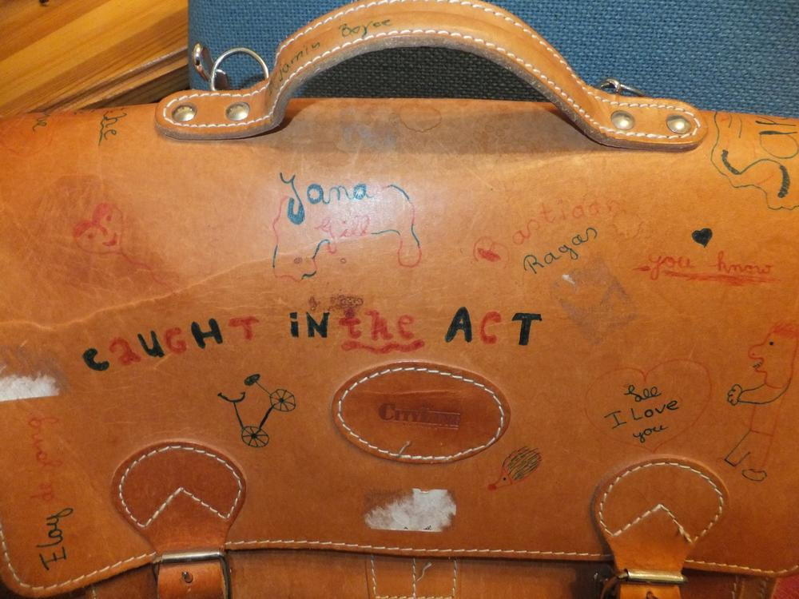
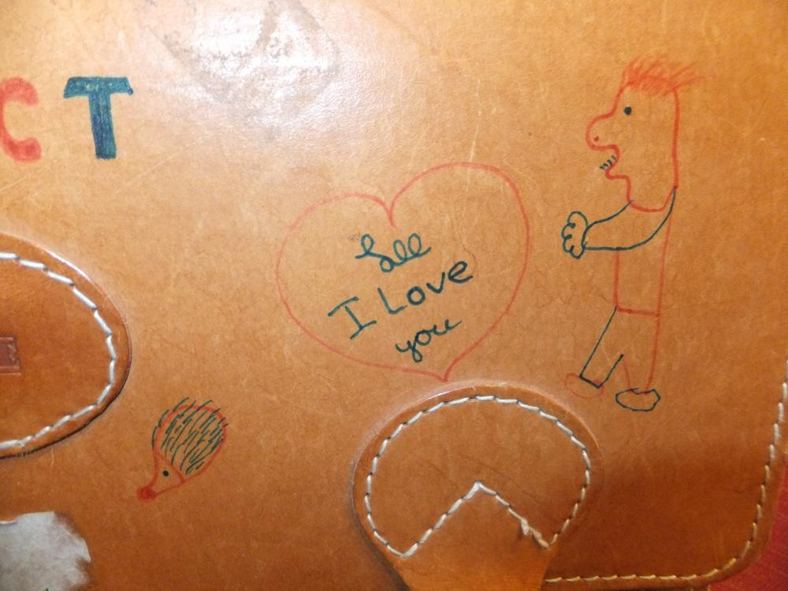
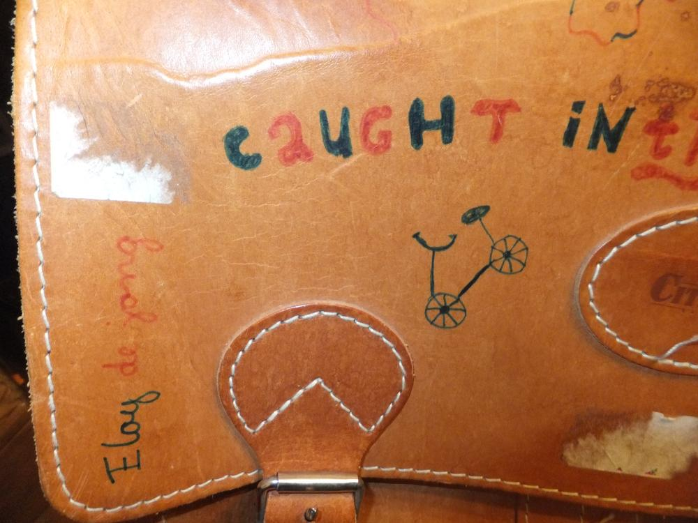
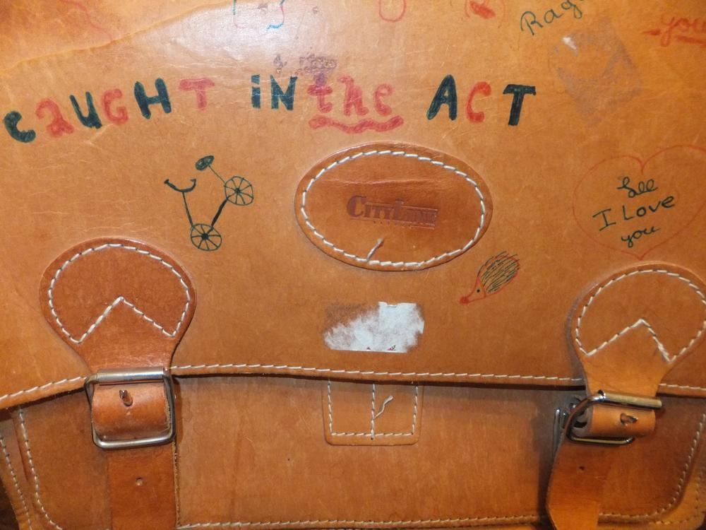
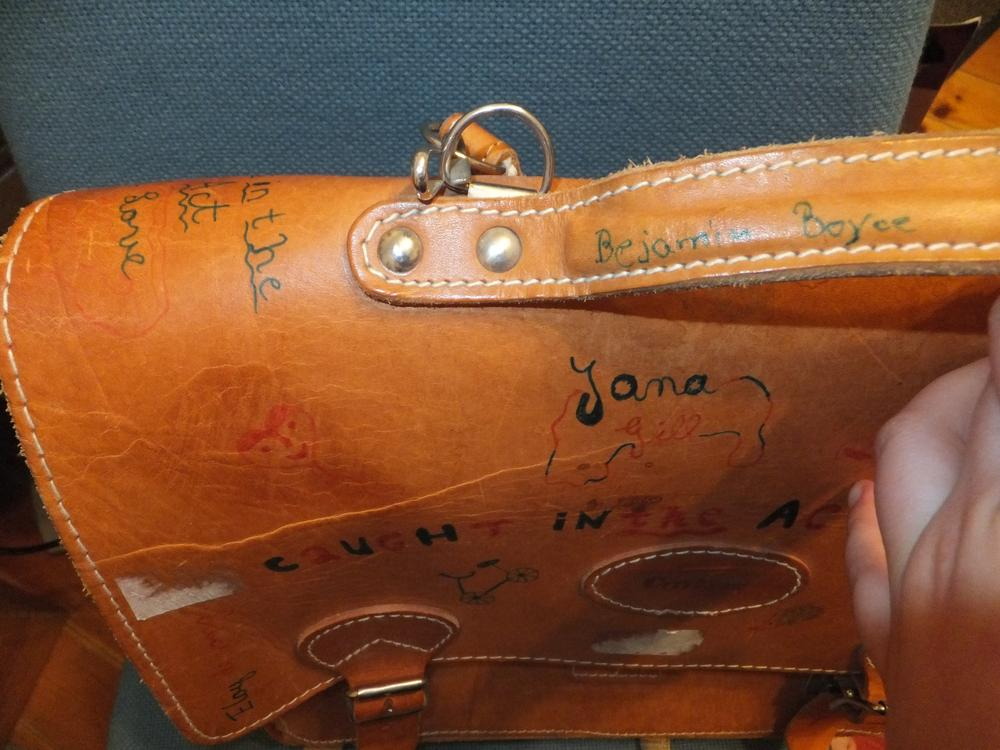
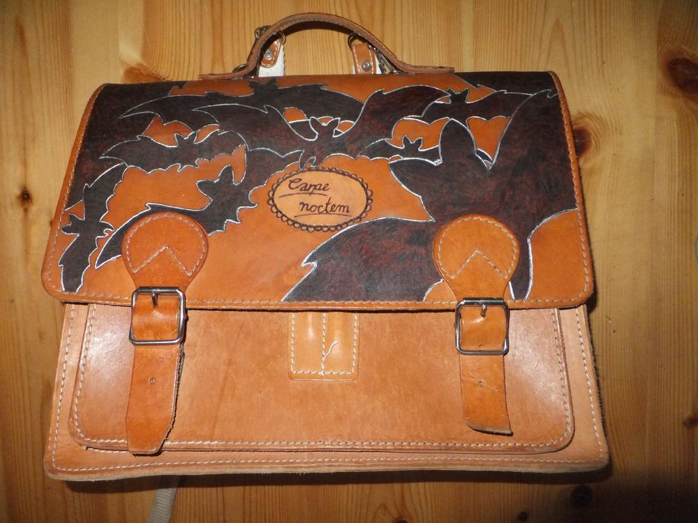
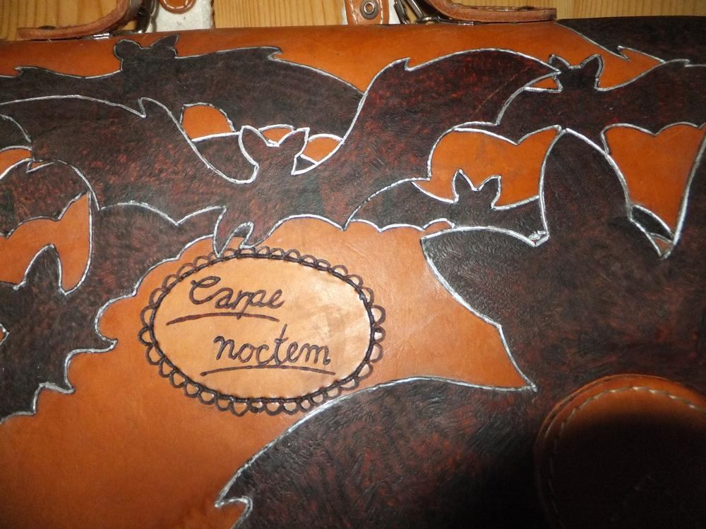
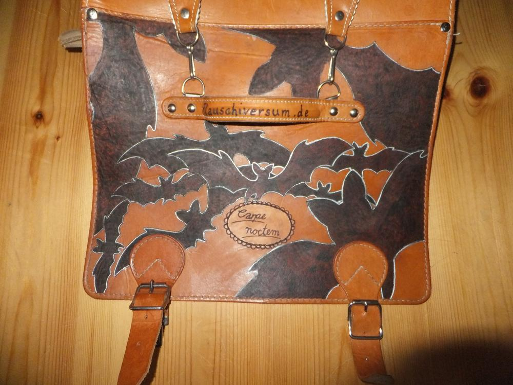
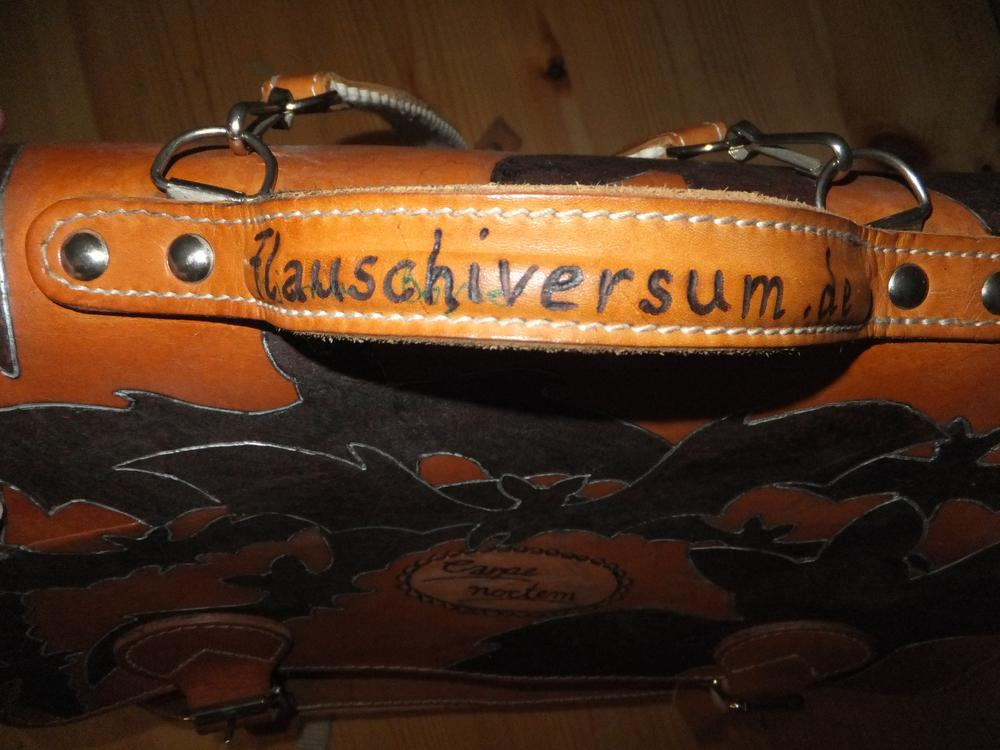
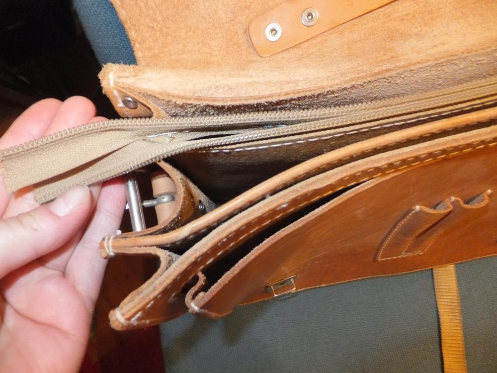

Dieses Flohmarktschnäppchen hat mich fast wahnsinnig gemacht. Für 2€ dachte ich: "Da kannste nix verkehrt machen. Ledertaschen sind teuer und naja immerhin ist sie nur am Deckel bekritzelt und sonst gut in Schuss." Ja, manchmal fordere ich mich gerne selbst heraus. Nach den ersten gescheiterten Versuchen, die Schrift mit verschiedensten Methoden verblassen zu lassen entschied ich mich für eine großflächige Bebrennung. Ich dachte an ein florales oder barockes Muster, leider reichten alle Muster die ich probierte nicht aus, um die Beschriftungen abzudecken. Grummel. 

Ich ließ diese frustrierende Tasche etwa einen Monat unter meinem Schreibtisch versauern und dann kam mir über Nacht die Idee von den Fledermäusen. Da sie eh wild durcheinanderfliegen, konnte ich sie auch wild auf der Tasche verteilen. Da sich viele Überlappungen ergaben, habe ich mit Silber die Umrisse der Fledermäuse nachgezogen. An der Stelle, wo zuvor ein Logo des Taschenherstellers war, platzierte ich das neue passende Motto. 

Jetzt muss ich nur noch den passenden Klosettschieber für die Reparatur des Reißverschlusses finden.

