Vieles kann man machen mit Besteck außer damit zu essen. Ich zeige euchheute mal meine Schmucksammlung aus Besteck. 
Die Ringe und den Anhänger habe ich von einem Hobbybieger vom Flohmarkt. Den Armreif habe ich selbst gemacht. Es befinden sich noch andere Besteck-Zweckentfremdungen in meinem Besitz, die jedoch noch nicht zeigenswert oder auffindbar sind, unter anderem einen Kettenanhänger und eine Haarnadel. 

Hier mal die Ringe...
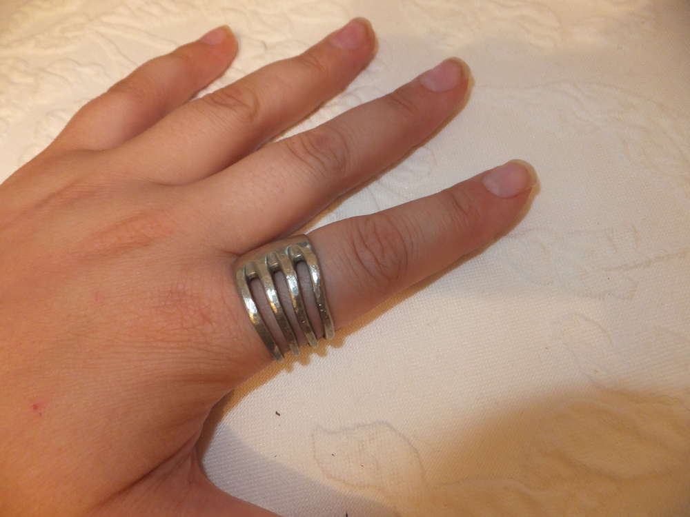
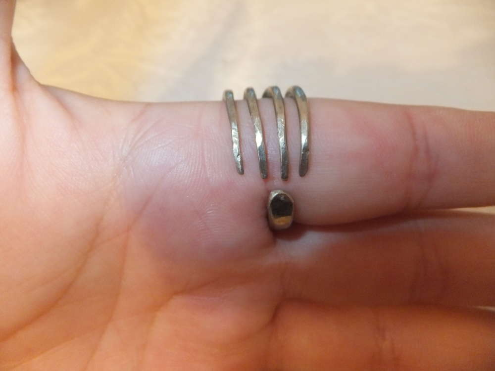
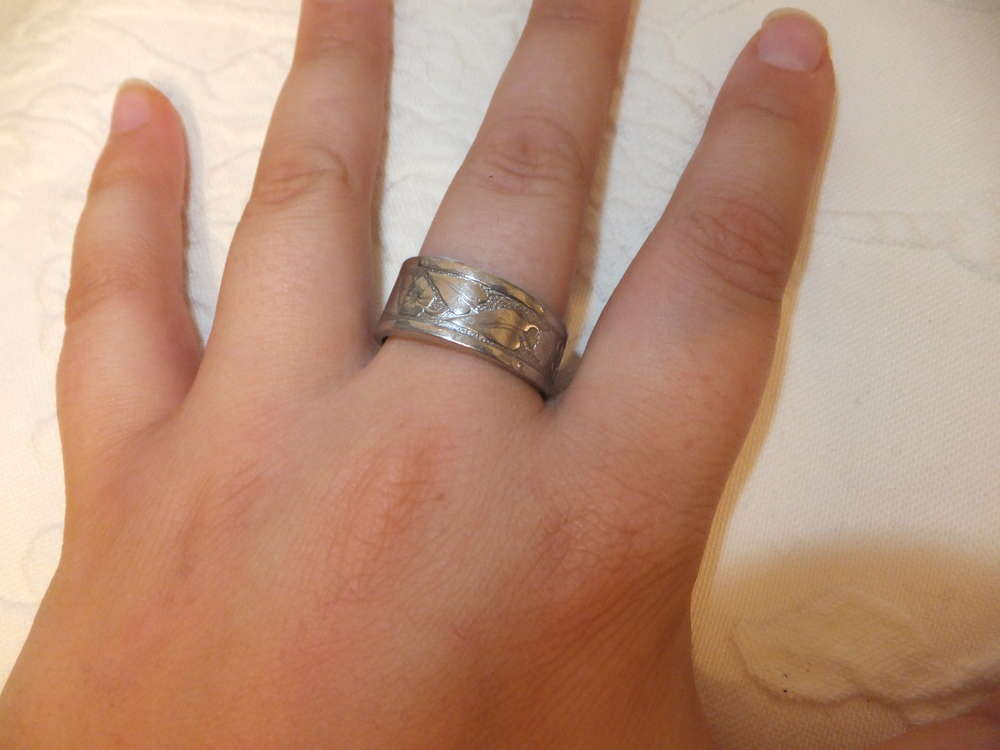
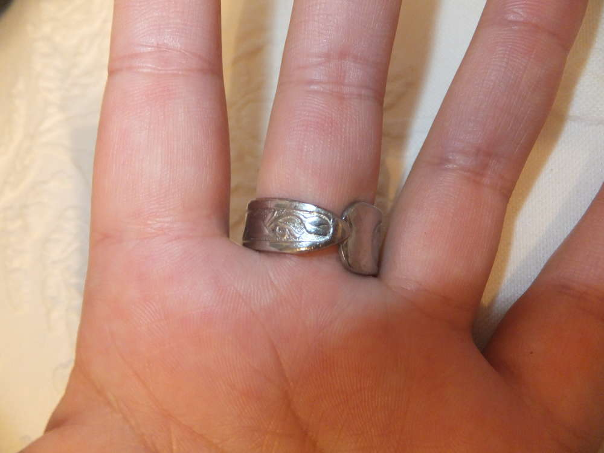
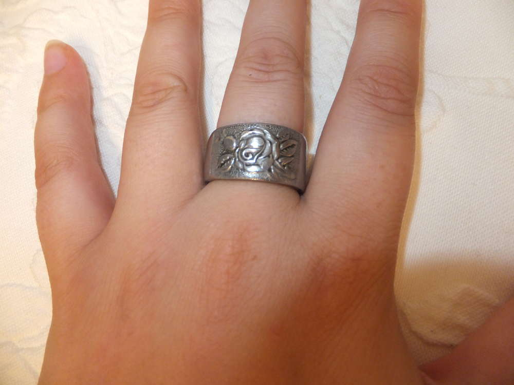
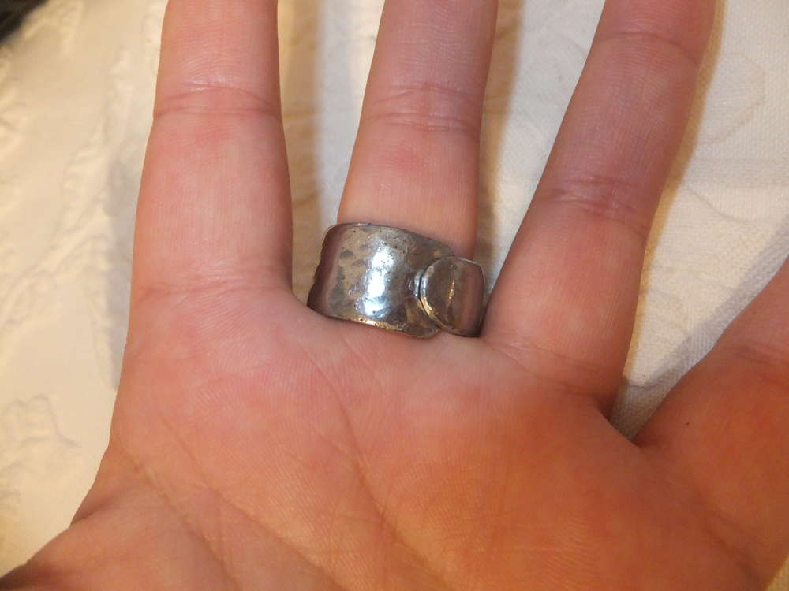
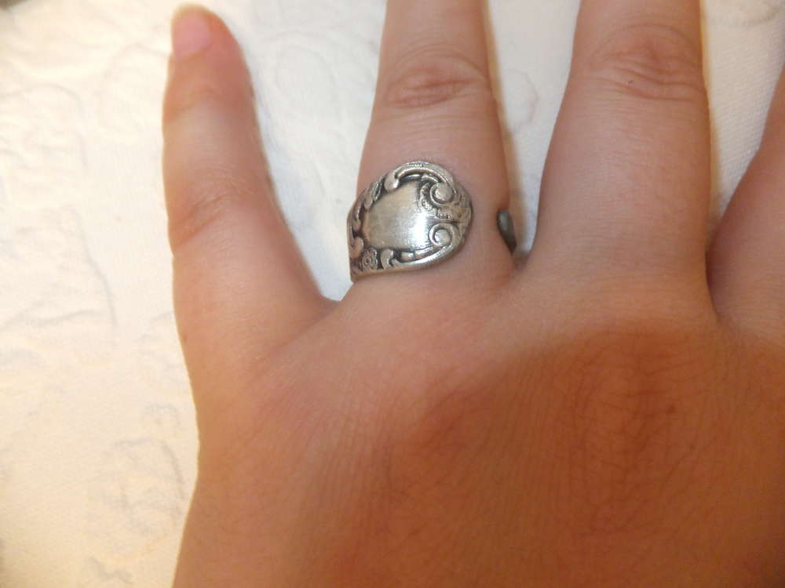
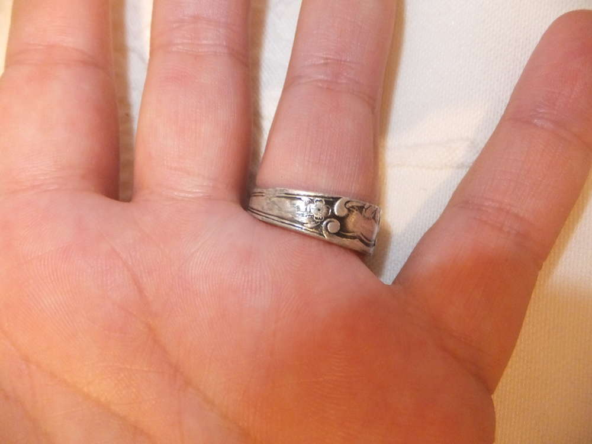
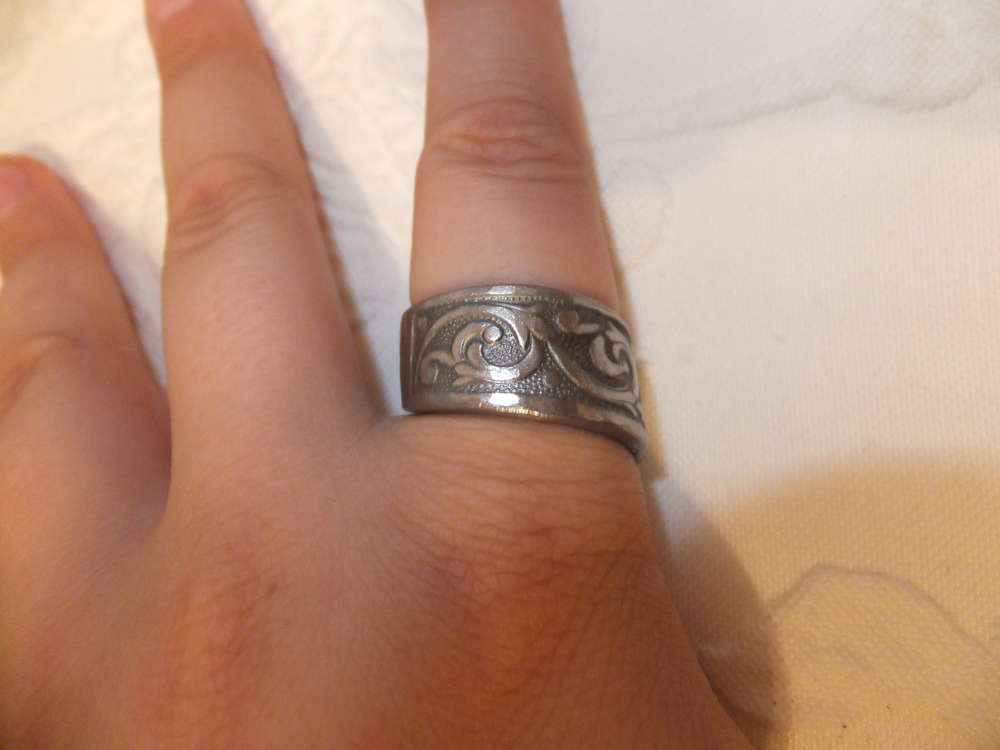
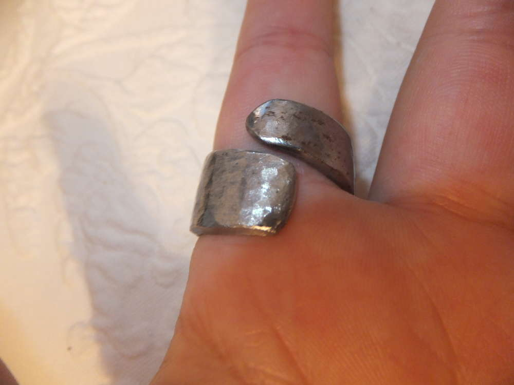

Dort der Armreif und der Anhänger...
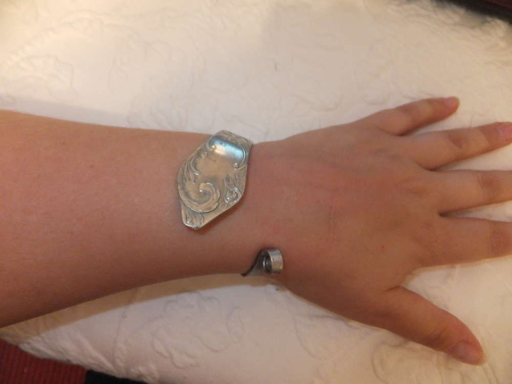
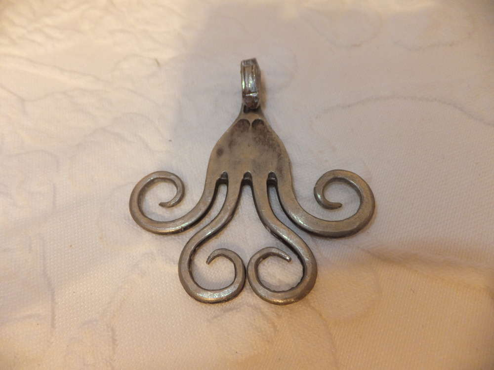

In diesem Sinne einen schönen kreativen Sonntag, Eure Ermeline.
