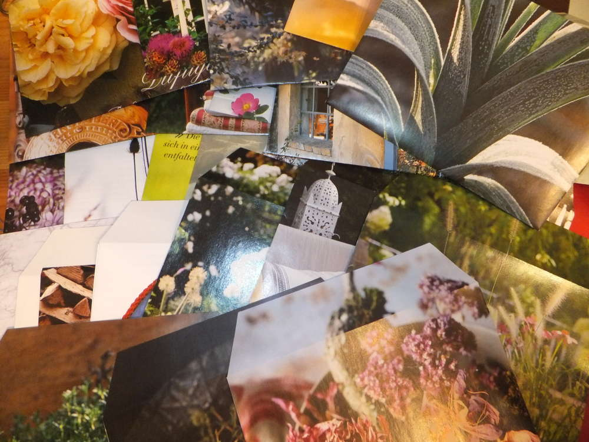
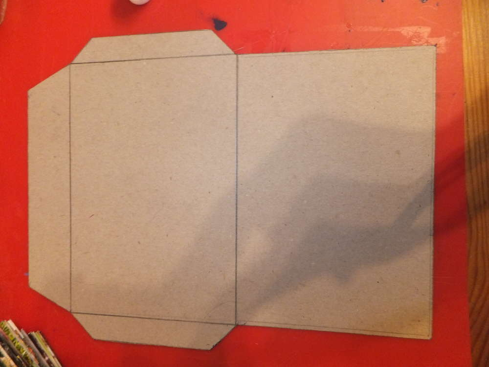
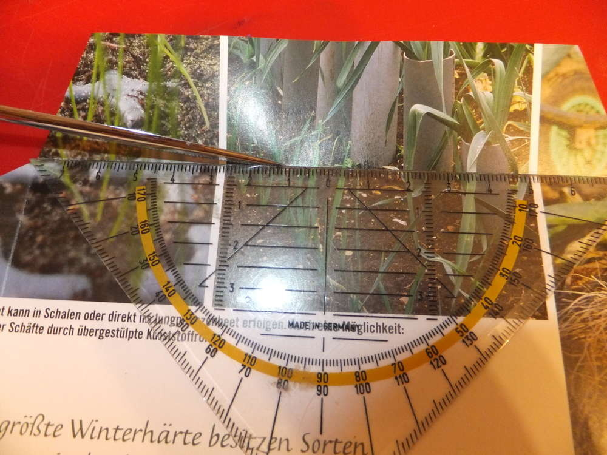
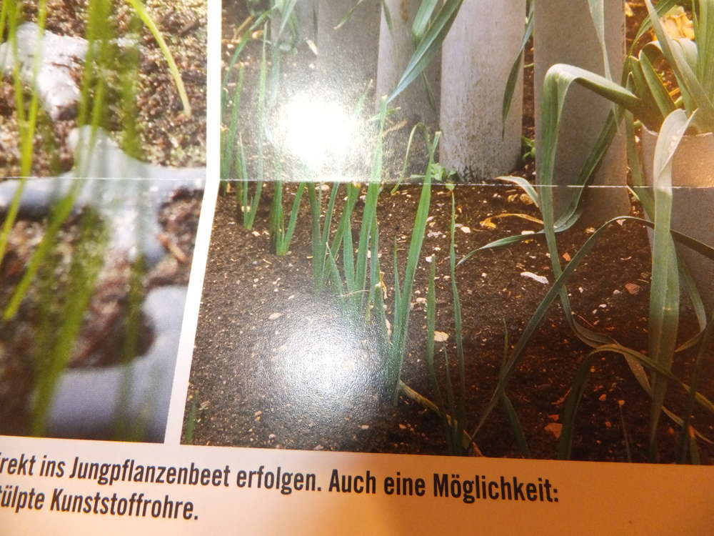
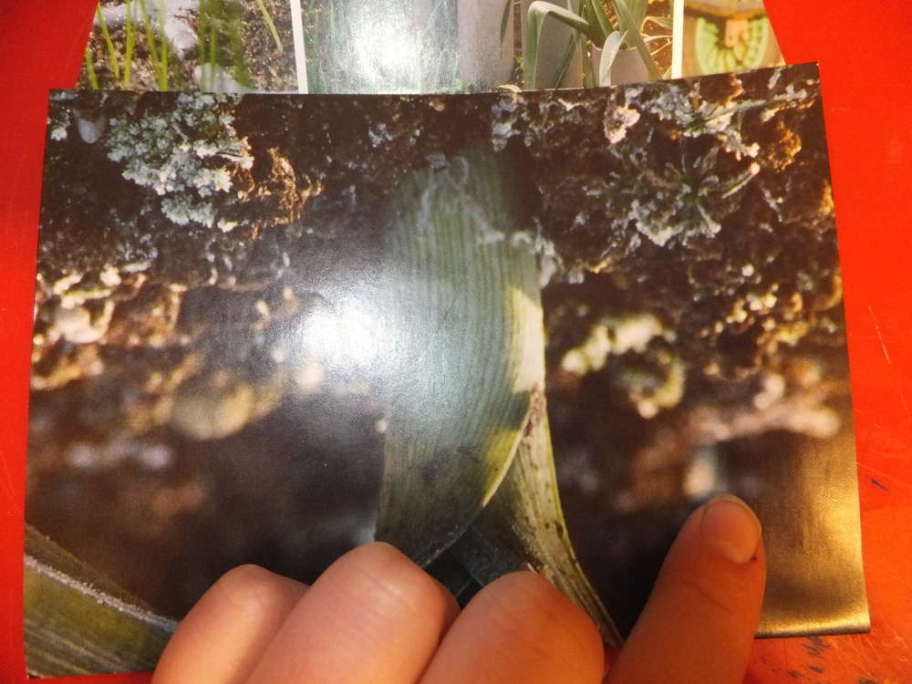
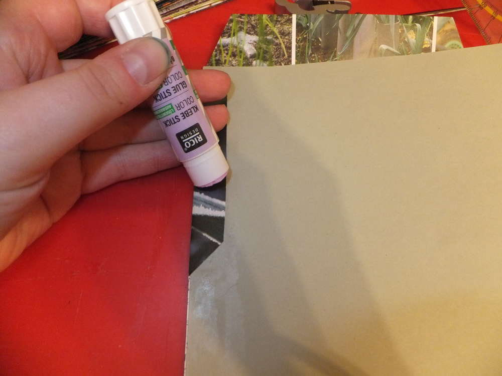
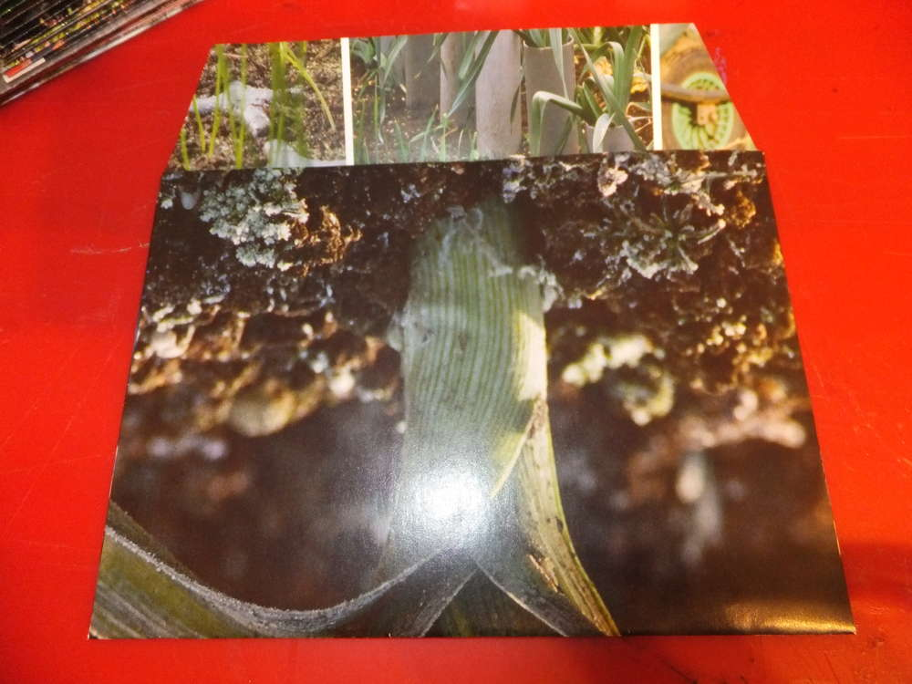
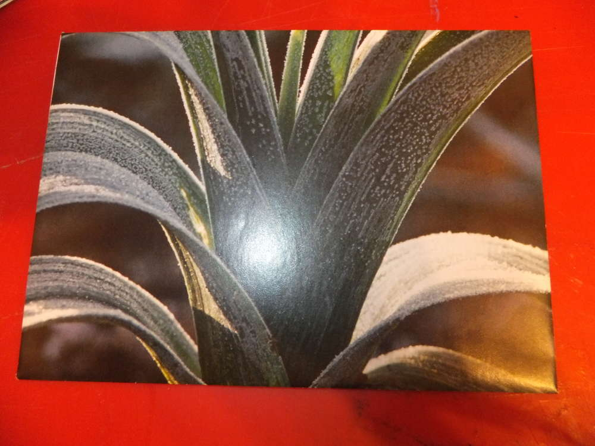
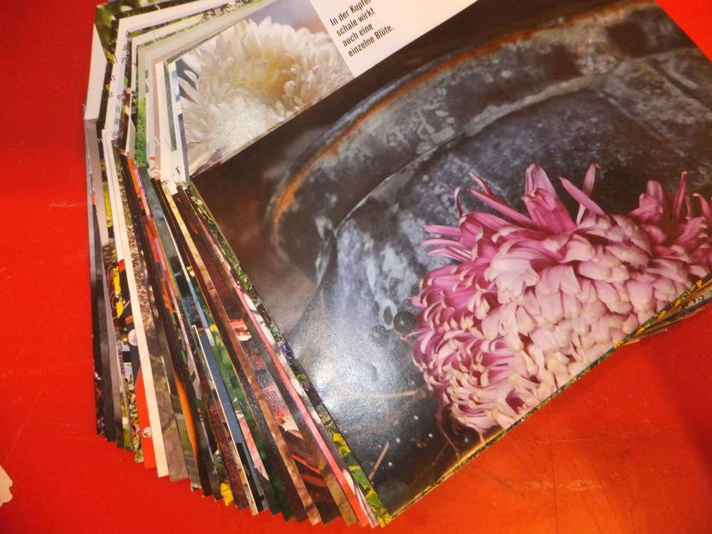

Wenn man mal ein paar besonders schöne Briefumschläge braucht, macht man sie sich selbst. Diese Umschläge sind super geeignet für Einladungen und besondere Briefe.

Du brauchst:

- alte Zeitschriften mit großen Bildern (möglichst wenig Text auf den Bildern, ich benutze die "LandLust")
- Klebe
- Schere
- Stift zum Anzeichnen
- Lineal
- Falzbein oder stumpfen Brieföffner
- Karton für die Schablone

Zunächst habe ich einen Bogen Din A4 Papier gefaltet und mich dann an den Maßen orientiert um meine Schablone zu machen. An jedem Rand habe ich noch mindestens einen Millimeter Zugabe gemacht und mir den Umriss des Briefes auf die Pappe gemalt. Meine Maße sind ca 15,4cm * 10,8cm. 1,5cm sind mein Kleberand mit abgeschrägten Kanten. Sowie die Schließlasche von ca. 3cm. Der Einfachheit halber kannst du auch einen schlichten Briefumschlag auseinander nehmen und dich an diesen Maßen orientieren. Man kann natürlich auch die länglichen Umschläge basteln, um die Maße zu ermitteln muss man dann den Papierbogen dritteln und demnach die Schablone basteln.

Die Seiten mit den brauchbaren Bildern habe ich aus den Zeitschriften getrennt und mit der Schablone den Umriss für den Umschlag übertragen. Diesen Rohling muss man dann nur noch ausschneiden.

Um den Rohling nun sorgfältig falten zu können, werden die Knickkanten vorher gefalzt, dies ermöglicht später ein schnelleres Falten. Dazu nimmt man das Lineal, legt es an der zu falzenden Geraden an und zieht mit dem Falzbein einmal entlang, ich benutze hier einen alten Brieföffner.

Nach dem Falten müssen nun nur noch die Klebelaschen mit Klebe versehen werden und der Briefumschlag zusammengefügt werden. Um ein inneres Verkleben zu verhindern, habe ich einen Pappkarton untergelegt und darauf mit Klebe bestrichen.

Um den Briefumschlag zu versiegeln kann man nun den Adressaufkleber nutzen oder die Lasche ebenfalls mit Klebe einstreichen oder Tesa benutzen. Ich war sehr produktiv, denn wenn man einen Umschlag macht, kann man gleich mehrere in einem Abwasch machen. Außerdem gehen bald die Einladungen für Beltane raus ;)

