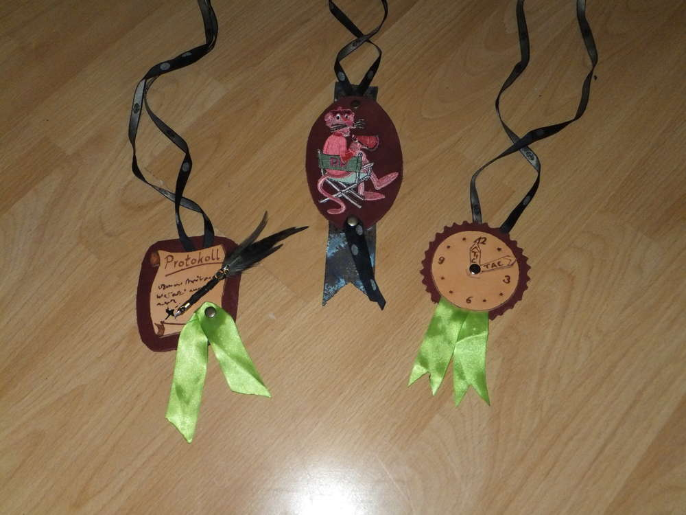
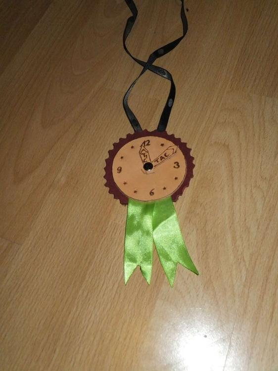
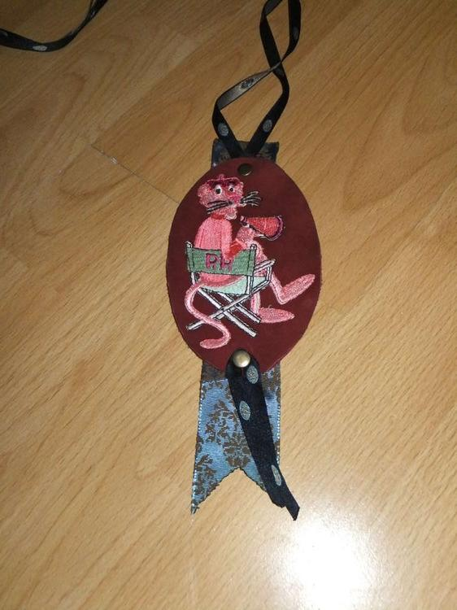
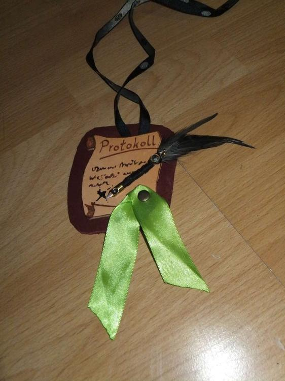

Wer hat schonmal was von "Klassenrat" oder "Klassenleiterstunde" gehört? Eigentlich ist es recht einfach zu erklären, einmal pro Woche findet in der Klasse eine Zusammenkunft statt in der jeder sich zu Problemen oder wichtigen Themen äußern darf und in der Organisatorisches für die Klasse besprochen werden kann. Die Kinder sollen dies im besten Falle selbst organisieren, gestalten und durchführen. Lehrer und Erzieher sind dabei um zu unterstützen. Es werden dann verschiedene Rollen verteilt und als Abschiedsgeschenk für meine Klasse habe ich Orden gebastelt, damit zum Einen jeder weiß was seine Aufgabe ist aber auch damit ein Ansporn entsteht auch einmal eine Aufgabe zu übernehmen.

