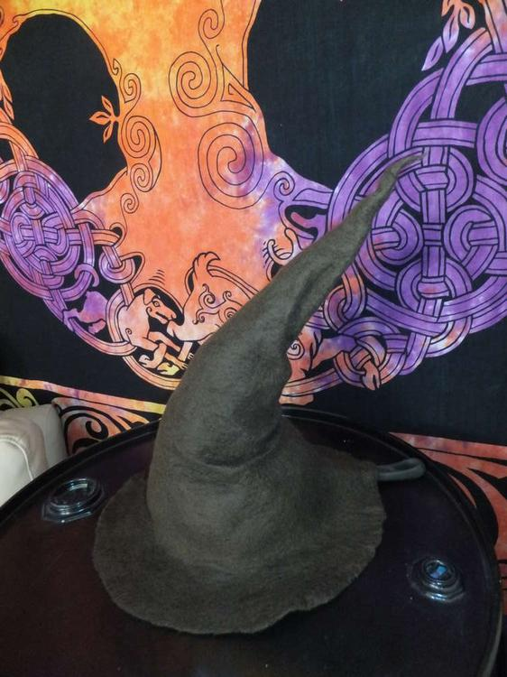
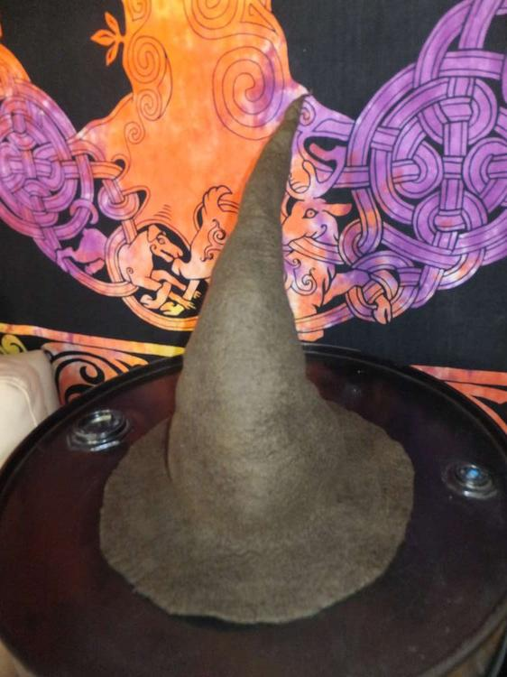
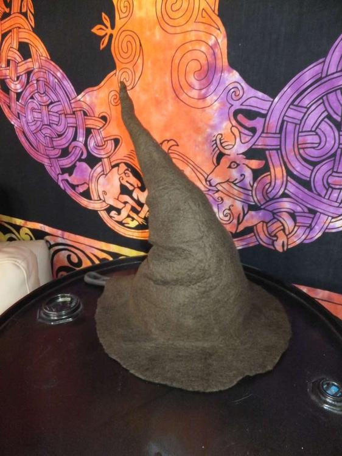
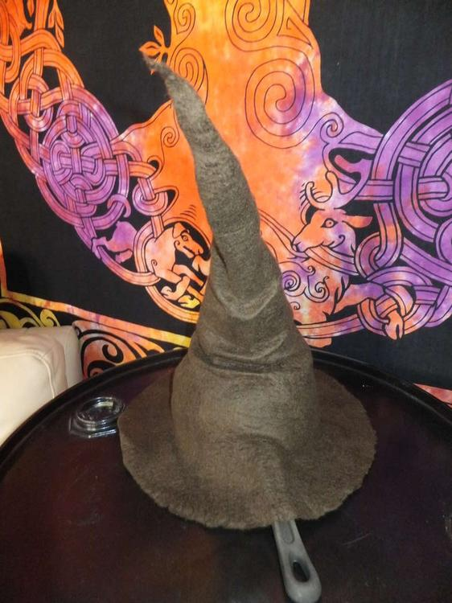

  
Und hier haben wir uns heute mal an einen schlichten Zaubererhut gemacht. Die benötigte Zeit beläuft sich auf etwa 3,5 Stunden. Die Falten hab ich schonmal etwas mit dem Dampfbügeleisen bearbeitet, jetzt trocknet er auf meinem Kochtopf. Es fehlt noch das lederne Hutband mit großer Schnalle, die wird dann in Heimarbeit gefertigt, sobald ein Bild vorhanden ist wird es hier hinzugefügt.
