Ein weiteres Mal widme ich mich mit einem Projekt der Grinsekatze aus Alice im Wunderland. Wie auch schon bei meinem [Grinsekatzenbild](/2015/05/grinsekatze-deluxe/) und diversen [Zeichnungen](/2015/08/ein-blick-in-mein-sketchbook/) handelt es sich auch hier um meinen eigenen Entwurf. Da meine [Bender-Tasche](/2014/01/taschen-aufhubschen/) lange genug getragen wurde, brauchte ich mal wieder was Frisches und was gibt es da Besseres als eine grinsende Katze? 

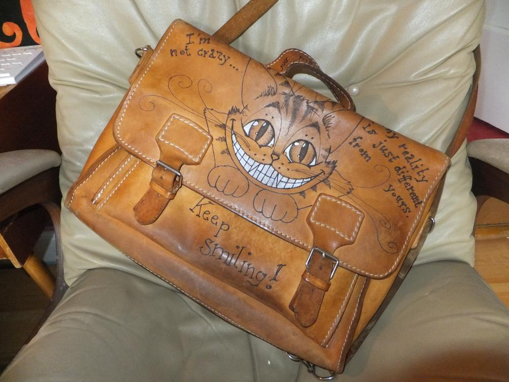
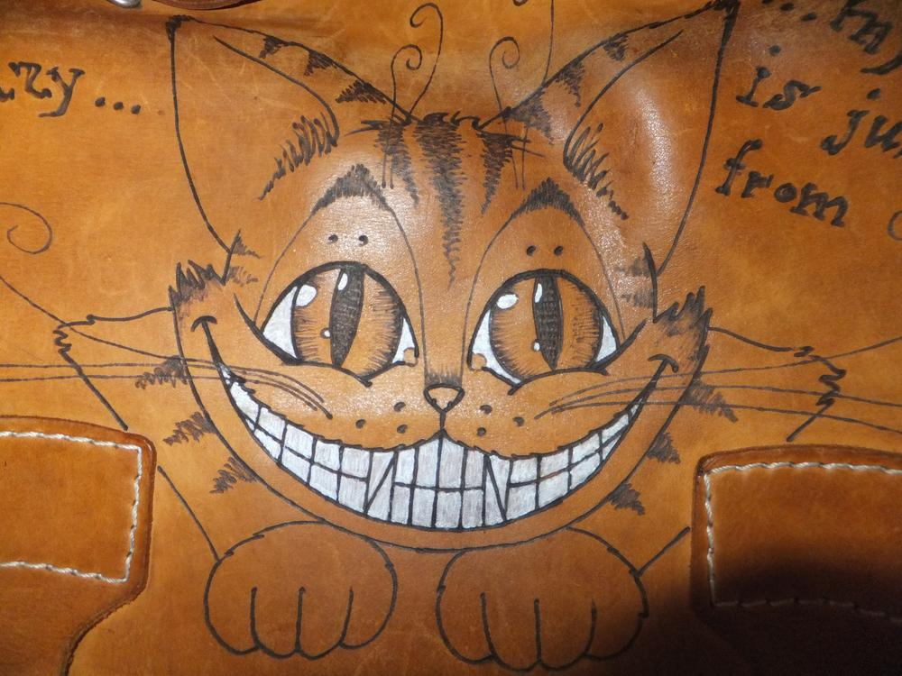
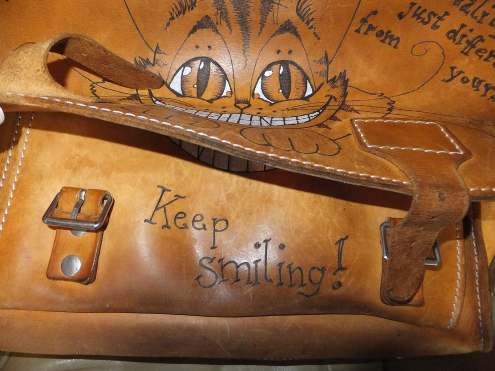
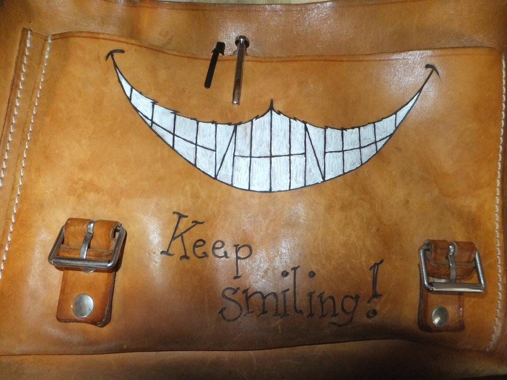
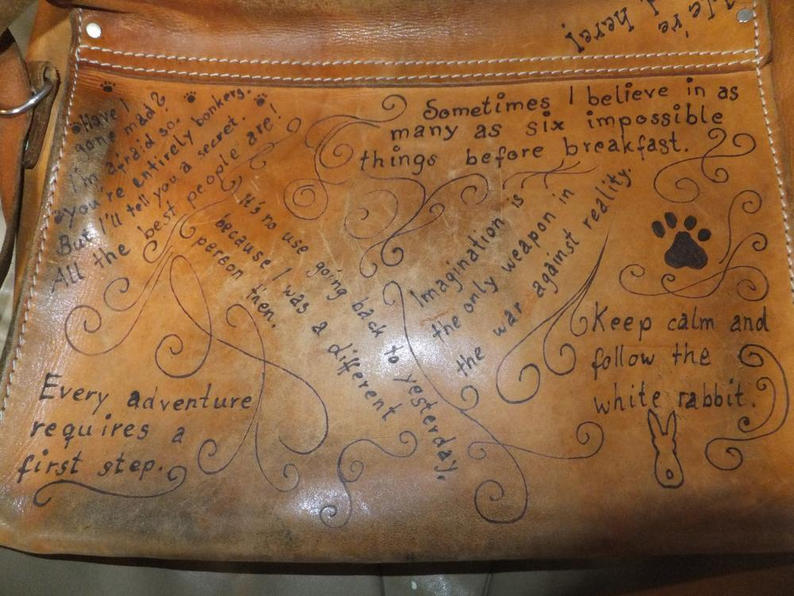
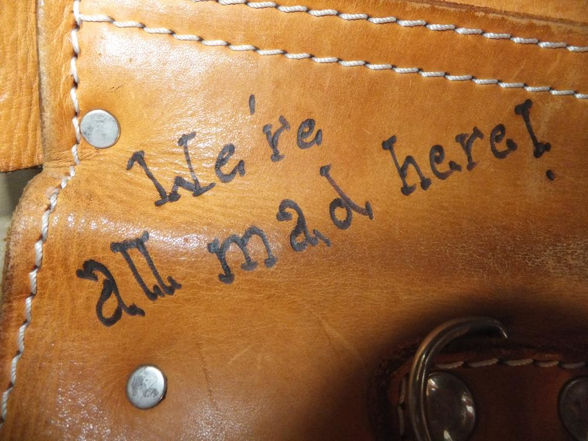
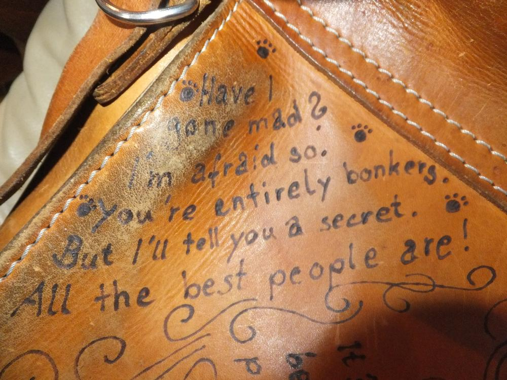
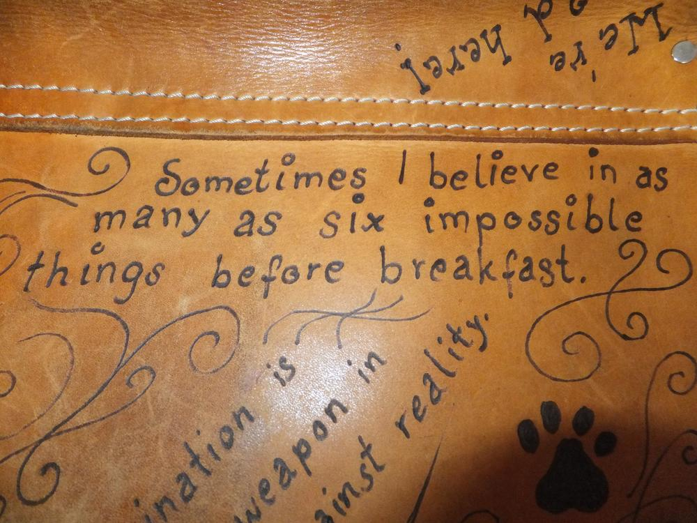
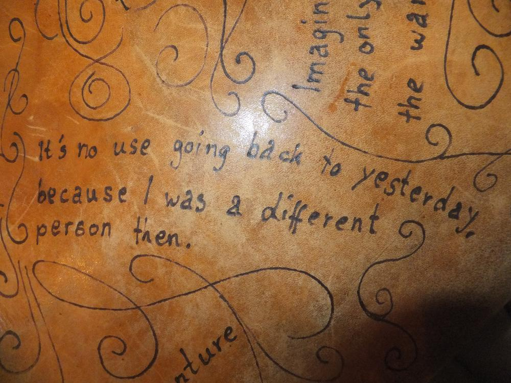
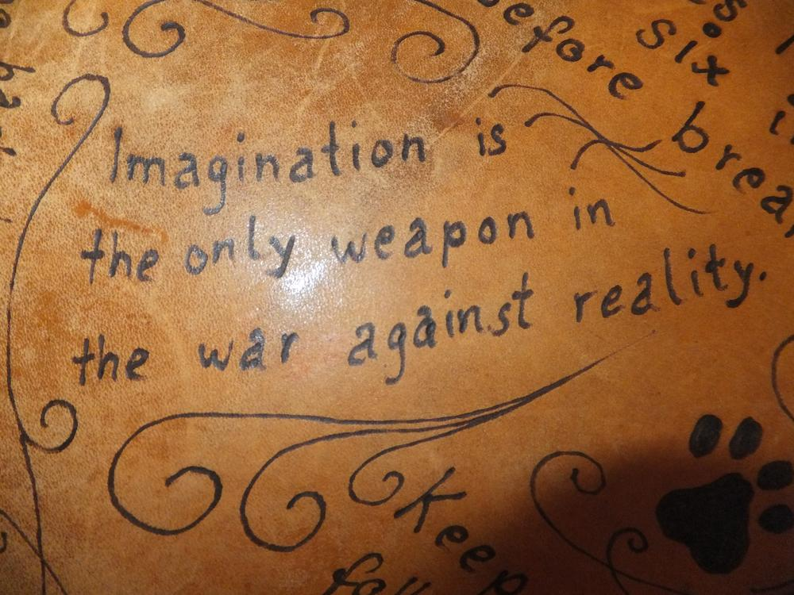
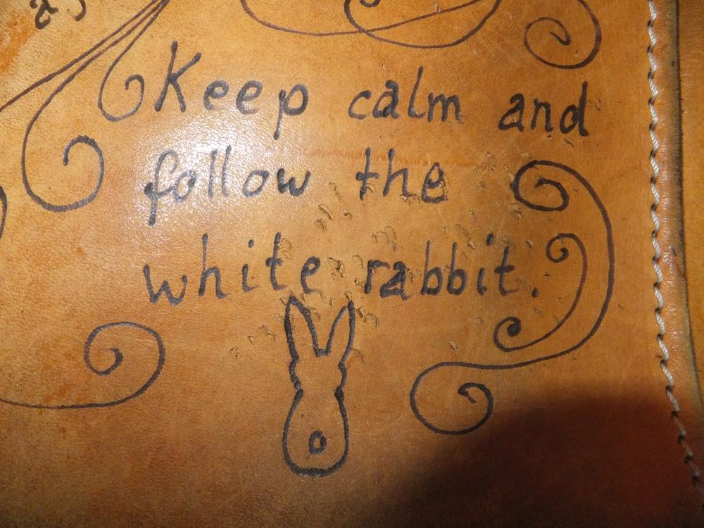
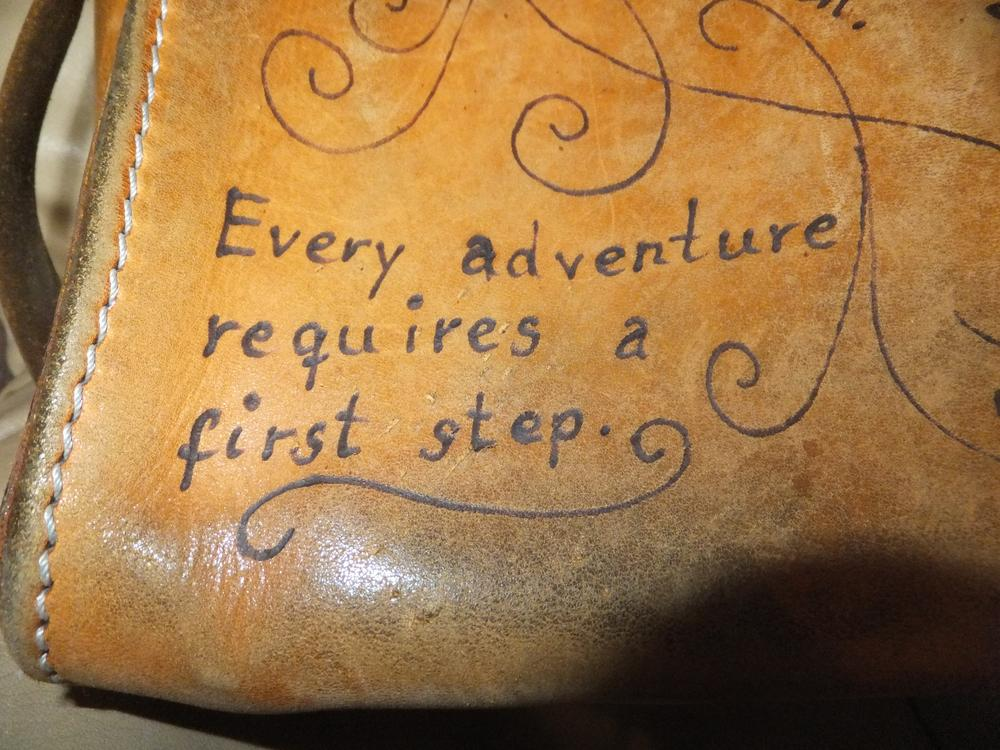

Ich wählte einige Zitate um auch die Rückseite mit grinsendem Charme füllen zu können.
Zudem tobte ich mich [erneut](/2016/05/bekritzelte-schultasche/) mit dem weißen Edding aus. Ich mag das weiche Leder, welches der Nutzung der Vorbesitzer zu verdanken ist. Niemals würde ich mir eine neue Tasche kaufen, zum einen würde ich mich nie trauen dort hinein zu brennen und zum anderen mag ich den Used-Look.
