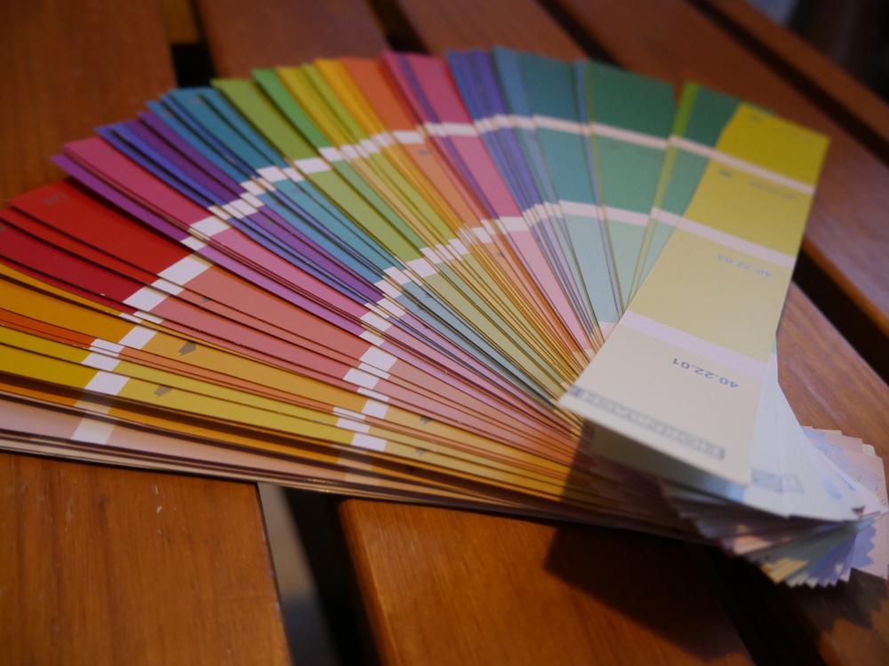
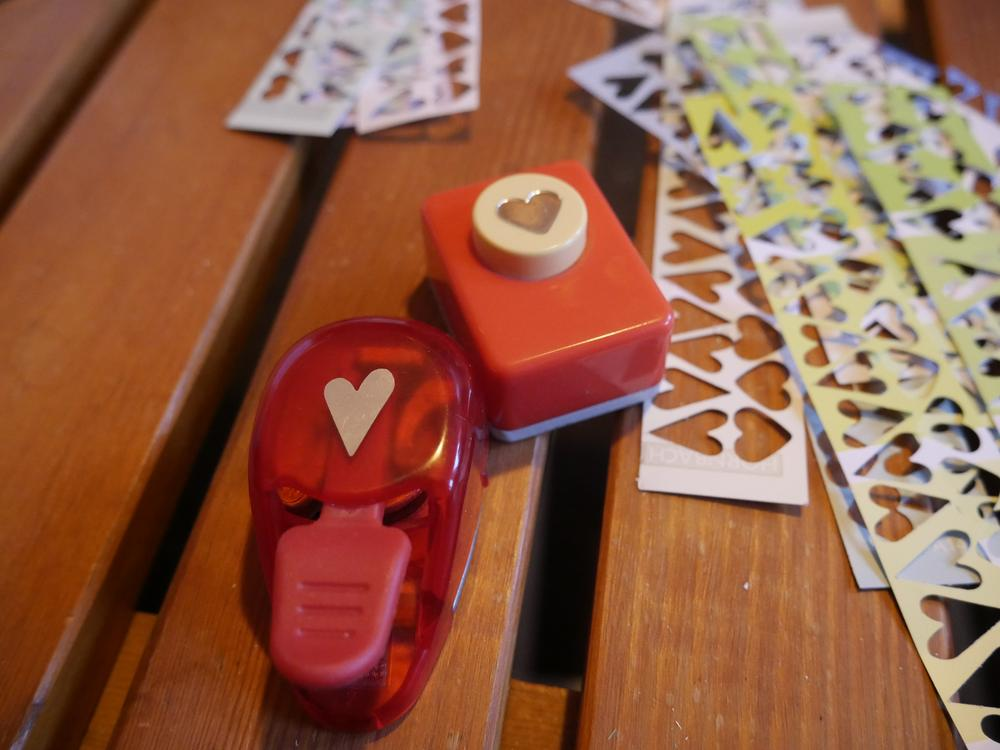
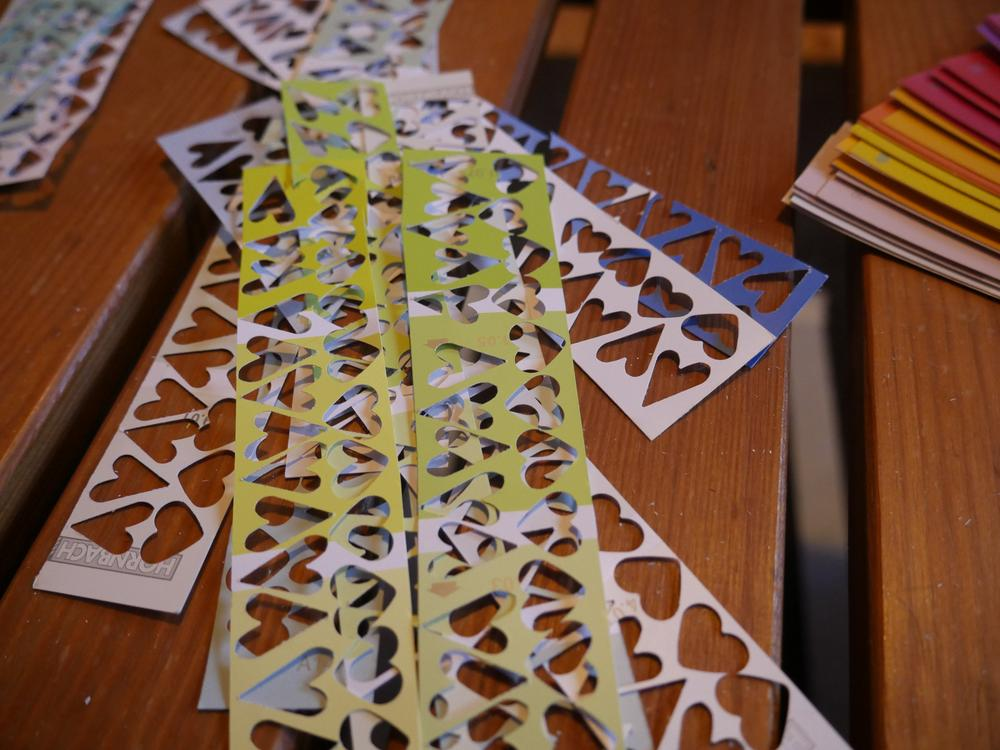
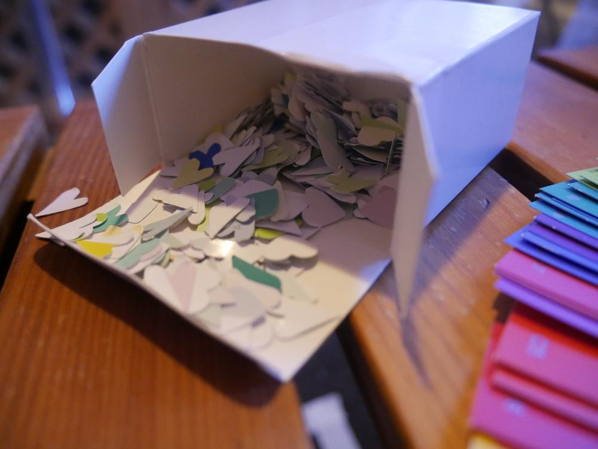

Fasching ist vorbei, aber Konfetti geht immer. Wenn man nicht weiß, was man mit sich anstellen soll und zufällig noch ein paar Farbkarten aus dem Baumarkt herumliegen hat. Ich habe mich während ein paar baulich vorgenommenen Maßnahmen mit meinen Stanzern hingesetzt und gestanzt, während hier die Handwerker wüteten. Das Schöne ist, das Material für mein Herzchenkonfetti ist umsonst und man kann jedes mal beim Baumarkt ein paar weitere Farbkarten mitnehmen. 

Ich hatte noch eine ganze Palette hier herumliegen und dachte mir, das kann man auch damit machen, wenn Lucy daraus [Kästchen](/2017/02/lucy-hat-gewerkelt/) macht, mache ich Konfetti.

