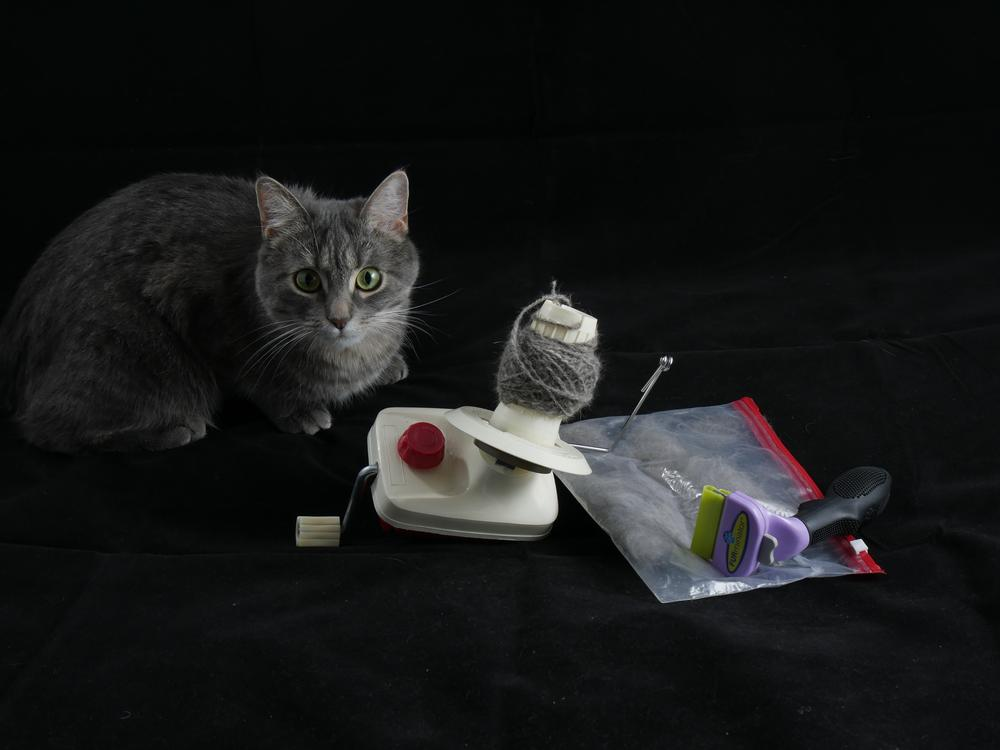
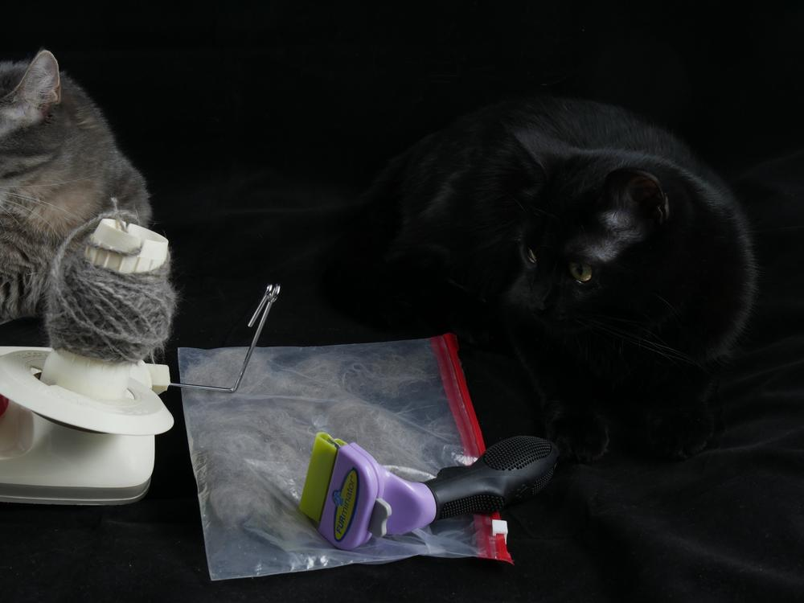
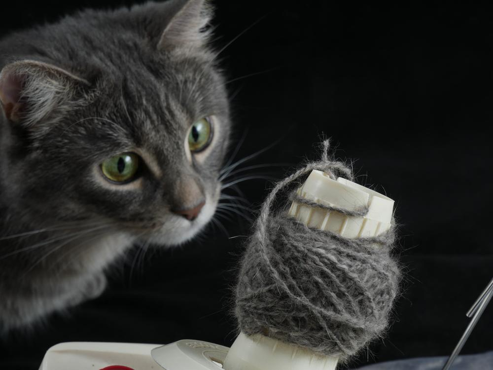
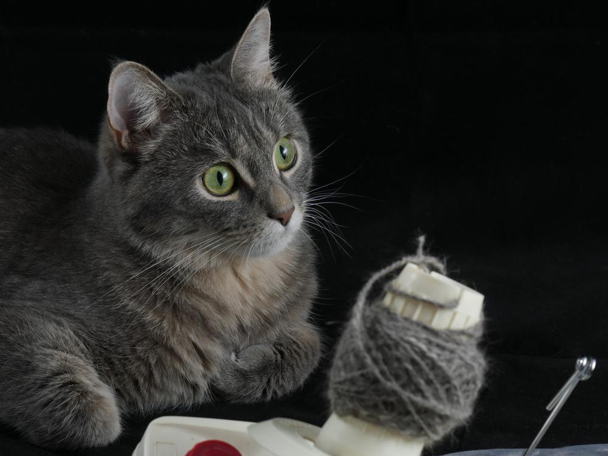
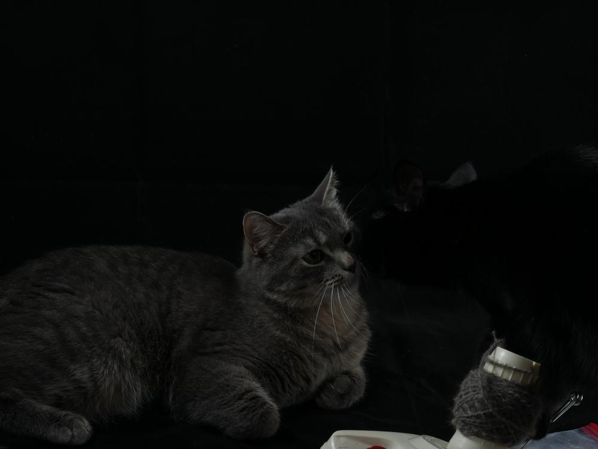
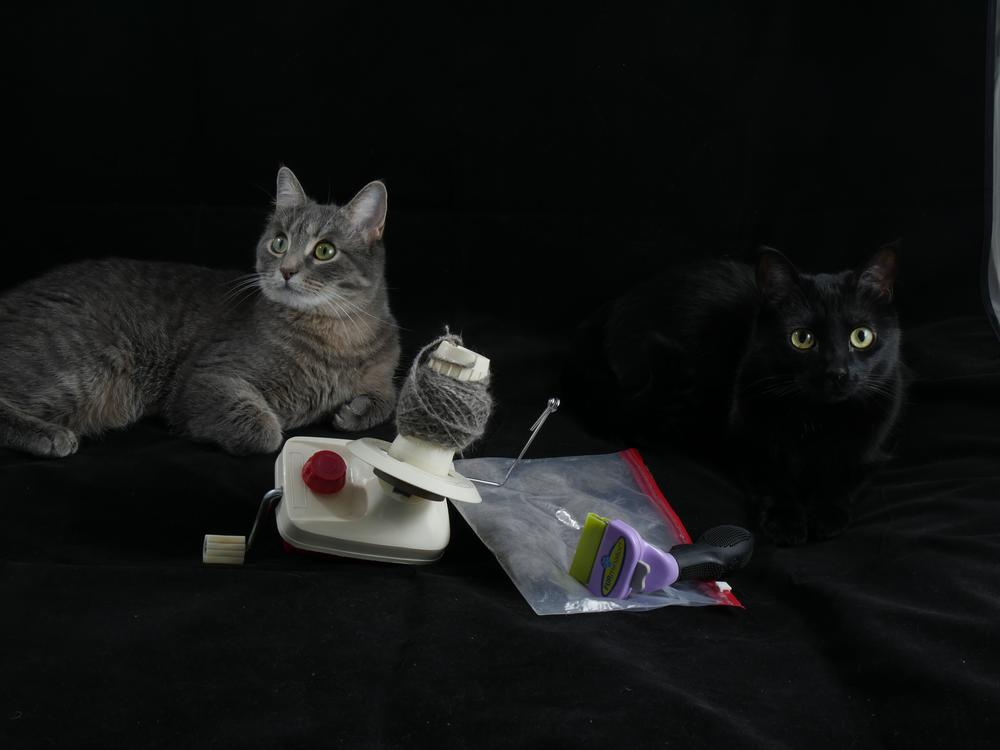
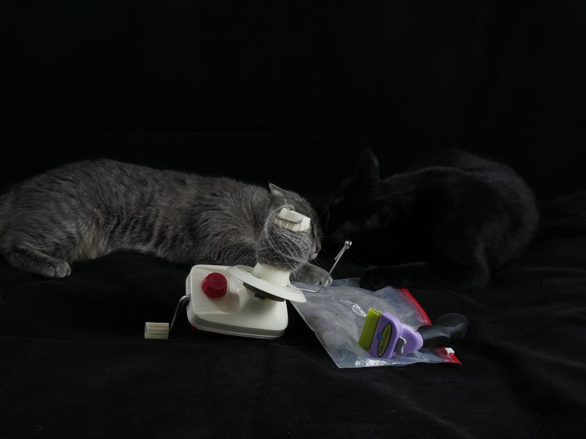
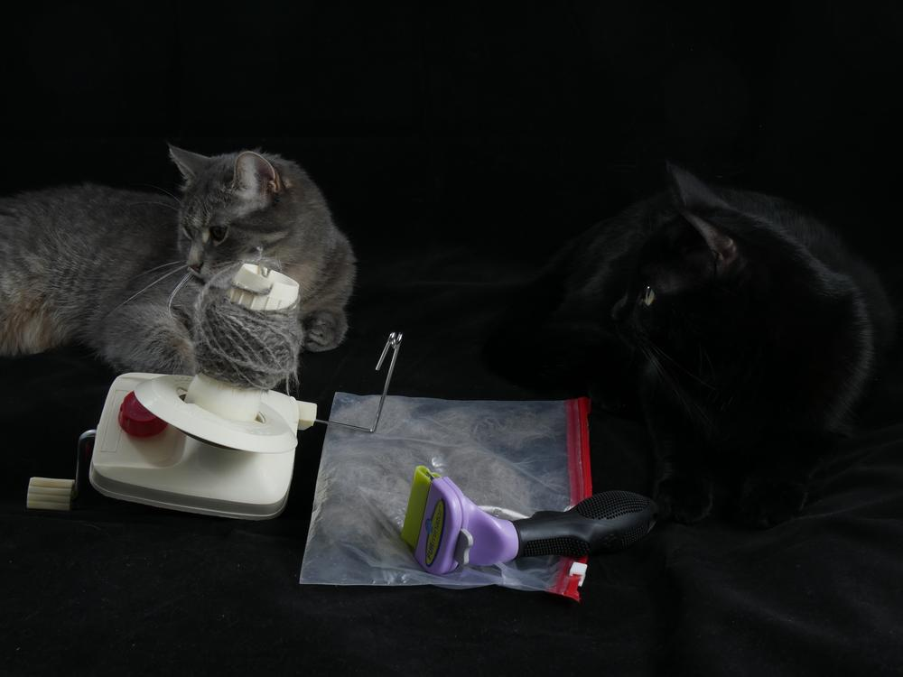

Katzenwolle - weil die flauschige Beklopptheit keine Grenzen kennt.

Irgendwo in Jemima ist eine Langhaarkatze, die sich tarnt. Soll bedeuten, dass Mimi echt viel Unterwolle hat, auch wenn sie wie eine normale europäisch Kurzhaar ausssieht. Diese Wolle furminieren wir in sehr innigen Kämmorgien raus. Die Wolle sammel ich, weil ich mal ausprobieren wollte, ob man die spinnen, filzen oder sonst was damit machen kann. Und ja es geht, filzen sollte auch möglich sein, aber diesmal entschied ich mich zum Spinnen. Aus Shubia bekommt man kaum Wolle heraus, dieses Wollspender-Privileg ist also Mimi vorbehalten.

Hier seht ihr also auf dem Wollwickler das fertige Knäul mit Jemimawolle aus 100% Katzenhaar. 

Die Wolle ist genauso flauschig wie meine kleine Mimi, jedoch nichts für Katzenhaar-Allergiker.

Naja und nachdem die Fotobox schon mit einer Katze besetzt war, musste die zweite auch dazu, schwarze Katze auf schwarzem Grund. Tatsächlich waren sie selten so entspannt wie in der Fotokulisse.

Bleibt Wolltastisch und flauschigste Sonntagsgrüße wünschen Ermeline, Shubia und Jemima.
