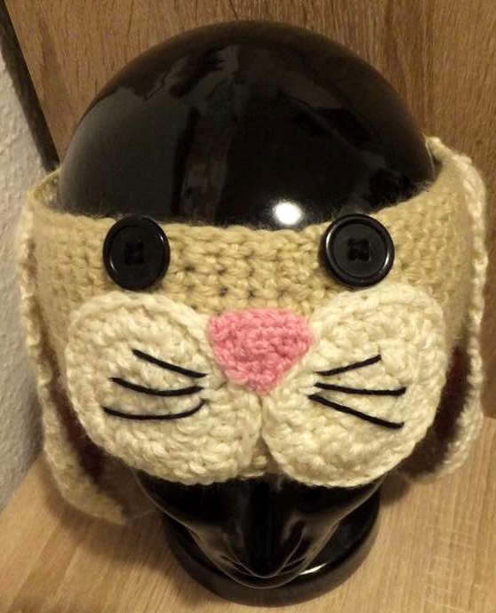
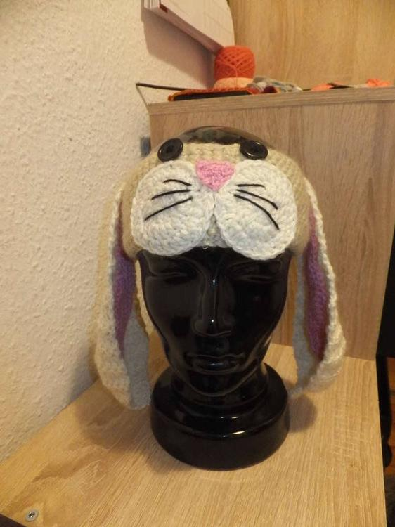
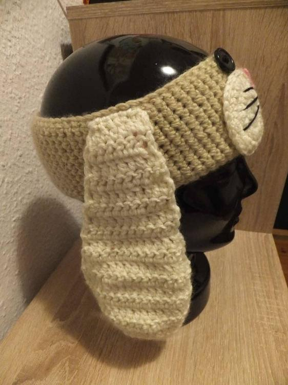
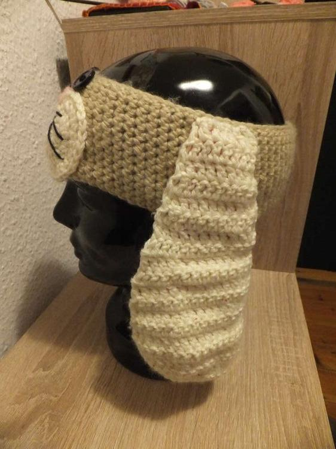
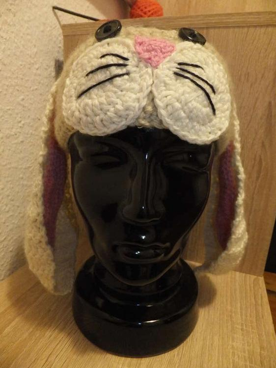

Ein Kaninchenfreund kann mit diesem Stirnband seine Zuneigung erst richtig zum Ausdruck bringen. Und es ist nicht, wie zu erwarten, ein kleines Kind welches nun neuer Besitzer dieses Schlappohrs ist, nein ein erwachsener Mann wärmt damit seine Ohren. 

Das Stirnband ist in festen Maschen gehäkelt, die Ohren sind anfangs mit der Anleitung der [Katzenmütze](http://flauschiversum.de/2014/05/mutzekatze/) gehäkelt, zum Ende hin dann nur noch etwas mehr in die Länge gearbeitet. Wer ihn in der Kieler Innenstadt oder an der Uni herumlaufen sieht hat die Erlaubnis zum Streicheln. :D
 

