Um es mal so zu sagen, auch bei einer Ermeline läuft nicht immer alles perfekt. Diese tolle Katzenhöhle sollte ein Hut werden.  

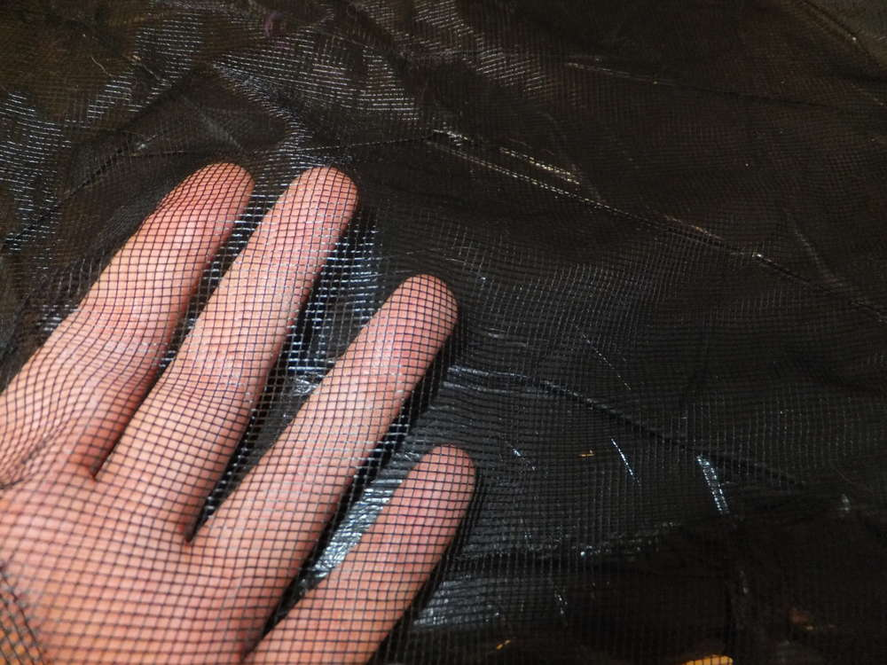
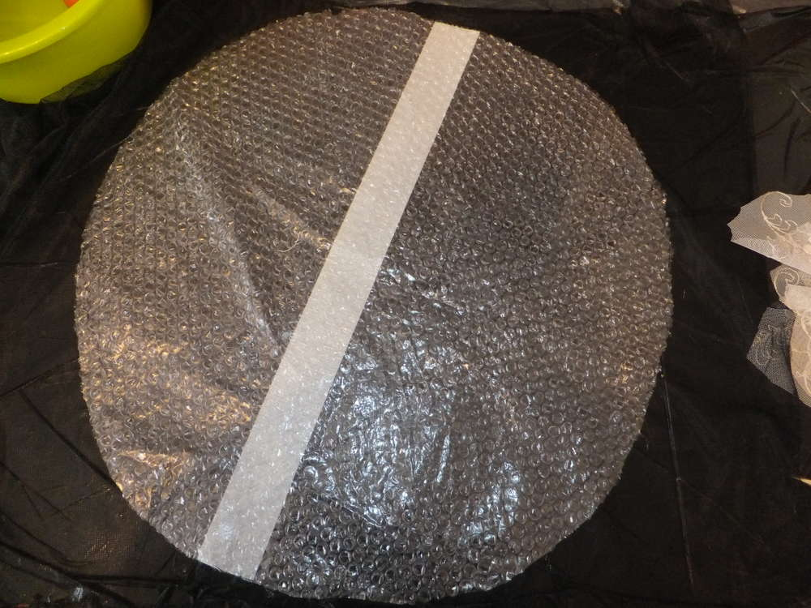

Zunächst habe ich mir ein Fliegengitter ausgelegt. Dieses sorgt später dafür, dass die ausgelegten Formen nicht verrutschen beim Filzen. Die gleiche Technik habe ich bei meinen [Schleimschals](http://flauschiversum.de/2015/02/kuschelmonster/) angewandt. Ich werde, wenn die Formen ausgelegt sind und das Werkstück bereit zum Filzen ist, das Fliegengitter um es herum legen und mit dem Anfilzen beginnen. Meine Hohlform lege ich obendrauf, in meinem Fall hat sie einen Radius von 30 cm. Für eine große Katze kann dieser um einige Zentimeter vergrößert werden. Hierbei ist auch auf den Schrumpffaktor der Wolle zu achten, bei mir hatte ich ihn zu optimistisch angesetzt und mein "Hut" wurde zu groß, dafür ist die Katzenhöhle nun zu dünn. Machen wir das Beste draus.

Ich habe mein dünnes Wollvlies (es sollte ja ein Hut werden, der keine Kopfschmerzen durch das Gewicht verursacht) unter die Schablone gelegt und die Ränder großzügig zurechtgezupft.

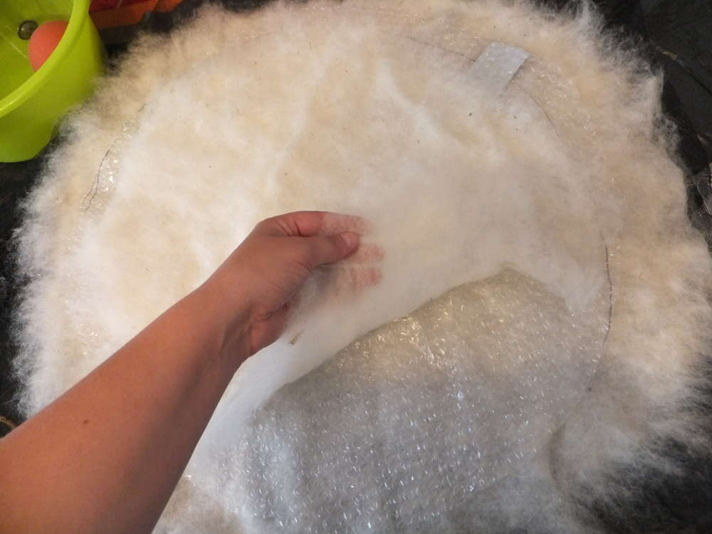
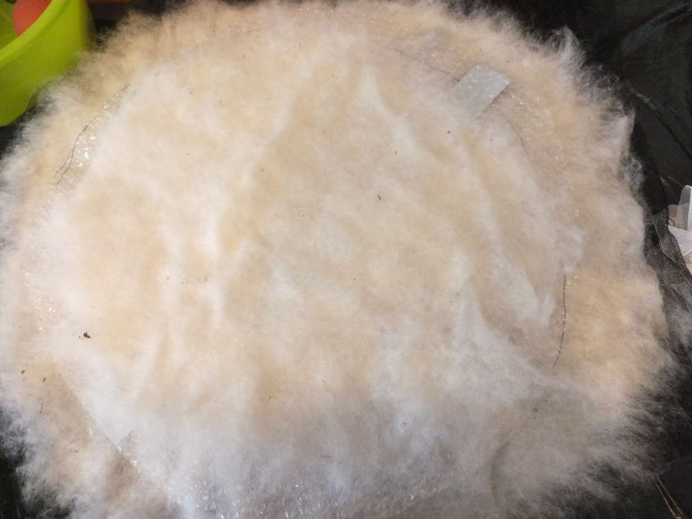

Die andere Seite wird mit einem kleineren Stück bedeckt. Dennoch sollte die ausgelegte Wolle knapp am Rand auslaufen, denn im nächsten Schritt musst du die Kanten umklappen und diese sollen sich überlappen, damit die Seiten sich verbinden. Hier kannst du auch sehen, dass mein Vlies wirklich dünn ist.

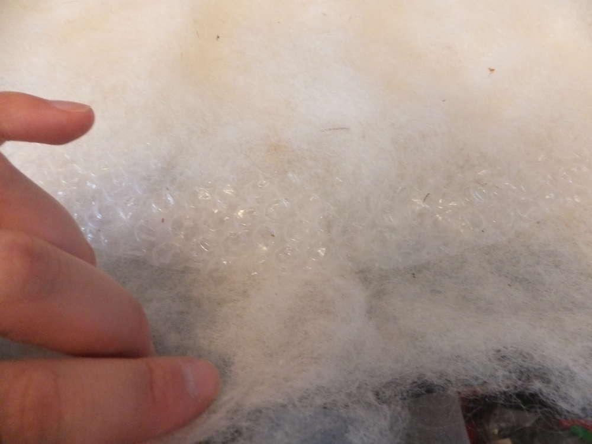

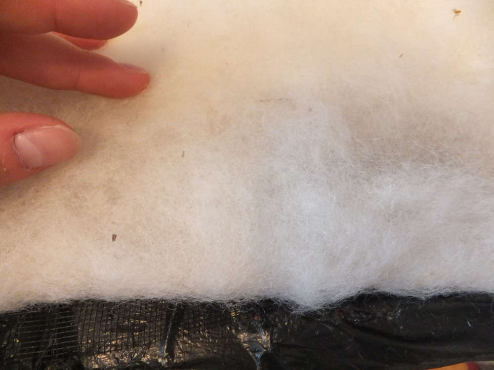

Ich schlage nun die Kanten um und du kannst sehen, dass sich meine gut überlappen. Du kannst, wenn deine Wolle sich etwas sträubt in der Position zu verweilen, ein wenig die Kanten auszupfen und die sich kräuselnden Fasern besser vorläufig auf dem anderen Stück verhaken lassen. Jetzt einmal rundherum und ich habe begonnen meine Farben auszulegen. Für eine richtig stabile Katzenhöhle empfehle ich aber noch eine Lage Vlies zu legen. Dafür legst du das große Vlies mit den überstehenden Kanten auf die Seite, wo du zuvor das Kleine liegen hattest, dann einmal wenden und das kleine Vlies auf die andere Seite und wieder die Kanten umschlagen. Auf diese Weise bekommst du später einen festen Filz und deine Kanten sind durch die Überlappung gut verbunden.

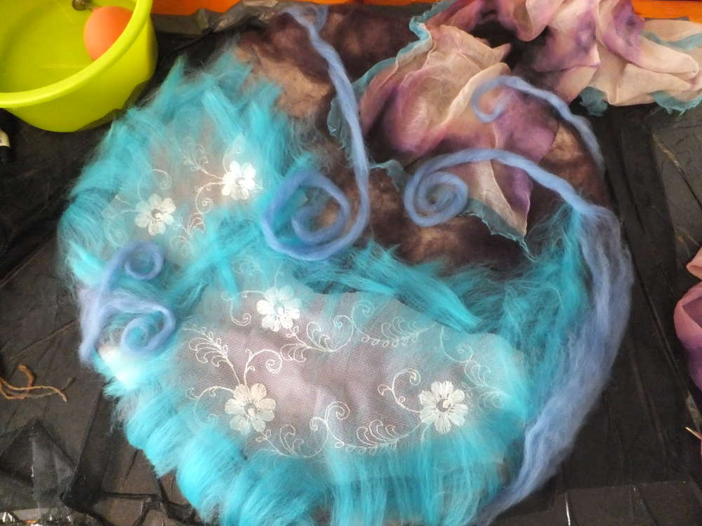

Hier ein paar Eindrücke von meiner Gestaltung der ersten Seite. Ich habe ein wenig mit einem Wolltuch und einer Spitzengardine experimentiert. Nachdem diese Seite nassgemacht und plattgedrückt war, habe ich sie vorsichtig mithilfe einer Platte umgedreht.

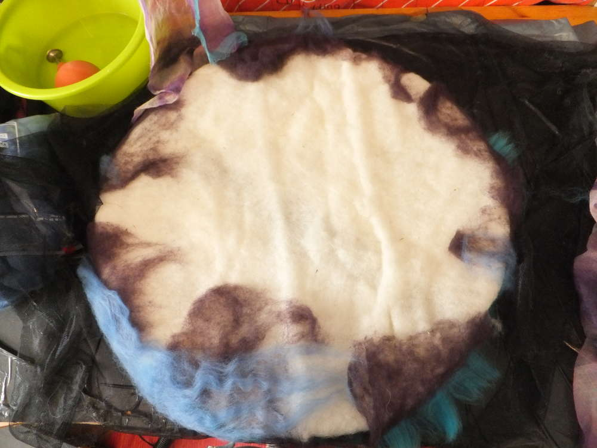

Umdrehen und die überstehenden Kanten von der anderen Seite umschlagen. Ich habe mich nun an diesen Farben orientiert um keine Farbkanten zu verursachen. Die weißen Stellen in der Mitte werden nachher für die Öffnung verwendet und rausgeschnitten. Daher habe ich mich nicht groß mit dem Design an dieser Stelle beschäftigt.

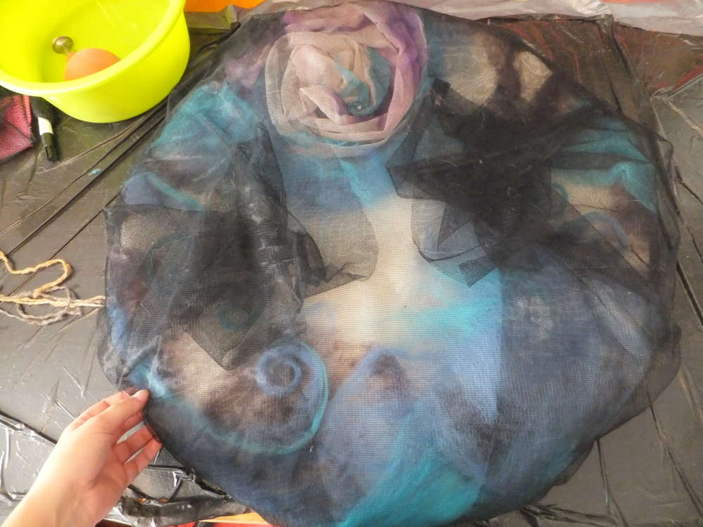
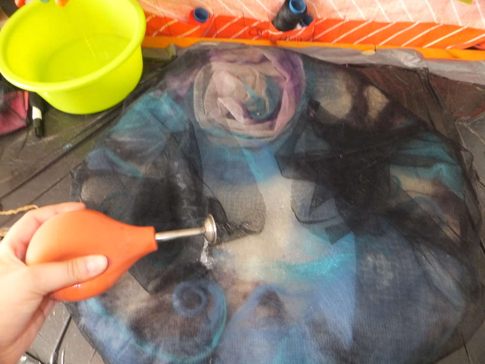

Nachdem ich fertig war mit dem Auslegen des Musters, habe ich das Fliegengitter an den Kanten umgelegt und auch diese Seite mit Seifenwasser benetzt. Jetzt konnte ich mit dem Anfilzen beginnen.

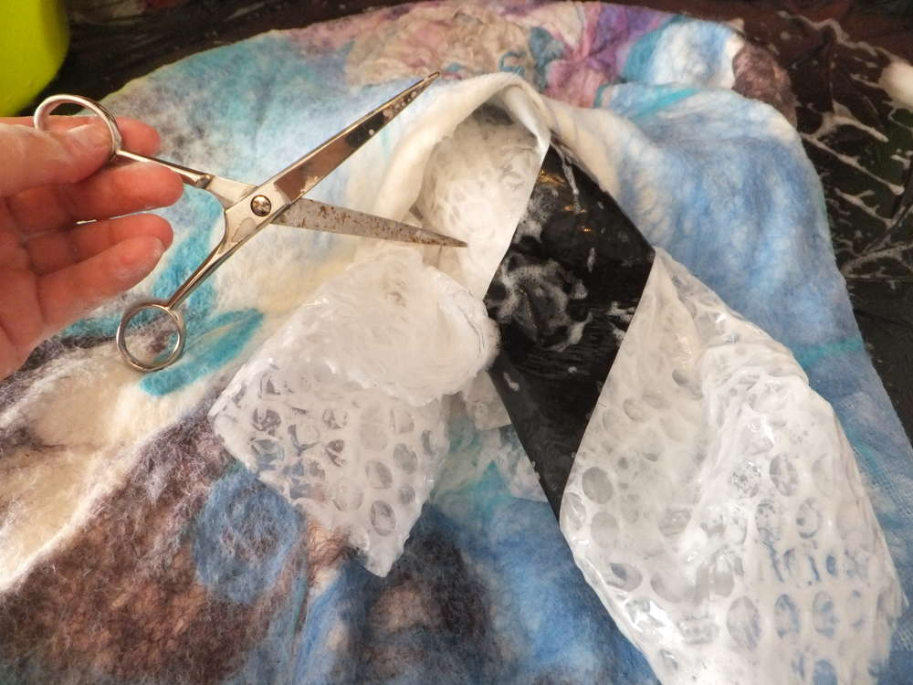

Achte beim Anfilzen gut auf die Kanten, wenn dein Stück in der Mitte gut angefilzt ist, fängt es ein wenig an den Rändern über die Schablone zu rutschen und das kannst du super an den Kanten nutzen um diese zu verfilzen, dafür nimmst du deine ganze Handfläche und reibst vorsichtig an der Kante entlang immer zur Mitte hin und wieder zurück. Am Anfang musst du besonders Vorsichtig sein, später kannst du problemlos reiben, ohne das etwas kaputt geht. Wenn dein Werk gut verfilzt ist und der Zupfprobe standhält, kannst du dein Loch schneiden und die Schablone rausnehmen. Mach das Loch nicht zu groß, gerade so, dass deine Hand durch passt, es wird sich noch dehnen und im Zweifelsfall kannst du ein Loch immer größer machen aber nur schwer wieder klein. Ist die Schablone draußen, widme dich der Innenseite und reibe mit der Hand die Kanten glatt.

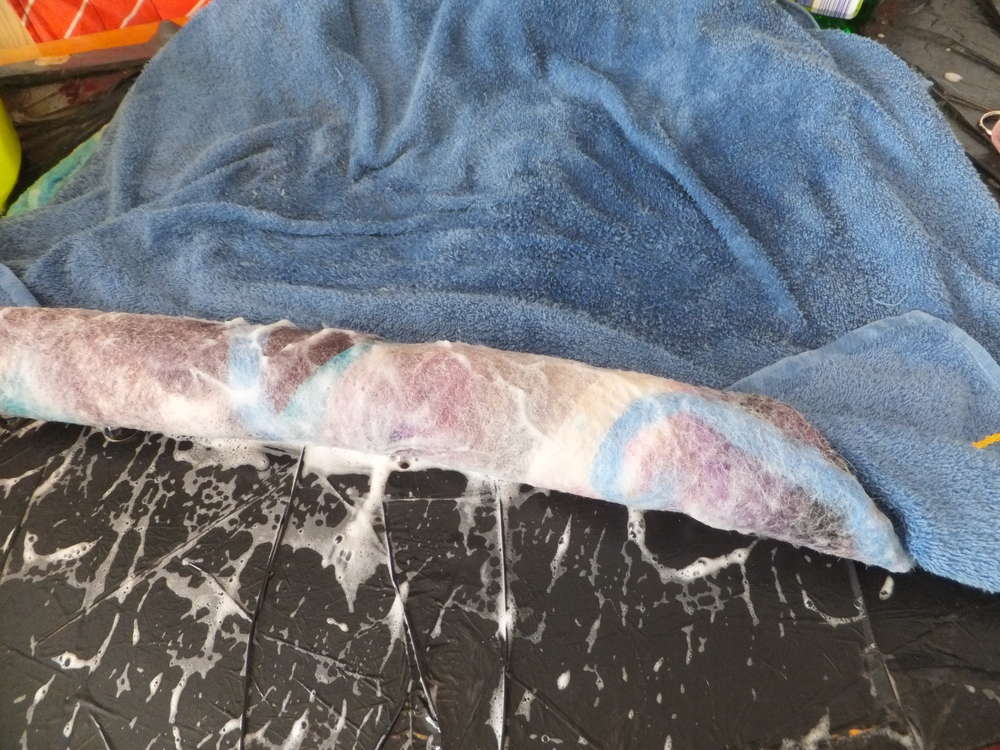

Jetzt kann das Walken und damit das Schrumpfen beginnen. Du kannst den Filz schmeißen und schlagen, kneten und reiben. Wenn du ihn rollst, achte darauf, dass du allen Seiten die gleiche Aufmerksamkeit zukommen lässt (ich nehme mir als Richtlinie für den Anfang immer 30 vor und Zurückbewegungen), sonst hast du eventuell ein total verschrobenes geschrumpftes Ding. Wenn du also rollst, dann immer beide Seiten und aus jeder Richtung. 

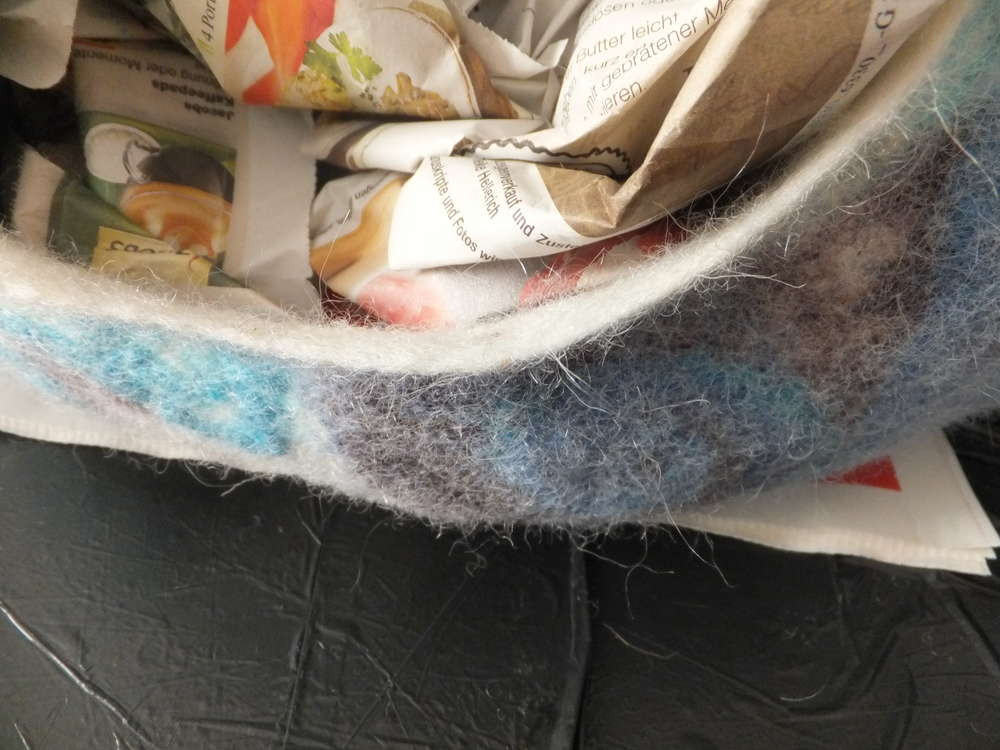

So, wenn du zufrieden bist und alles gut bearbeitet hast, dann geht es ans Ausspülen der Seife, neutralisiere die restkiche Seife noch mit Essig danach aber auch unbedingt gut ausspülen. Zum Schluss den Rand vom Loch in Form bringen und alles mit Zeitungspapier ausstopfen. Denk daran, wenn nasse Wolle in einer bestimmten Form trocknet, behält sie diese auch recht zuverlässig im trockenen Zustand. Also sorge dafür, dass es keine hässlichen ausgestopften Dellen gibt, wo keine sein sollen. Jetzt heißt es Warten.

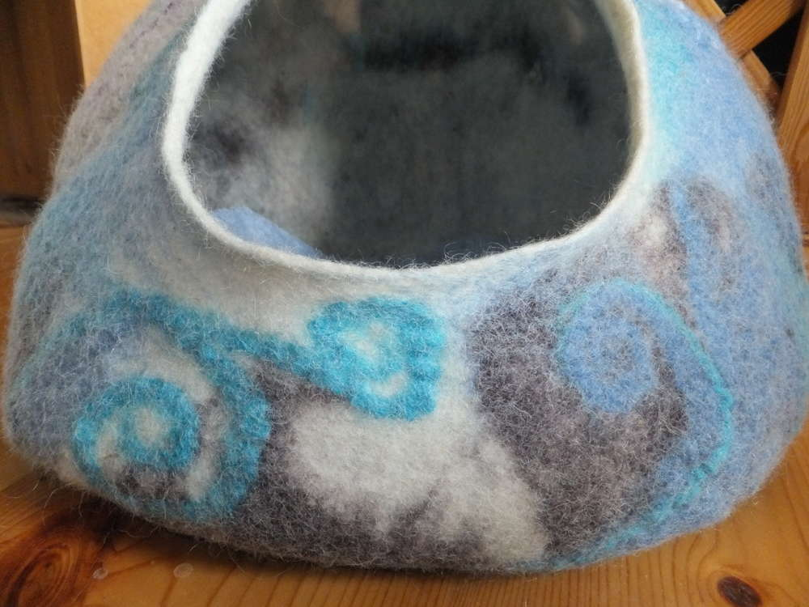

Und das Warten hat sich gelohnt. Hier ist sie meine Katzenhöhle für Katzen normaler Größe. Ich habe noch ein Handtuch als wechselbare Einlage hineingelegt und jetzt wartet diese Hütte auf einen Bewohner, mal schauen wann sich das ergibt.

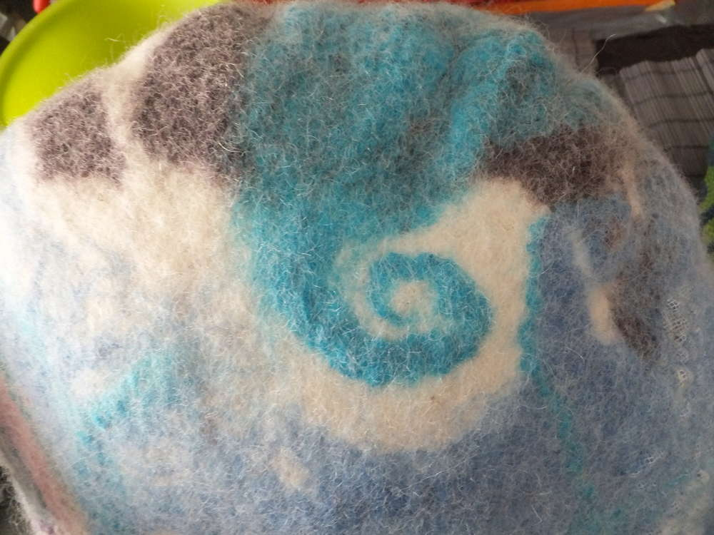
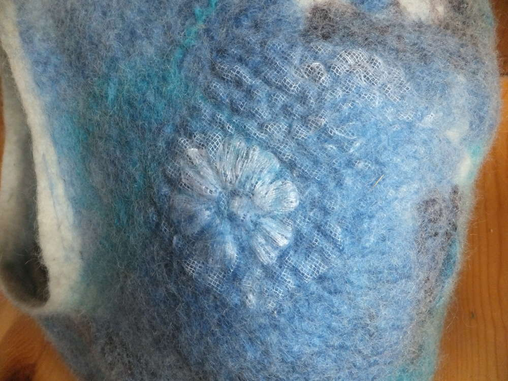
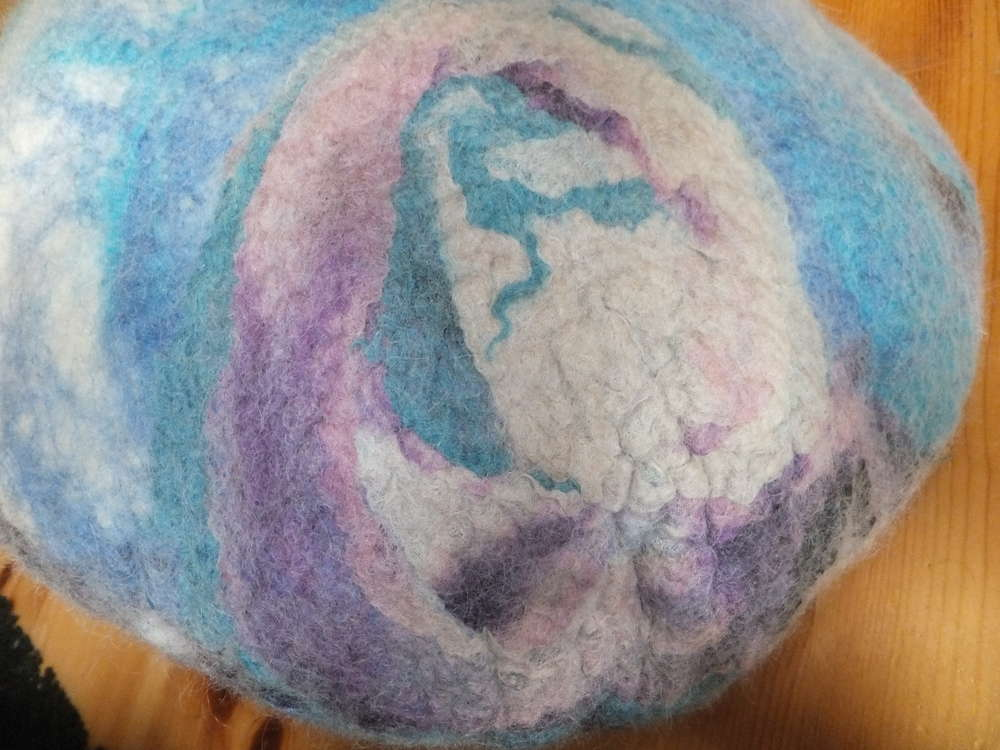
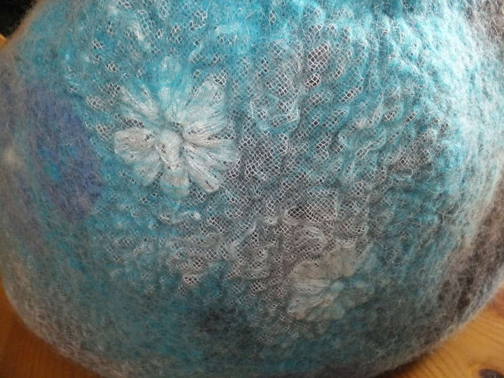

Hier noch Detailaufnahmen und frohes filzen. Ich freue mich wie immer über deine eigenen Schöpfungen, die du mit meiner Hilfe gemacht hast aber auch über Fragen und Anregungen.
