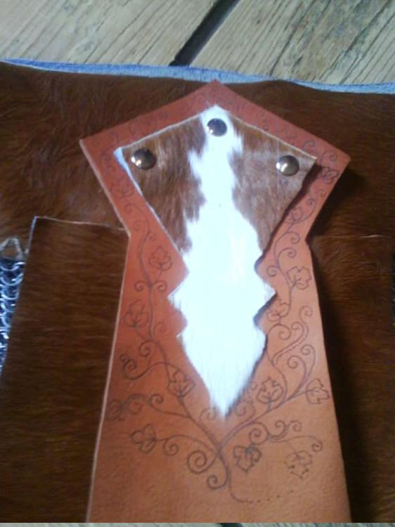

Eines meiner ersten Werkstücke, welches ziemlich viele verschiedene Arbeiten in sich vereint. Wofür braucht man sowas? Naja, der Rock sieht ziemlich genial aus und er rutscht nicht hoch soviel kann ich verraten. Na und wenn man sich einen kriegerischen Charakter bastelt fürs LARP, dann ist das eine angemessene Gewandung... ähh Rüstung für eine Frau. Auf der Innenseite der Lederstreifen sind Schutzrunen eingebrannt. Hier muss man Kettenringe verbinden, Nähen, Vernieten und bebrennen. Hey was für ein Aufwand ;)

