Wer brauchte nicht schon immer mal große, bunte Knöpfe in gaaaaanz bestimmten Farben? Vielleicht in eckig oder oval oder rund oder herzchenform???

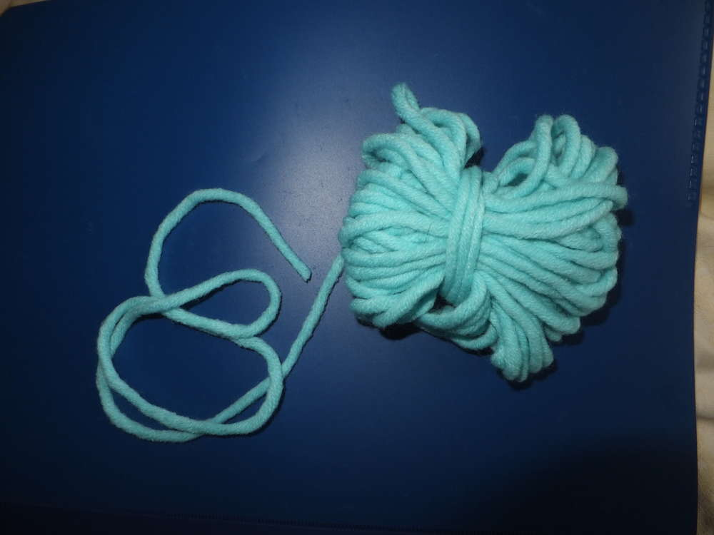

Du benötigst: Ringe (ich verwende alte Gardinenringe für große Knöpfe) oder eine beliebige Form (du kannst sie zum Beispiel auch aus dickem Draht selber machen), eine Nadel und Wollreste.

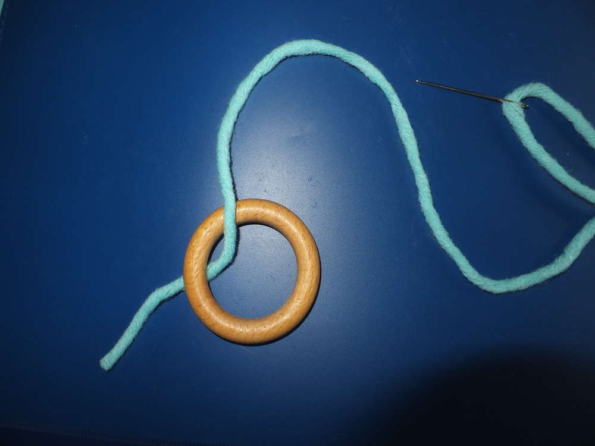

Du fädelst deine Wolle in das Nadelöhr ein und führst den Faden durch den Ring.

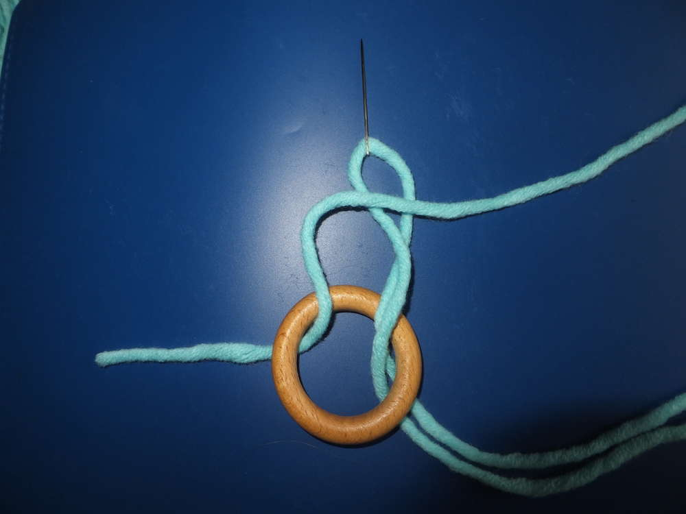

Stich mit der Nadel immer von unten nach oben durch den Ring und führe sie durch die Schlaufe. Diese Technik nennt man Langettenstich.

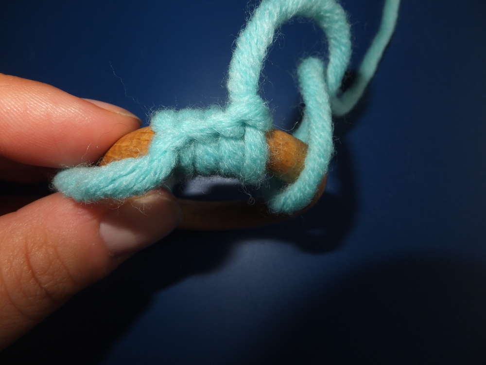
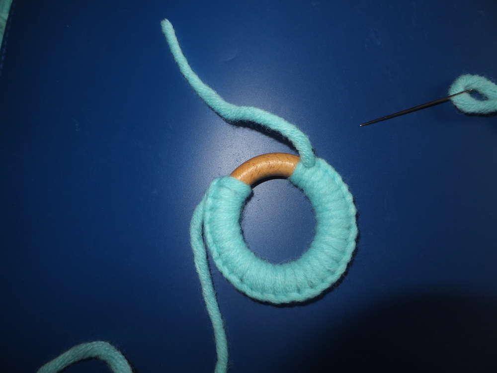

So sollte es bei dir aussehen. Du umwickelst mit dieser Technik den ganzen Ring.

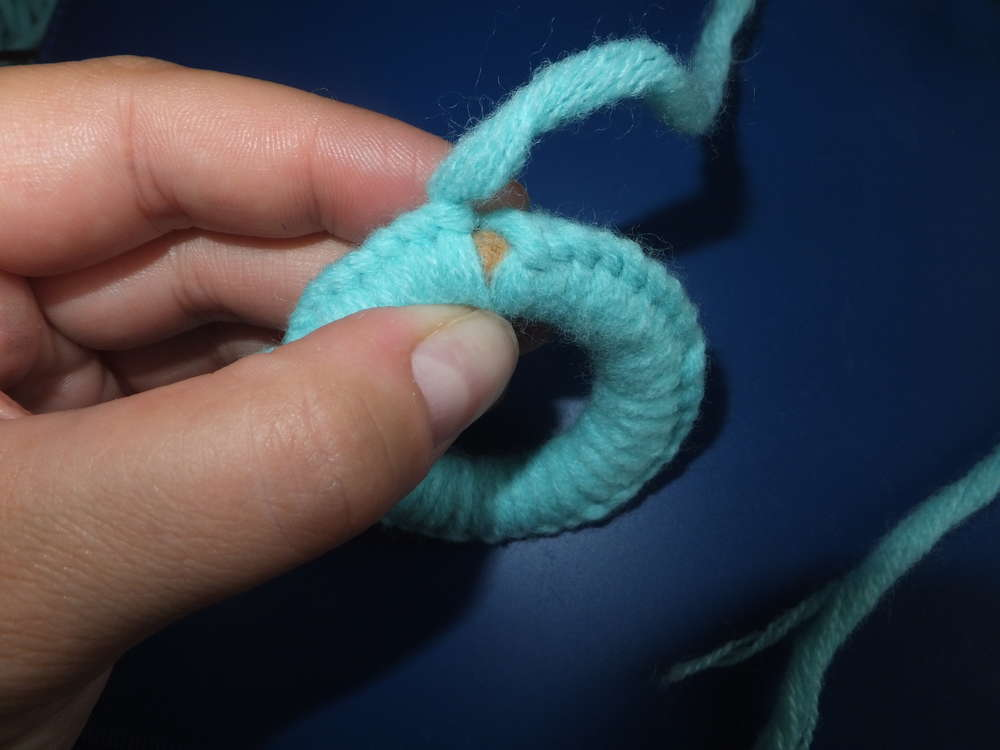

Um den Anfangsfaden zu vernähen, schlingst du ihn einmal um den Ring und umwickelst ihn mit dem Langettenstich bis der ganze Ring bedeckt ist.

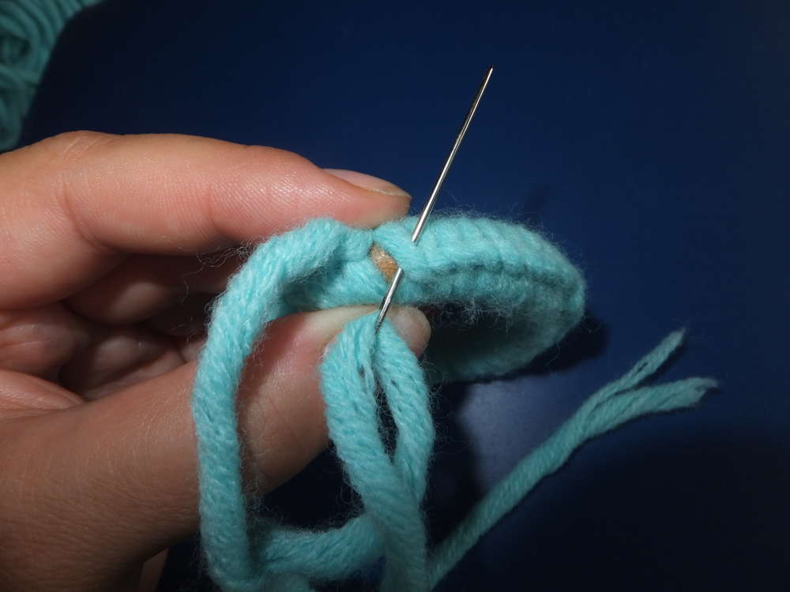
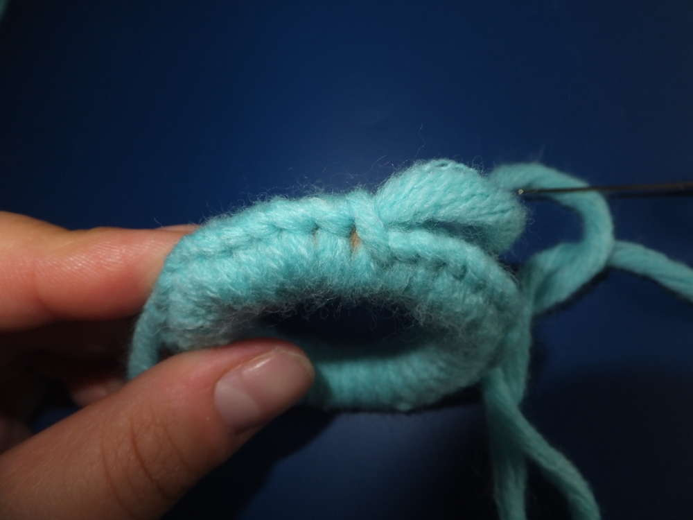

Zum Vernähen stichst du mit der Nadel in die erste Schlaufe und schließt das Umwickeln ab.

Drehe die äußere Kante nach innen, jetzt ist auch der Rest deines Fadens innen.

Du beginnst damit den Faden sternförmig innerhalb des Rings zu verteilen, nutze zur Befestigung die Stichkante. Achte darauf, dass dein Stern eine ungleiche Zackenanzahl hat, das ist wichtig für den nächsten Schritt. Dein Stern endet dort, wo du mit ihm begonnen hast, von dort aus führst du deinen Faden zur gegenüberliegenden Lücke zwischen den Zacken.

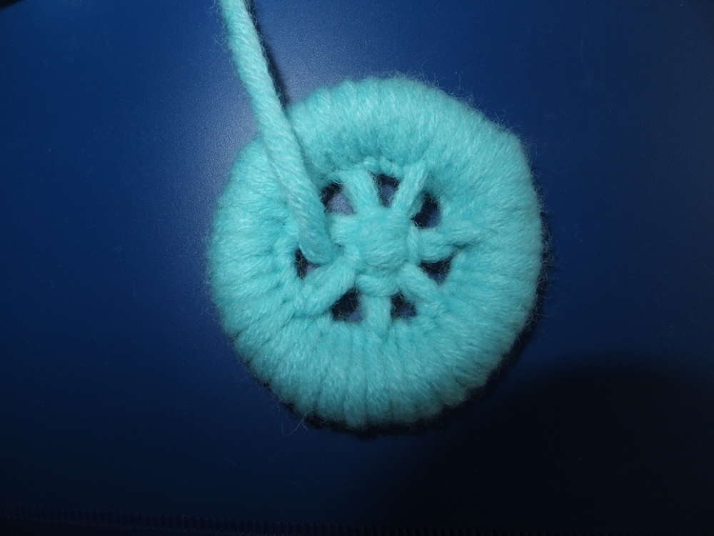
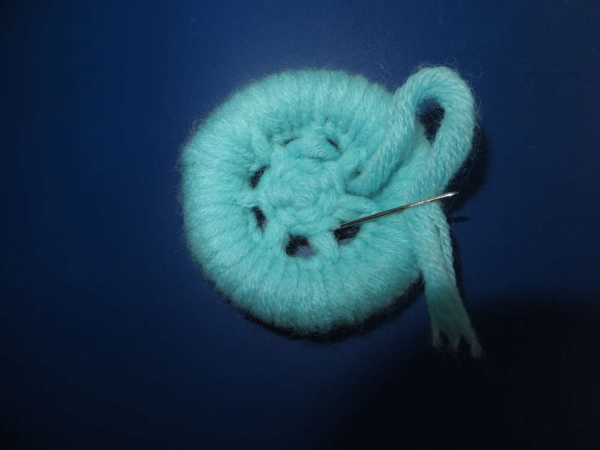
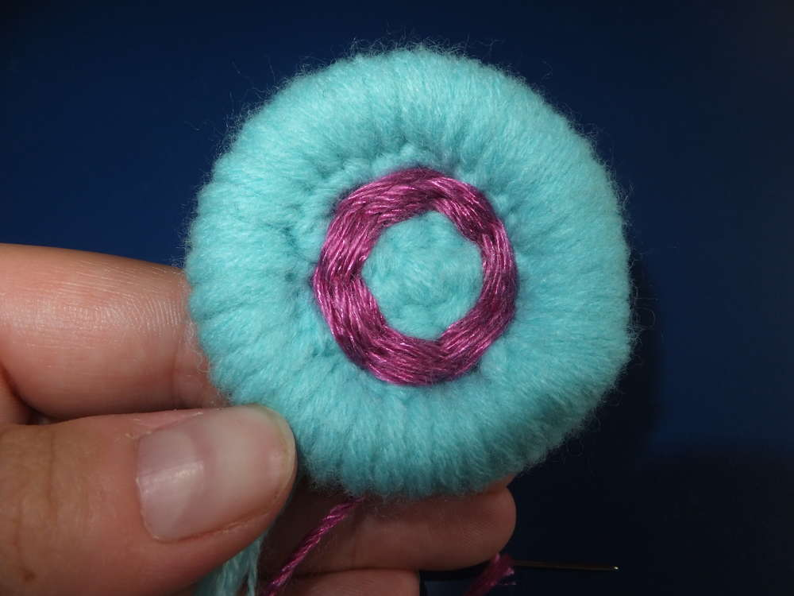

In dieser Lücke beginnt deine Webarbeit. Immer über einen Zacken drüber und drunter führst du deinen Faden, durch die ungleiche Zackenanzahl kann der Faden überlappend (wie Ziegel) die Webfläche bilden. So liegt in der ersten Runde der Faden beim ersten Zacken oben und bei der zweiten Runde unten. Du kannst Farbwechsel und andere kreative Ideen umsetzen, wie zum Beispiel Perlen mit einweben oder Lücken lassen und Fäden überspringen, lass deiner Kreativität freien Lauf.

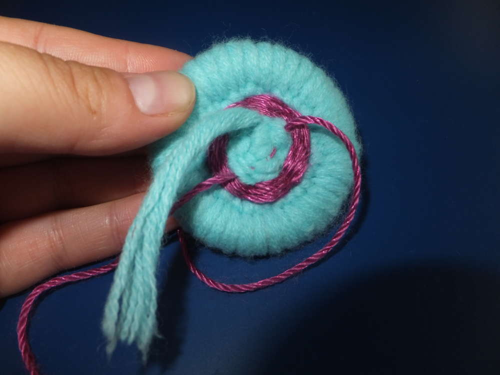

Die Fäden vernähst du mit einem großzügigen Überschuss, denn damit wird dein Knopf später festgenäht.

Und so toll können deine Knöpfe dann aussehen und die unterschiedlichsten Dinge aufpeppen.

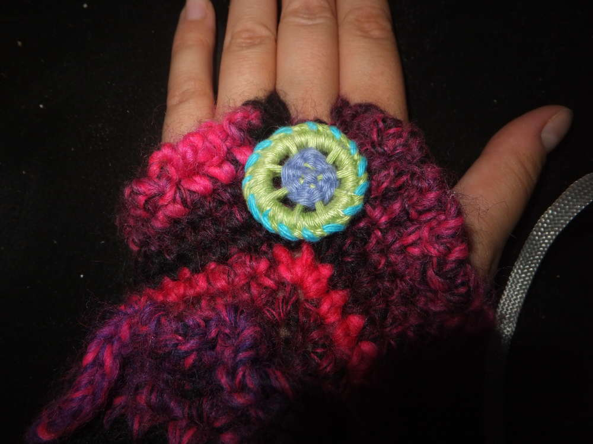
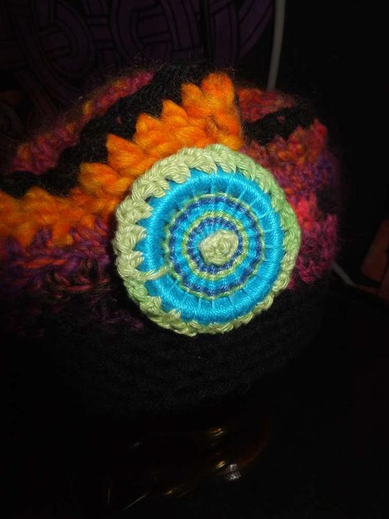
