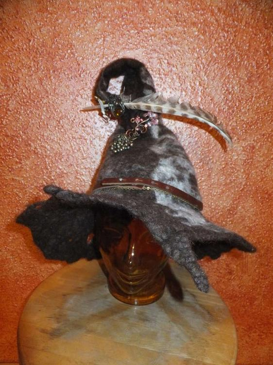
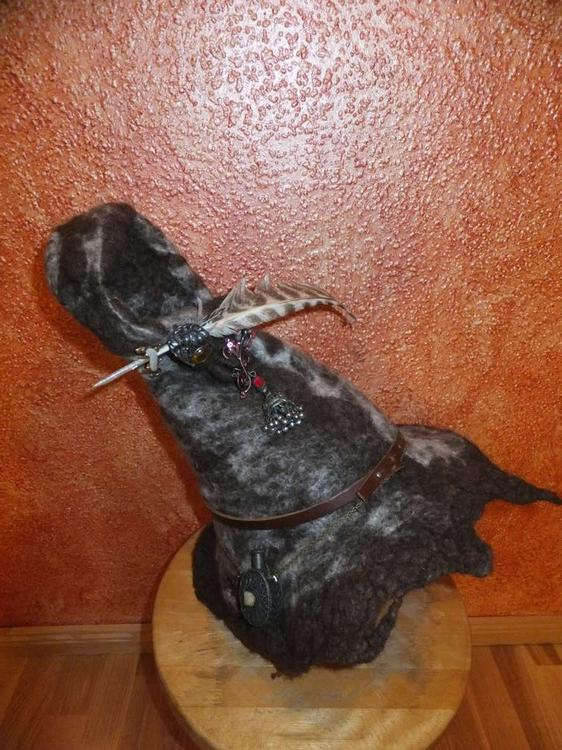
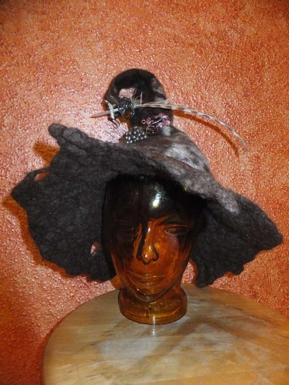
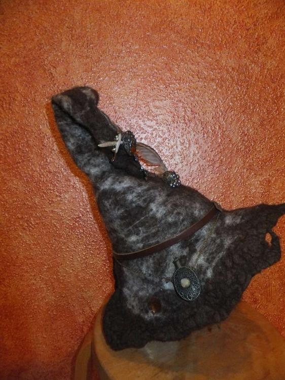
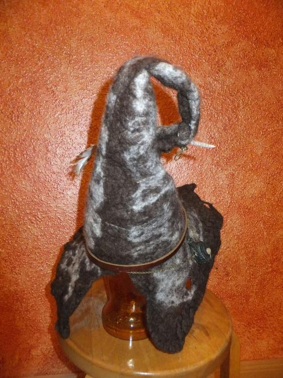

Also ich habe mich vorher noch nie an das Filzen herangetraut, und dann kam es über mich: zu viel freie Zeit und der Wille einen qualitativ hochwertigen Hexenhut zu haben, wie ich ihn mir immer vorgestellt habe.
Da ich über Umwege zum LARPen gekommen bin wusste ich, sollte der Hut was werden, was ich für einen Charakter erschaffen wollte - eine junge, leicht wollhysterische, verschrobene Hexe. 
Also ging es los, ich hielt mich an die Anleitung von meinem Buch. Ich wusste es nicht besser und nahm die Schafswolle, die ich noch hatte, sie war zwar schon gewaschen aber von der falschen Sorte, staubtrocken, brüchig und sehr widerspenstig. Nachdem ich mehrere Stunden per Hand gefiltz hatte, war meine Enttäuschung groß, die Hände schrumplig und die Knie wund (ich filze auf dem Boden...), der Hut wollte sich nicht verfilzen lassen und er war viel zu groß... 
ich resignierte und warf das bisher nur angefilzte Stück in die Waschmaschine, denn schlimmer konnte es nicht werden. Ich dachte im besten Fall an ein gefilztes Etwas, was ich dann eventuell noch anderweitig verwursten könnte. 
Umso überraschter war ich, als der Hut, der aus der Wäsche kam, ein ziemlich interessantes und individuelles Teil war. Als es auch noch wie für meinen Kopf geschaffen schien hat er mein Herz im Fluge erobert. Hinten hat die Krempe zwar einen Riss, aber dann kann ich wenigstens einen Zopf tragen... :)
