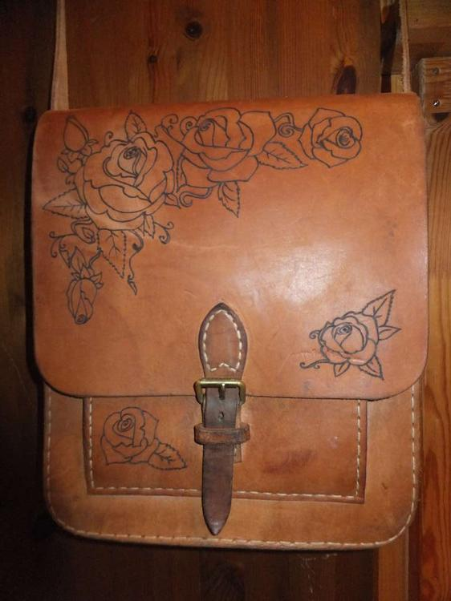
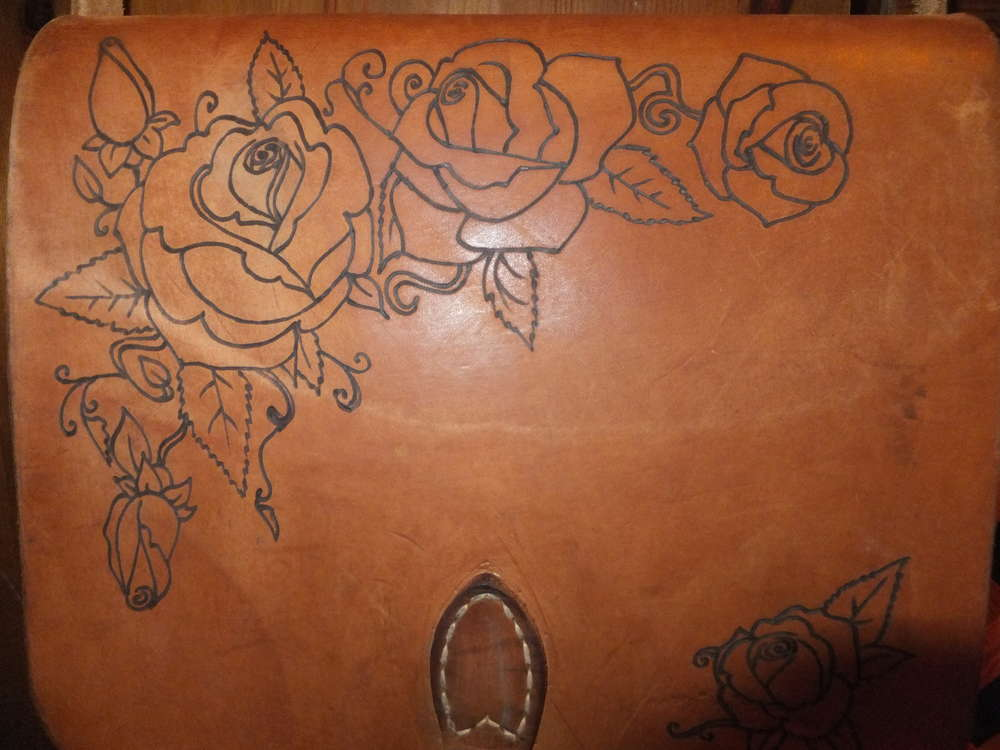
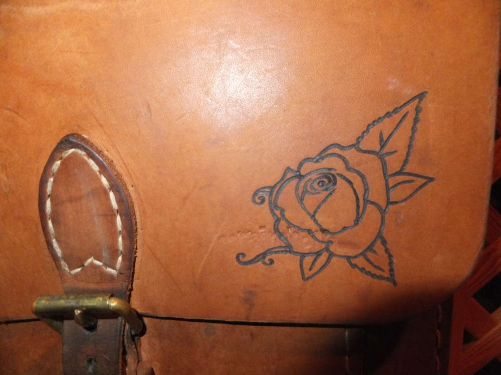
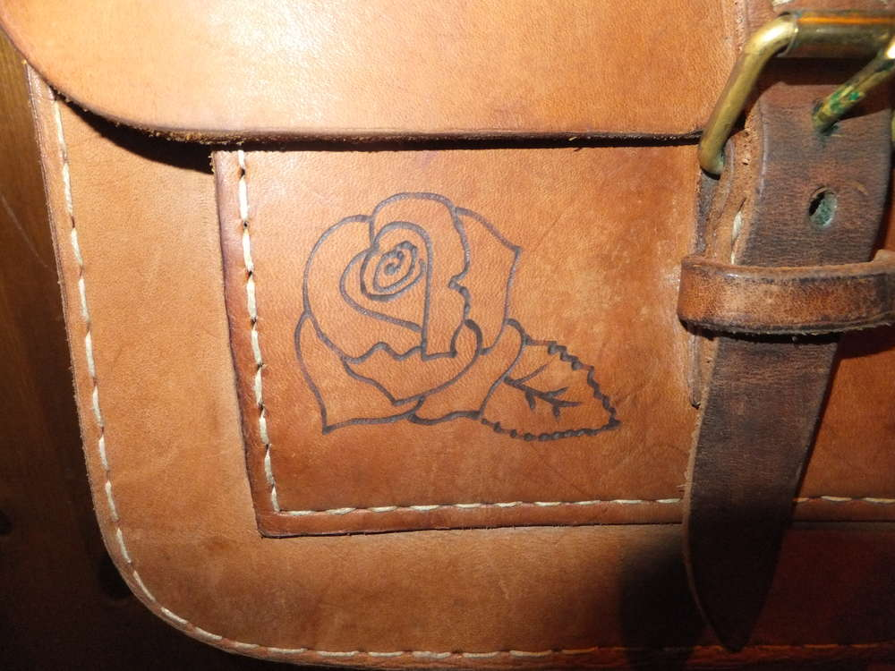

Neulich auf dem Flohmarkt... fand ich diese Ledertasche. Das Leder ist noch in einem guten Zustand und sie bot sich förmlich an für ein erneutes Branding. Da sprach das Mutti: "Och, ich wollt ja auch schon längst ne neue Tasche haben. Mit schönen Blumen oder so wäre die was für mich..." 

Na da haben wir uns doch direkt Zuhause hingesetzt und ein paar Blüten rausgesucht. 

Diese habe ich auf die Tasche übertragen und mit dem Brenner im Leder verewigt. Nun suchen wir noch nach einem schönen Spruch, den man zwischen den Rosen beginnen und auf der Rückseite der Tasche fortsetzen kann. Für Vorschläge bin ich offen. Mal schauen für was wir uns entscheiden und wann Mutti mit der fertigen Tasche losziehen kann. Die fertige Tasche werde ich dann noch mit Fotos ergänzen.

