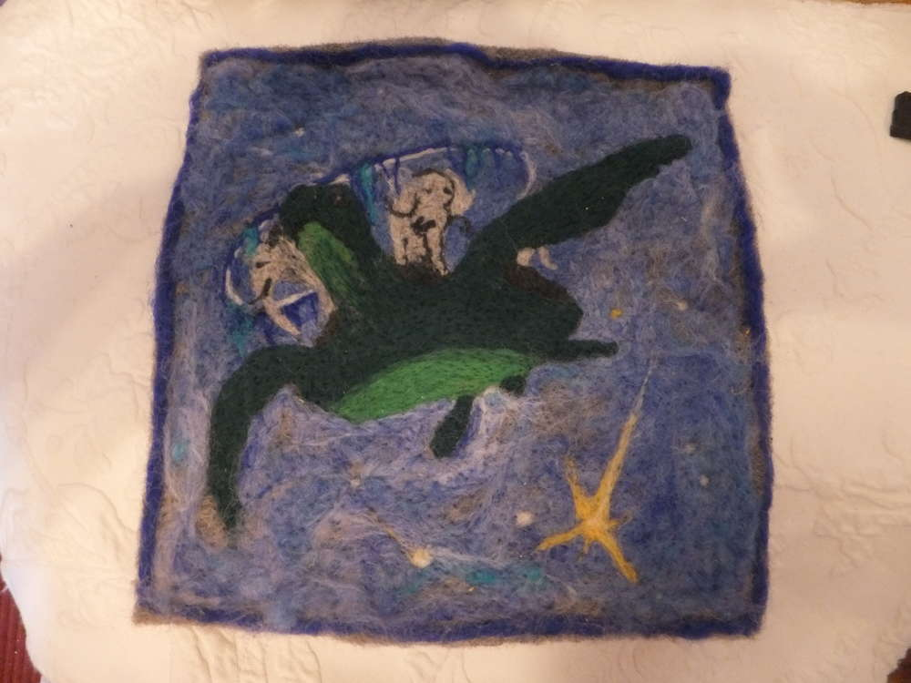
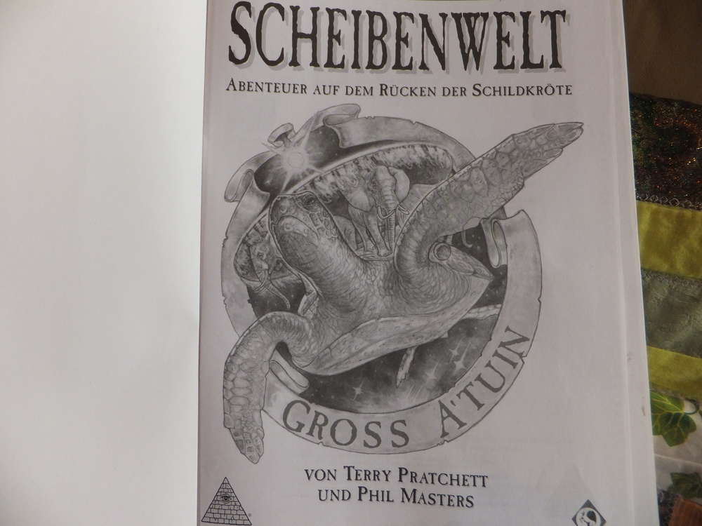
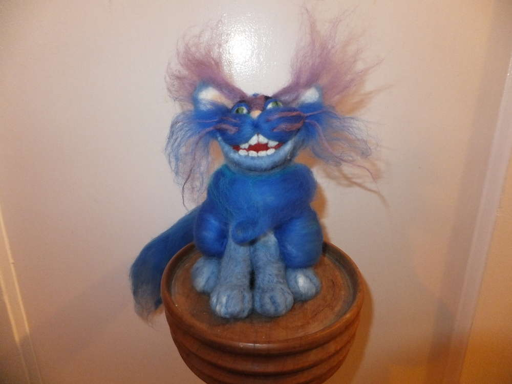
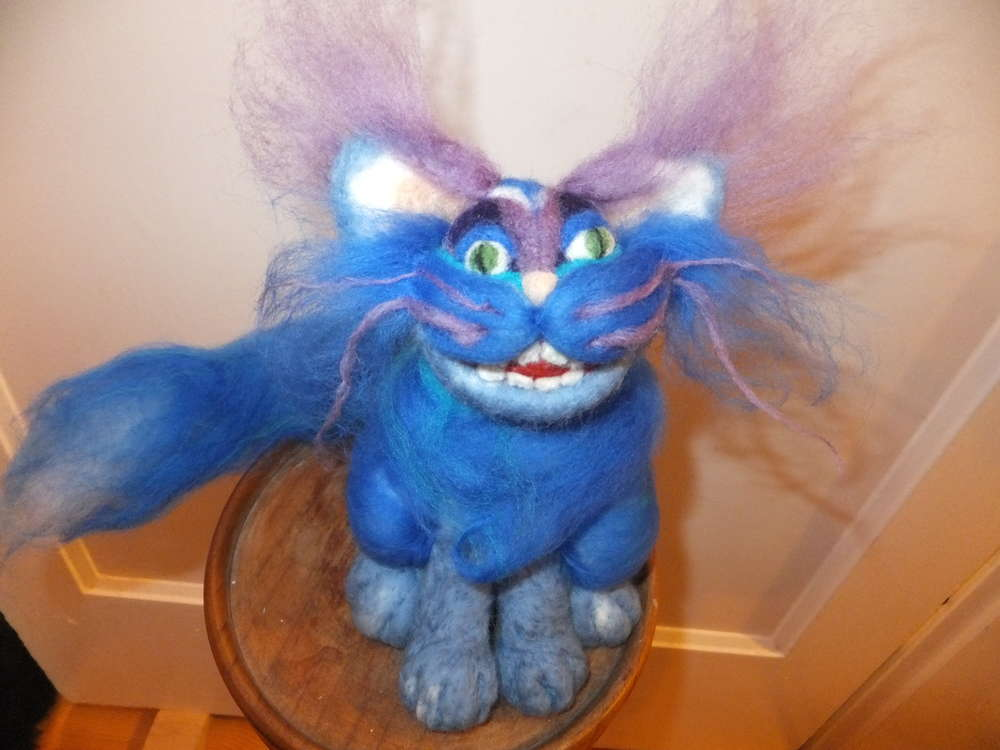
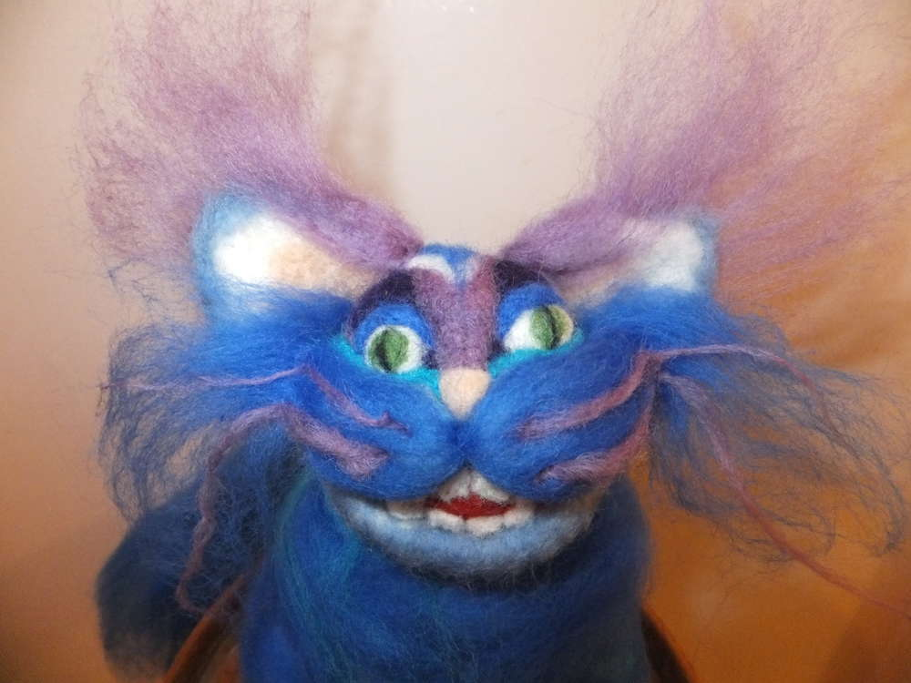
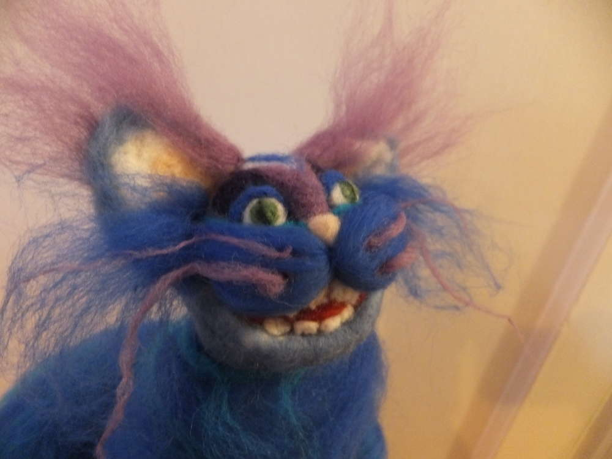
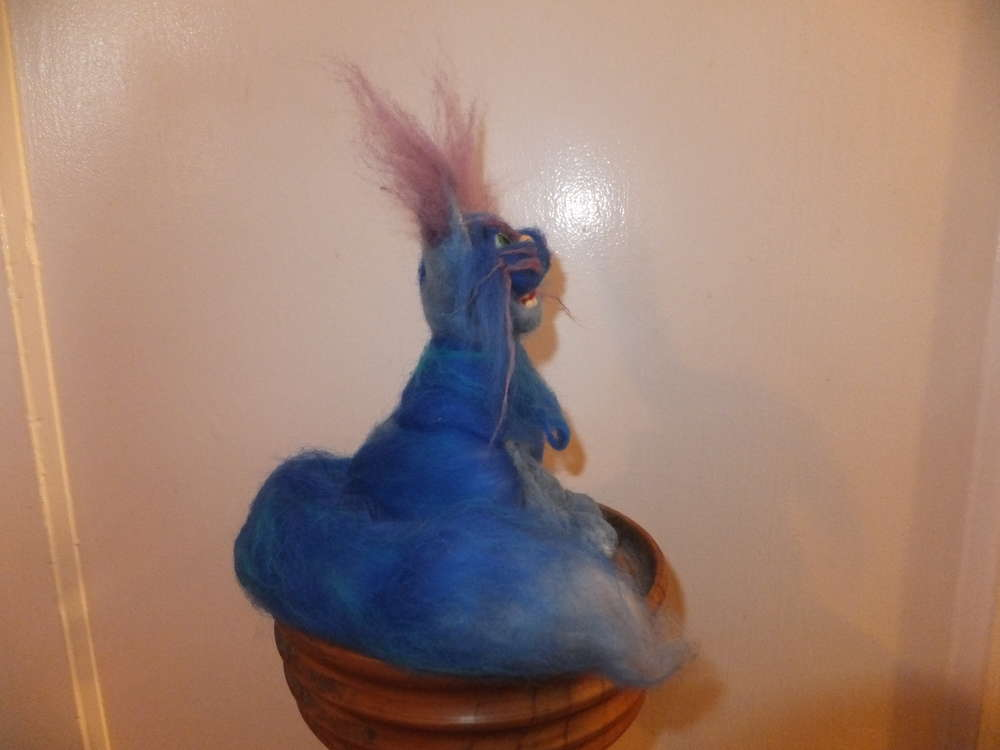
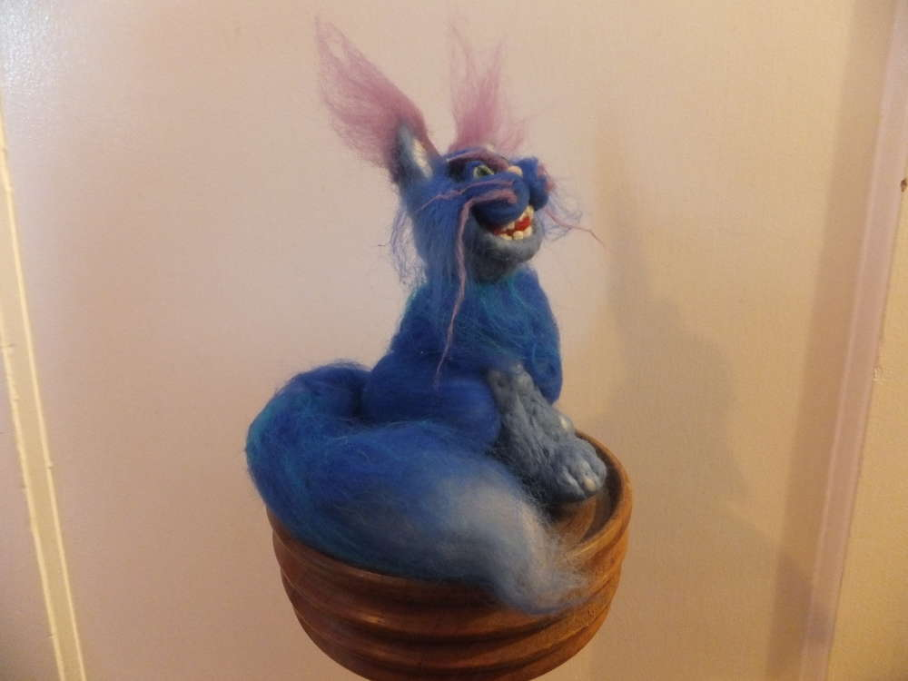
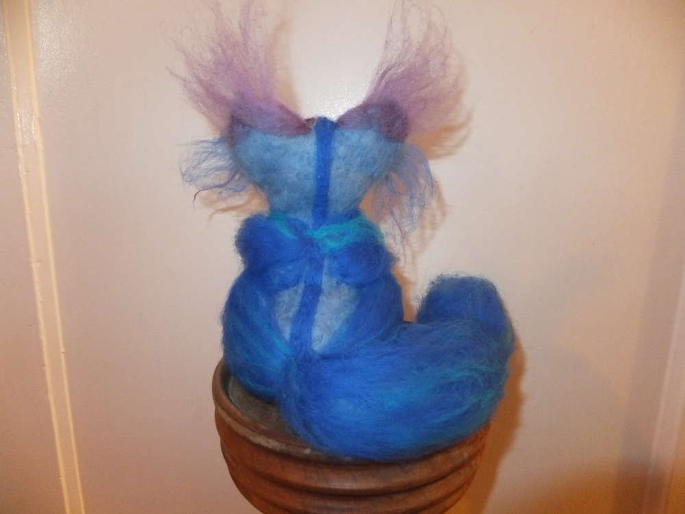
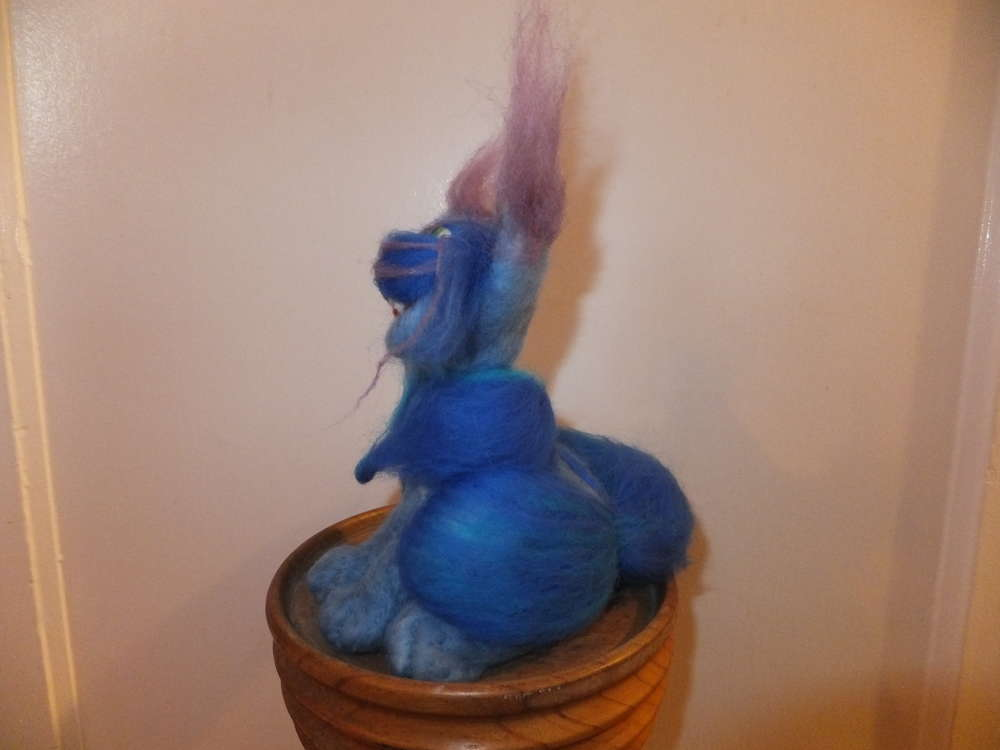

Irgendwie muss ich das wohl noch üben. Mein erster Nadelfilzversuch sollte ein Bild werden. Die Scheibenwelt kann man - so - naja - irgendwie - ein bisschen erkennen, wenn man es kennt und viel dazu interpretiert. Habe auch die falschen Nadeln benutzt, aber das muss man am Anfang auch erstmal wissen.

Und trotz des ersten missglückten Versuches, habe ich mich beim zweiten Mal an etwas noch Schwereres herangewagt um mich dann selbst zu enttäuschen. Also wer sich das Ding, das mal eine Grinsekatze werden sollte, anschaut, der sieht allerhand Baustellen... zählen wir sie nicht auf. Ich muss auch gestehen, zum Ende hin hatte ich keine große Lust mehr weiterzumachen, weil ich das Gefühl hatte alles nur schlimmer zu machen. Beim nächsten Mal werde ich Vieles anders machen, aber aus Fehlern lernt man ja bekanntlich. Möchte sich jemand diesem äh Tierchen erbarmen? Der schicke mir eine Mail zwecks Adoption. :)

Einen schönen Sonntag, Eure Ermeline.
