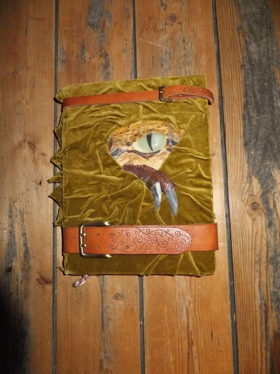
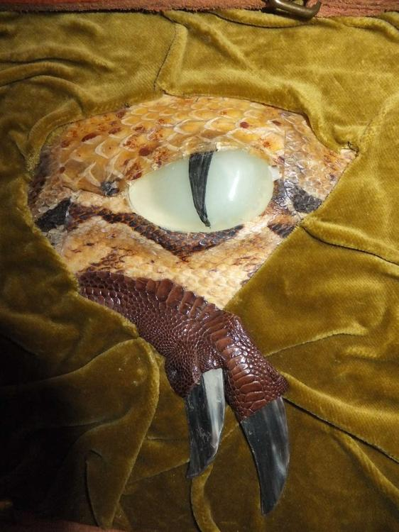

Ich wollte selbst immer einen dicken Wälzer haben, mit dem ich auffallen würde. Nach langandauerndem Binden und Kleben ist dann endlich mein Büchlein fertig geworden. Das Auge ist ein Leuchtstein (er speichert das Licht und im Dunkeln leuchtet er) den ich in eine alte Schlangenhaut eingearbeitet (mit tonnenweise Leim), in eine zurechtgeschnitzte Holzform eingelassen und danach auf eine Sperrholzplatte aufgeklebt habe. Nachdem das Auge getrocknet war, habe ich aus einem zersplitterten Horn die Krallen geschnitzt und habe ein Hühnerbeinlederstück als Drachenklauenhaut genutzt. Den faltigen Samtstoff habe ich mittels Leim, der auf die Holzplatte aufgestrichen wurde, erzielt. Bevor der Stoff darauf antrocknet muss man ihn in Falten ziehen und sich zurecht modellieren. Zum Schluss sperren wir das Untier noch im Buch ein und legen dicke Lederschnallen darum. Irgendwie eine Mischung aus dem Buch aus "Hokus Pokus", dem "Monsterbuch der Monster" und meiner eigenen Interpretation.
