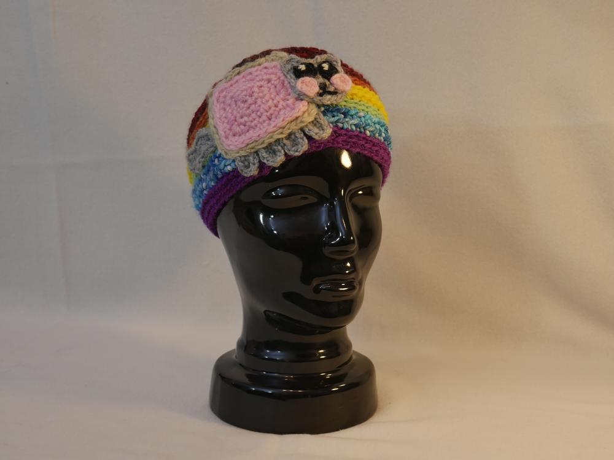
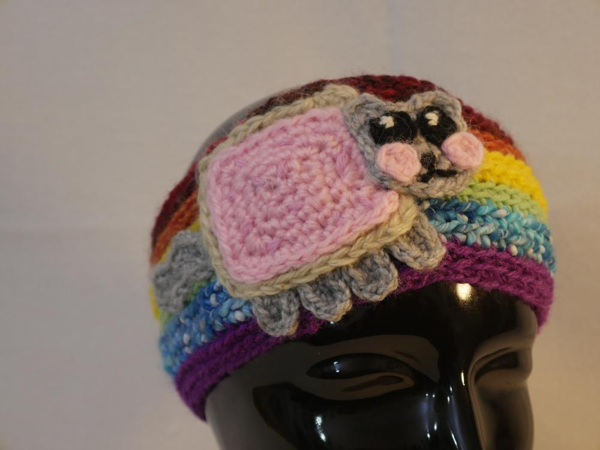
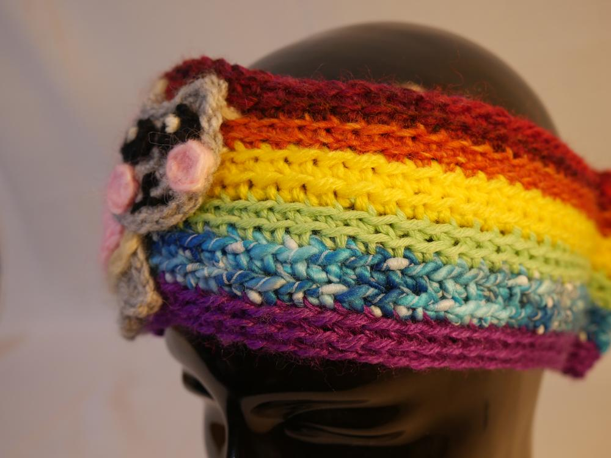
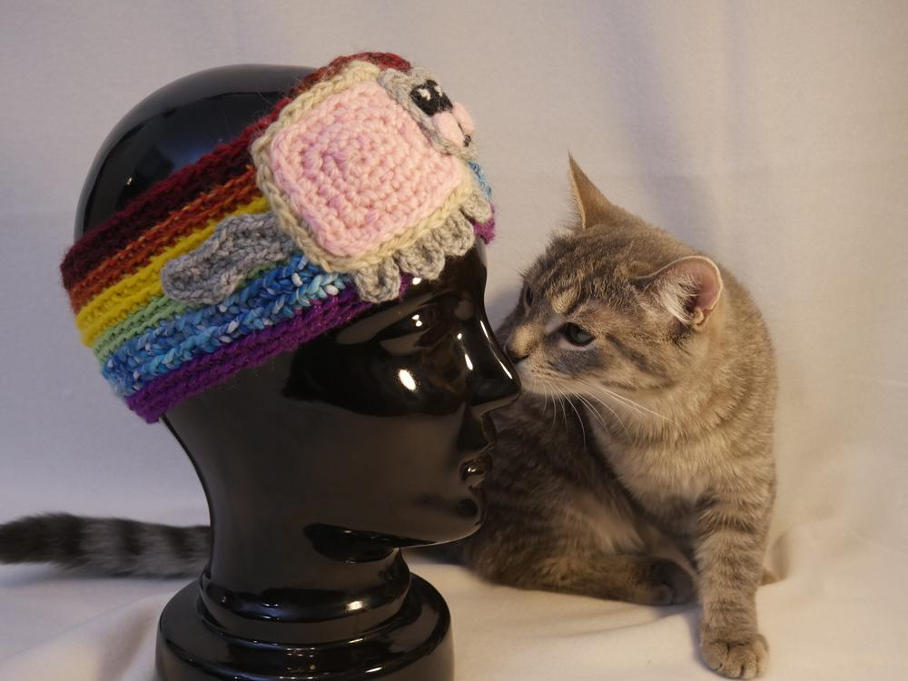
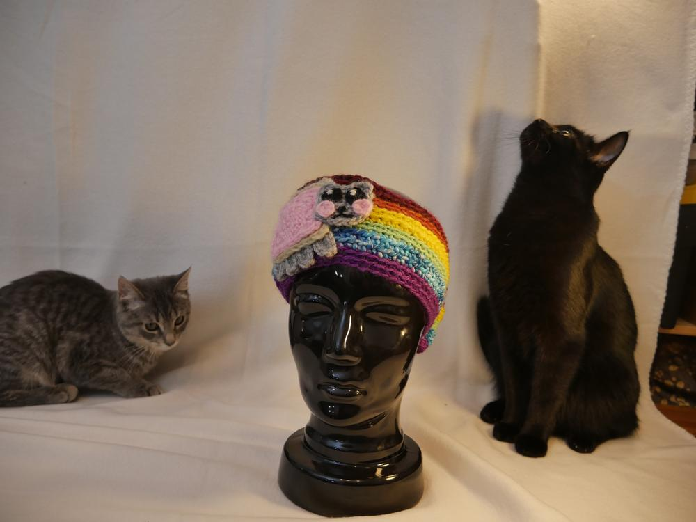
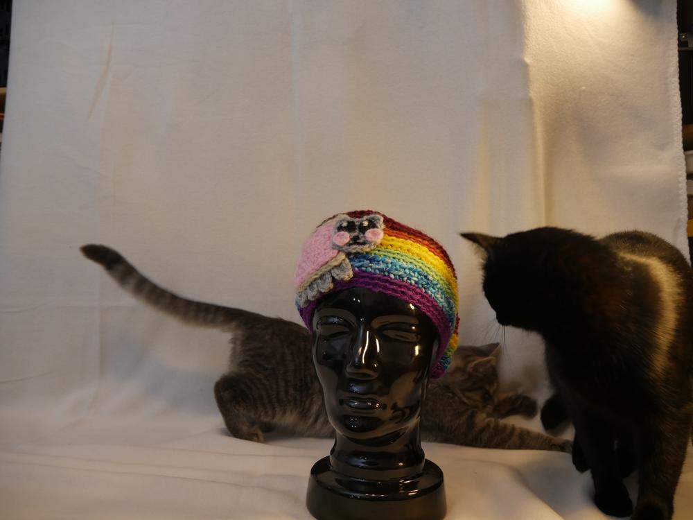
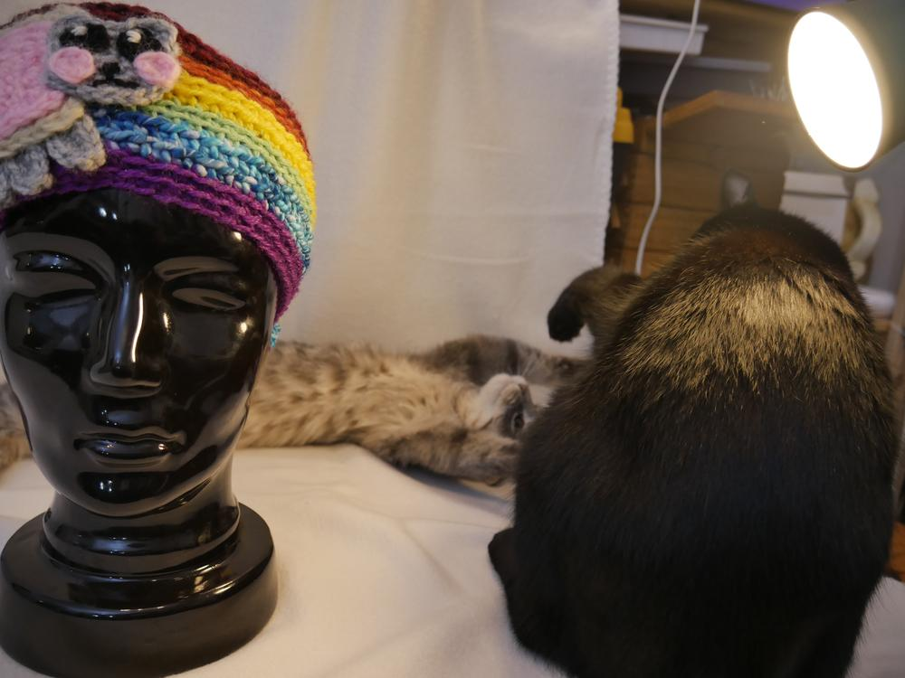

Zu dieser Jahreszeit passen Regenbögen sehr gut, denn sie machen wieder fröhlich, wenn alles grau ist. Kann man ja mal wirklich gut gebrauchen, wenn der Winter weiterhin nicht hält was er versprechen sollte. Was passt da besser als die NyanCat, die einem als Stirnband den Kopf warm hält? 

Einfach mal wild drauf los gehäkelt und zusammengenäht, passt schon so. Anleitung gibt es nicht wirklich aber für den etwas Häkelbegabten dürfte auch dieses kleine Werk keine Zauberei sein. Ich habe hier viele verschiedene Reste und Wollarten verwendet. 

Und wie man an den Bildern sieht, beide Katzis haben ihre große Freude meine Bilder zu fotobomben. Wenn die beiden nun noch ein Regebogenhalsband hätten, wären 3 NyanCats auf dem Bild. I wish you an "Everythings-Better-With-Cats-Sunday".
