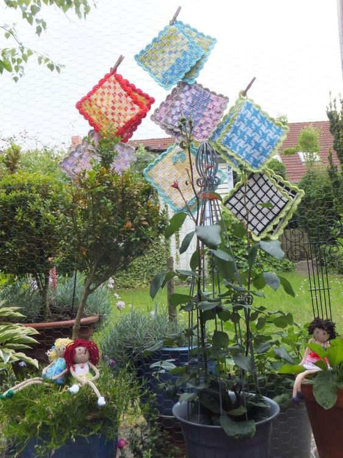

Nach Vollendung eines so großen Projekts wie einer Wolldecke, fertige ich zur Entspannung dann gerne mal kleinere Teile wie z.B. Topflappen aus Baumwolle (natürlich wieder im Doppelstrick, denn wir wollen uns ja nicht die zarten Fingerchen verbrennen), oder diese niedlichen Püppchen an.  

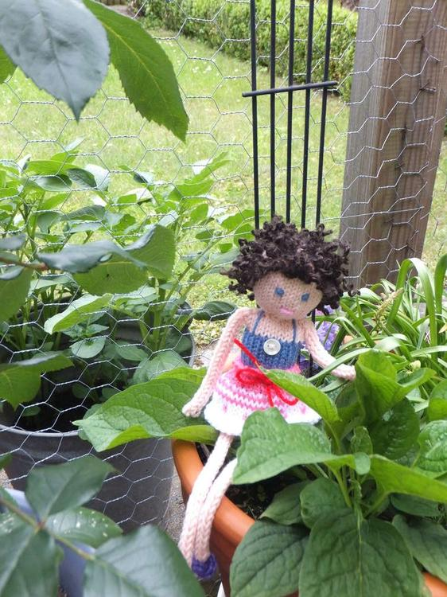
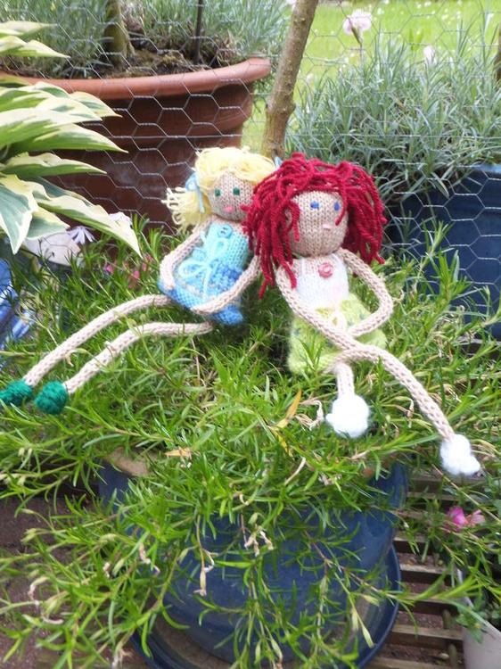
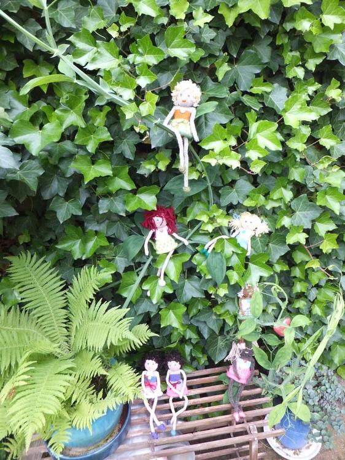
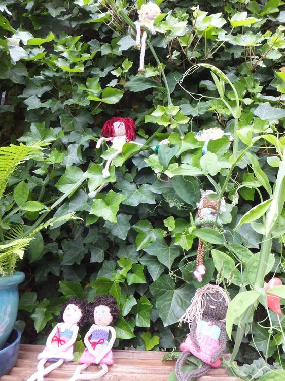
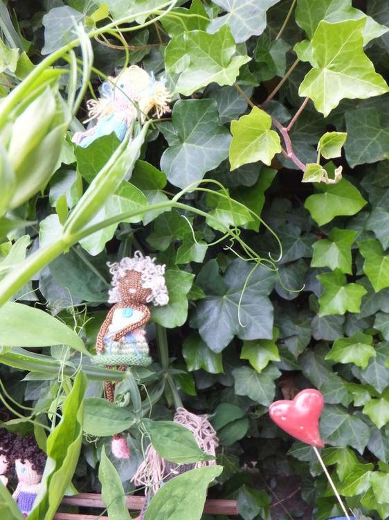
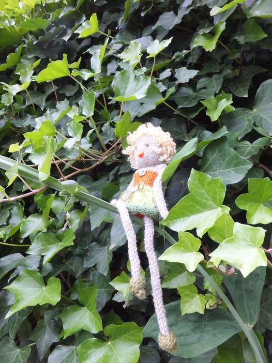
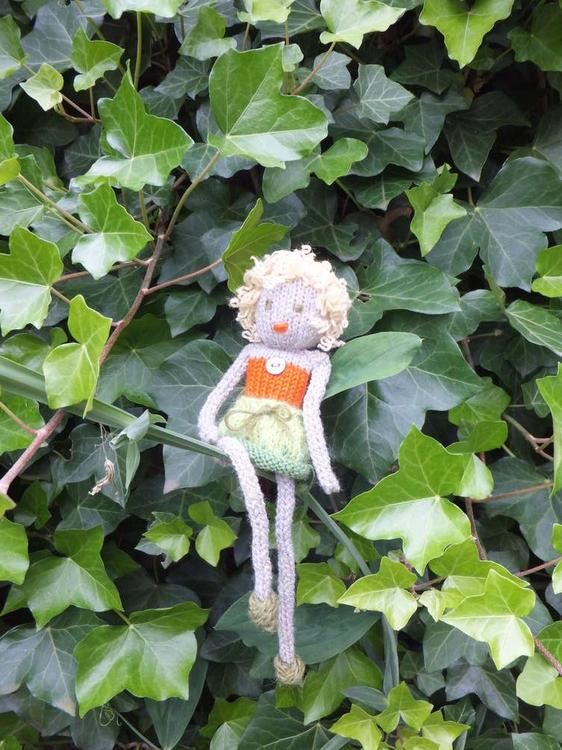

Erst Arme und Beine auf der guten alten Strickliesel arbeiten (bitte Maschen zählen, sonst werden die Beine ungleich lang, und die Süßen bekommen womöglich einen Haltungsschaden). Der Körper wird rundgestrickt (Nadelspiel), erst in der Farbe des Bodies, dann noch 3 - 4 Runden in Hautfarbe. Oben zusammennähen, von unten mit Füllwatte ausstopfen und dann zunähen. Wem das zu unanständig ist, der kann den Körper auch von oben ausstopfen. Den Kopf wieder rundstricken: 2x die anfänglichen 8M. verdoppeln (32M.) und nach 18 Runden genauso wieder abnehmen. Vorher stickt man noch Mund und Augen auf und stopft Füllwatte hinein, bevor man die letzten Maschen zusammenzieht. Tja, nun alle Teile dort annähen, wo sie deiner Meinung nach hingehören, ein kleines Röckchen mit nettem Muster stricken und als Gürtel einen Faden durchziehen. Für die Haare ziehe ich mit der Häkelnadel Wollschnipsel (ca. 10 cm lang) durch die Kopfhaut. Doppelknoten rein und je dichter man knüpft, desto wuscheliger wird die Frisur. Ist etwas fummelig, bringt aber viel Spaß.  

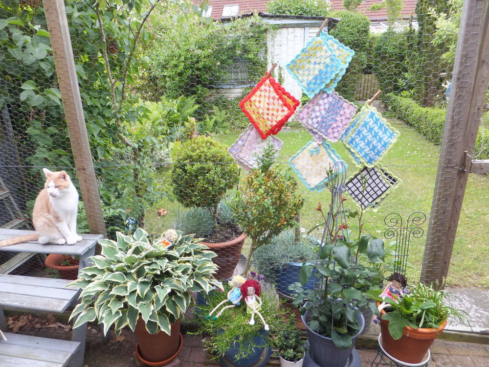

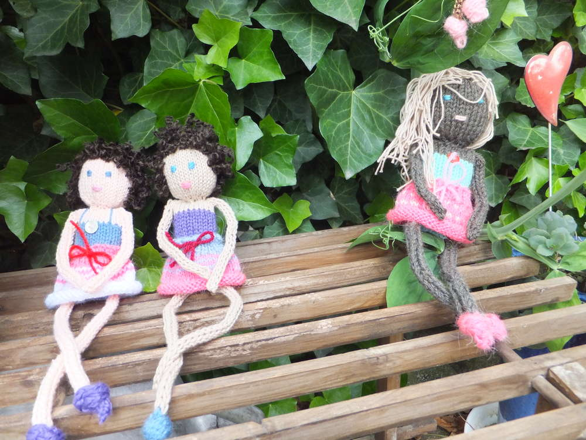
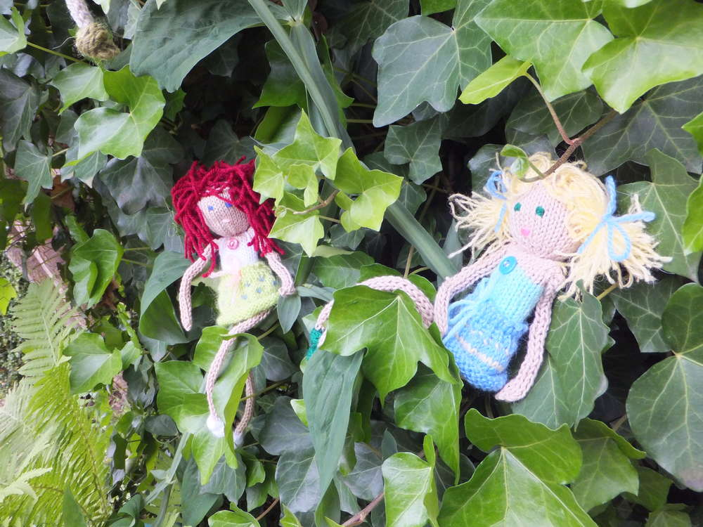
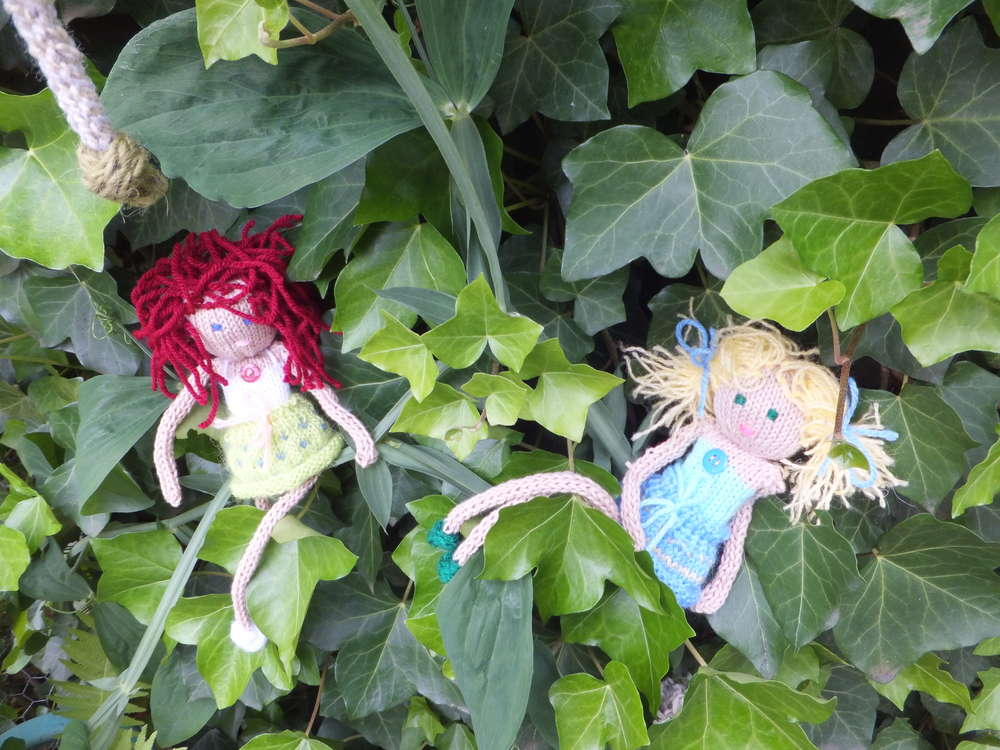

 
