Sowohl für Walpurgis brauchte ich einen neuen Hut, als auch für Katherie meinen LARP-Charakter, eine Schreiberin. Das ist das Ergebnis, ein eigentlich recht normaler Hut, jedoch mit der rollenspieltauglichen Möglichkeit auch im Dunkeln schreiben zu können und der stets verfügbaren Tafel mitsamt Kreide.

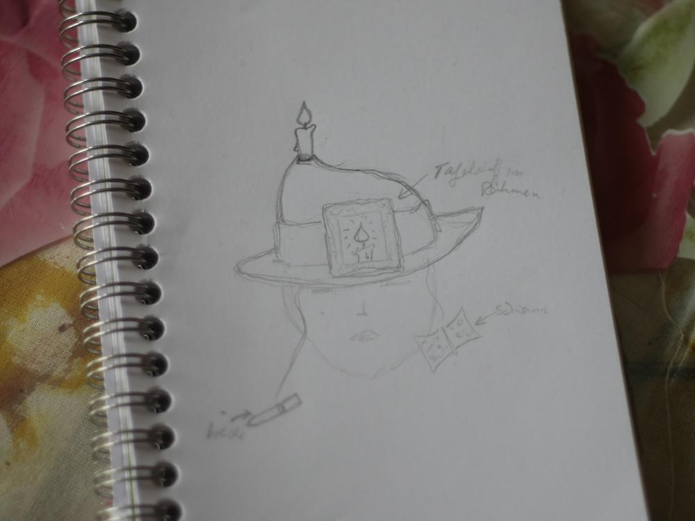

Im kleinen Bilderrahmen ist ein Stück Tafelstoff eingespannt, diesen konntet ihr schon im [Osterpost](/2017/04/osterfilzen/) in der Geschenkesammlung sehen. Dies dürfte der erste Einsatz sein. Der ursprüngliche Bilderrahmen war leider viel zu groß, ich ersetzte ihn durch einen Kleineren.

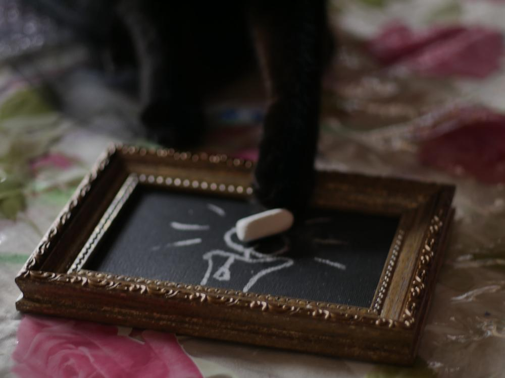
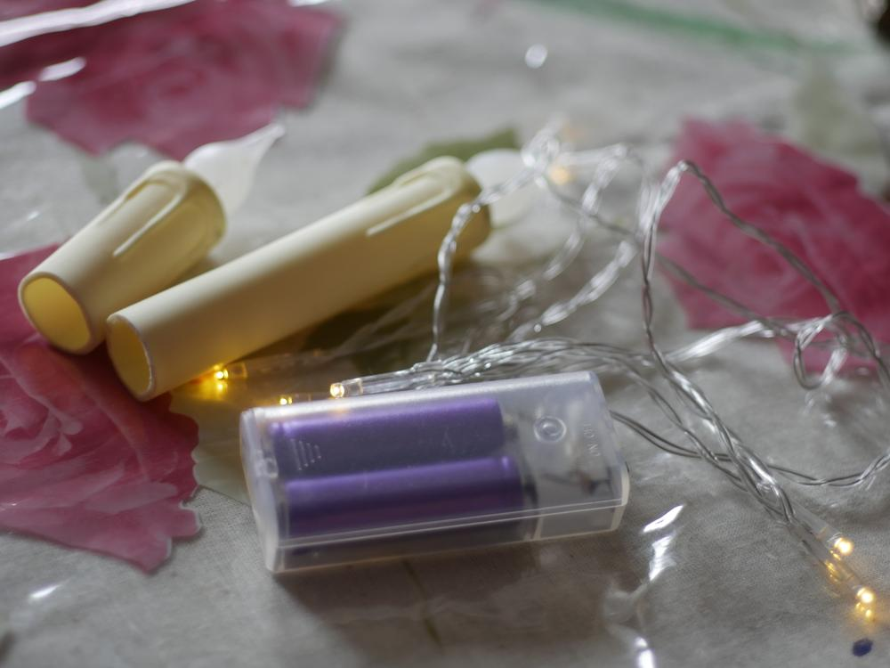

Hier noch ein paar Eindrücke vom Filzprozess.

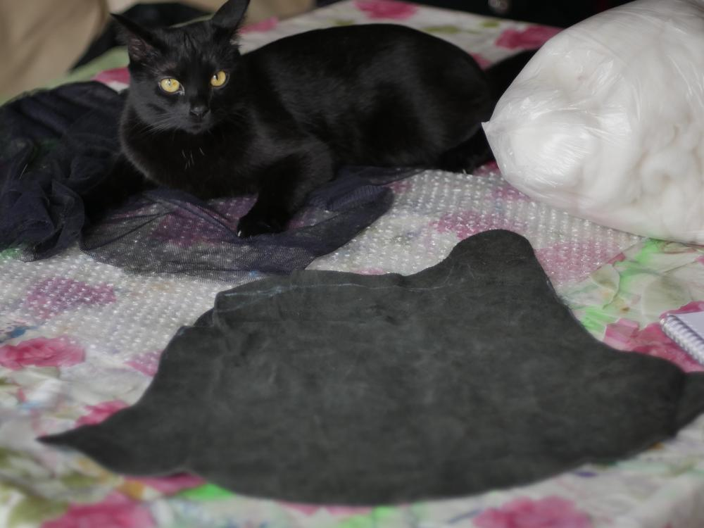
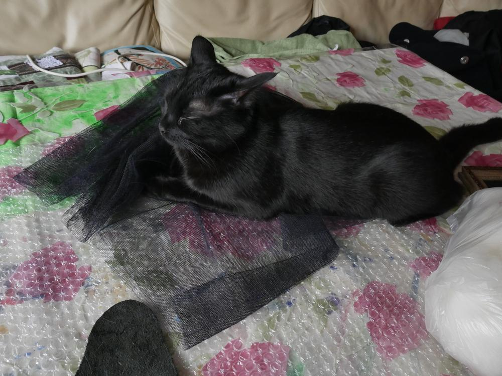
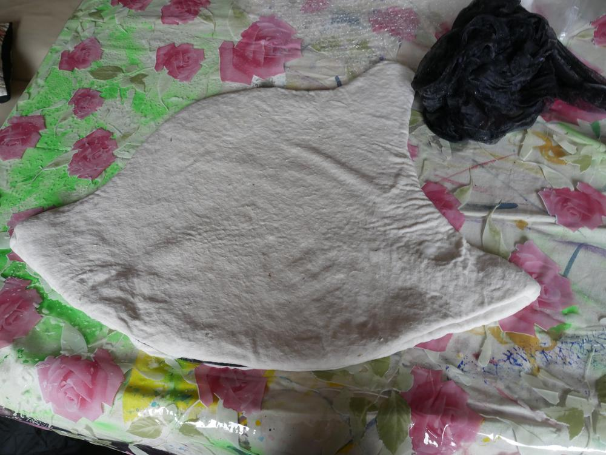

Alles in allem erinnert er mich an einen Sommerhut kombiniert mit einem Grubenhelm. Eine tolle Kombi, die schlicht genug und doch andersartig genung ist um bei den Bewahrern des Gleichgewichts nicht aufzufallen oder vielleicht gerade um als ein Bewahrer aufzufallen. Und auch hier ist es mal wieder gut, dass ich eine riesige Kiste mit Borten habe, an diesem Hut befindet sich eine 10cm breite Sariborte. In der Kreidebox verbirgt sich die Stromversorgung der Kerzen. Jetzt muss ich nur noch neue Kreide kaufen, habe nix mehr da, außer einem winzigen Stück. Die Flammen der Kerzen habe ich aus Heißkleber modelliert, da die alten LED in den Kerzen zu dunkel waren, habe ich sie durch eine LED-Lichterkette ersetzt, diese passten dann aber nicht mehr in die alten Flammen.

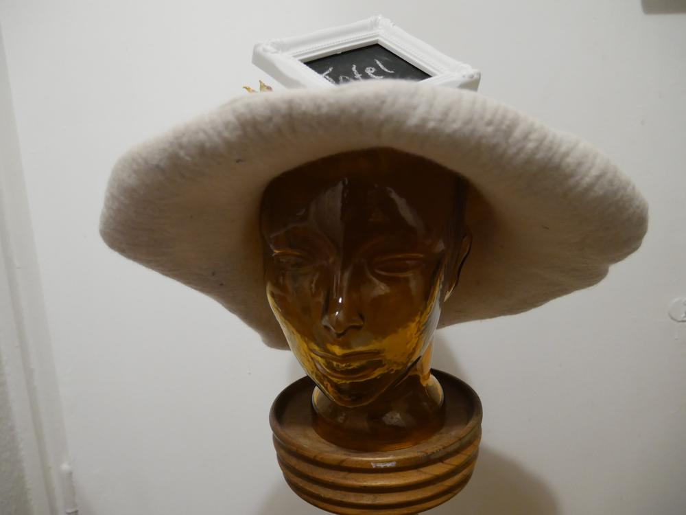
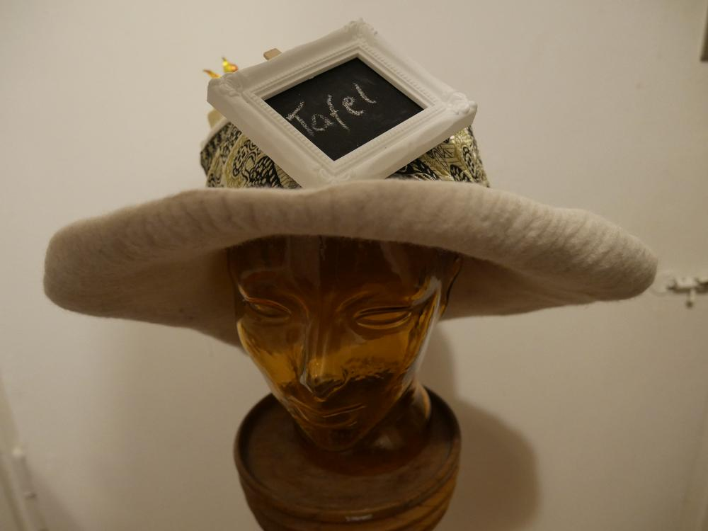
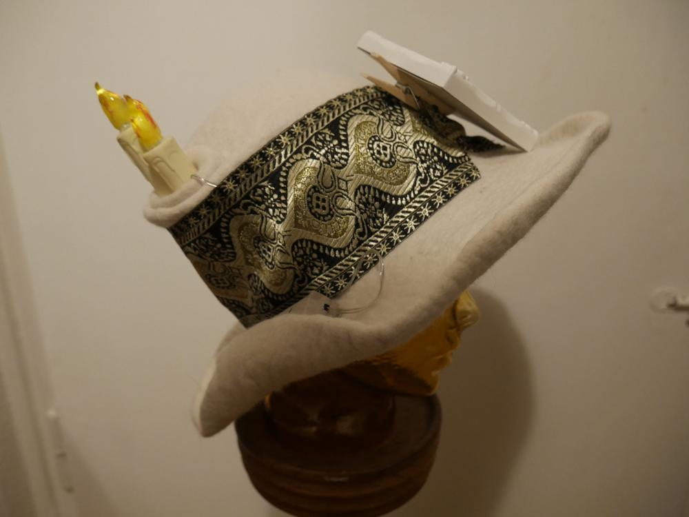
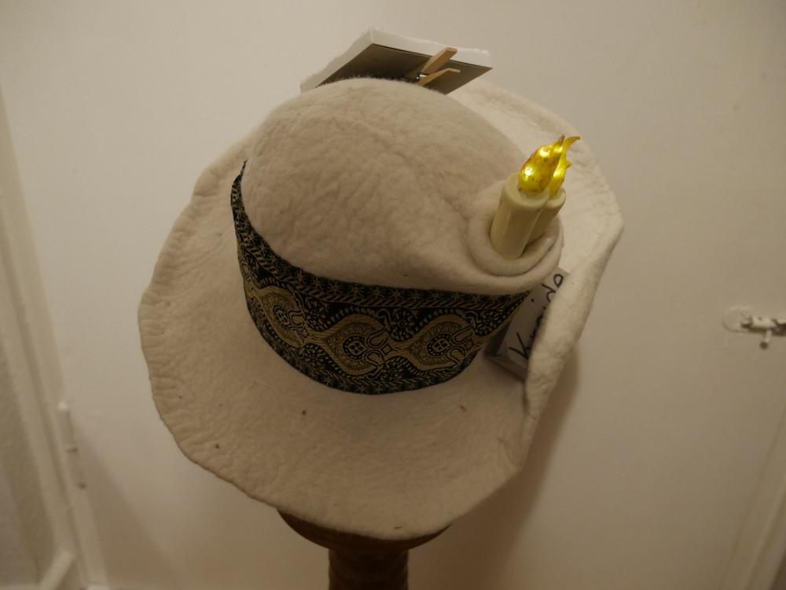
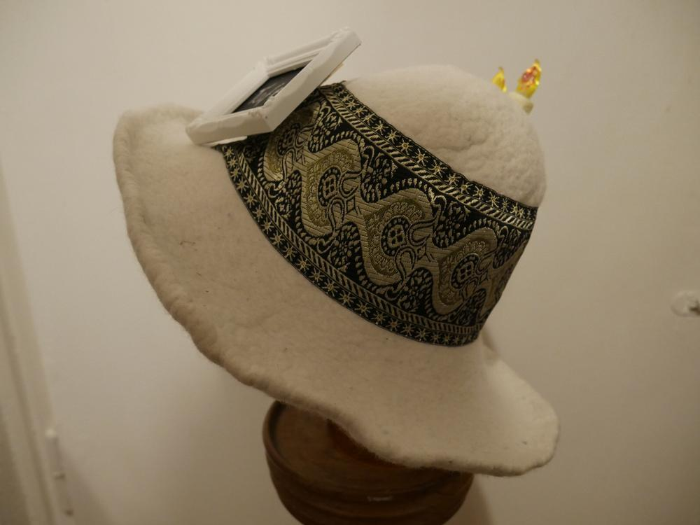
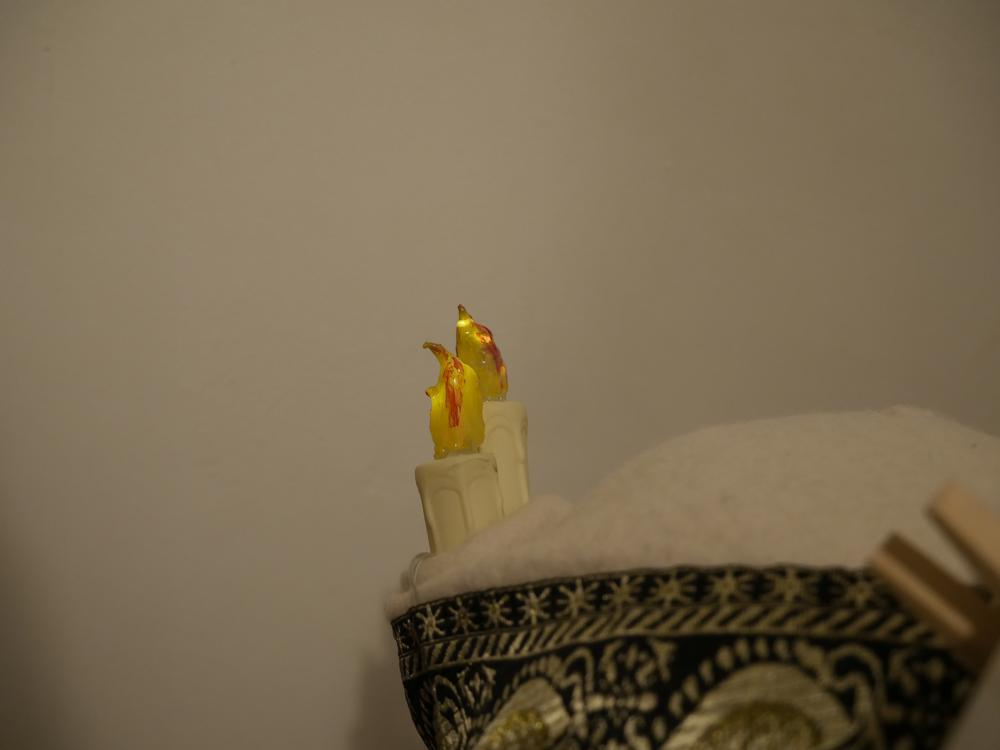
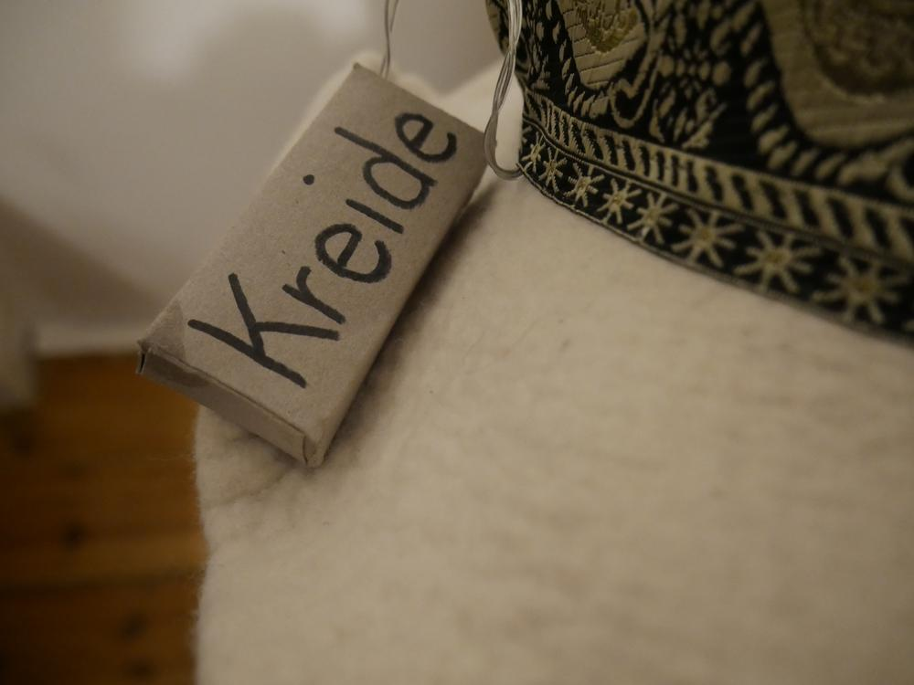
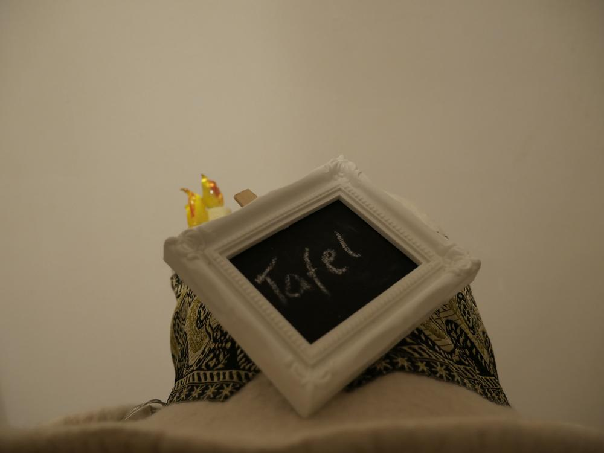

Eine zauberhafte Walpurgisnacht, schönen ersten Mai und tolle Ideen wünscht Euch Ermeline.
