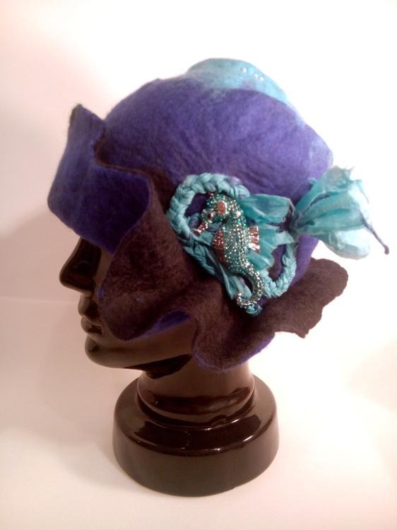
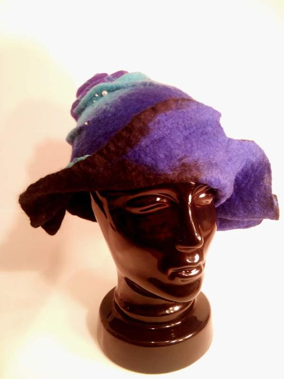
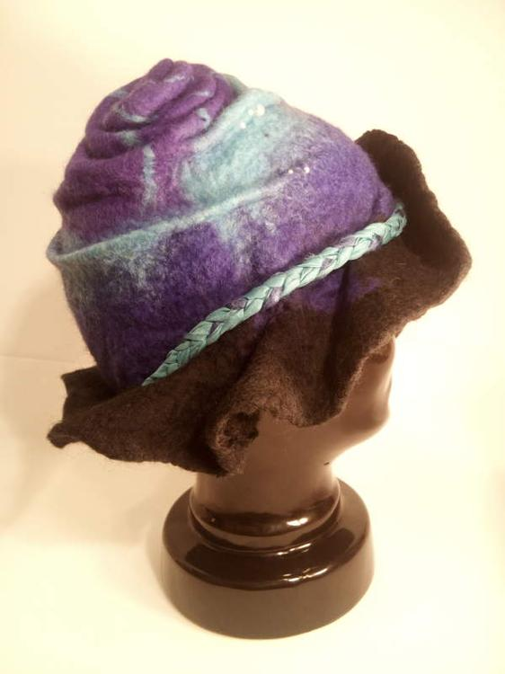
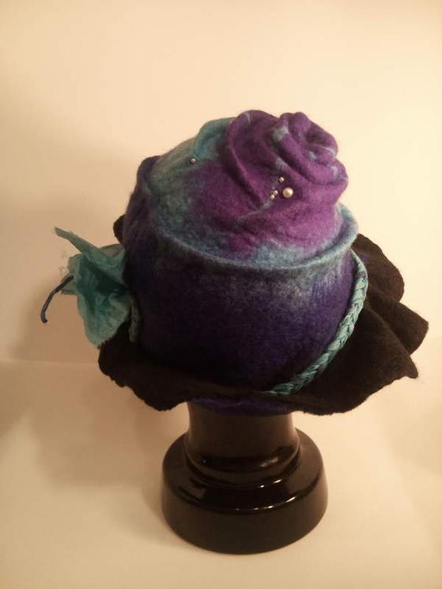
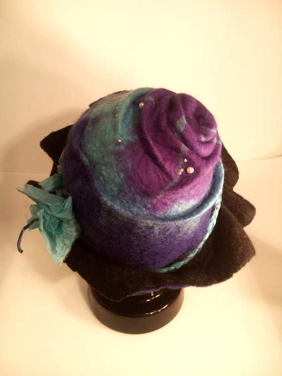

"Meer" auf dem Kopf haben wünschen sich nicht nur manche Männer, auch meine Mutter hatte den Wunsch nach einem alltagstauglichen Hut. "Ist ja bald Weihnachten..." dachte ich mir und so filzte ich ein verfrühtes Weihnachtsgeschenk. 

Die Farben waren ein Wunsch dem ich gerne nachkam und weil ich weiß, dass ich nicht weit vom Stamm gefallen bin und mein liebes Mütterlein bisweilen auch ein extraordinäres Auftreten pflegt, habe ich mich nicht gescheut, mich an der Krempe und dem Design auszutoben. Kleine Perlen in den Falten haben zum einen optische Gründe aber sie bieten auch Sicherheit, dass die Falten nicht so schnell ihren Halt verlieren. Die Wellen an der Krempe haben mir besonderen Spaß gemacht und so fügt sich das glitzer Seepferdchen in einem Wirbel aus geflochtenem Seidentuch perfekt in sein neues Zuhause ein.

Auf dem FLohmarkt wurde sie schon für den tollen Hut gelobt, nun trägt Mutti ihn stolz durch die Welt.
