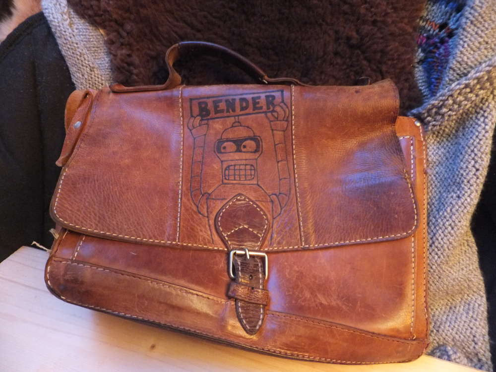
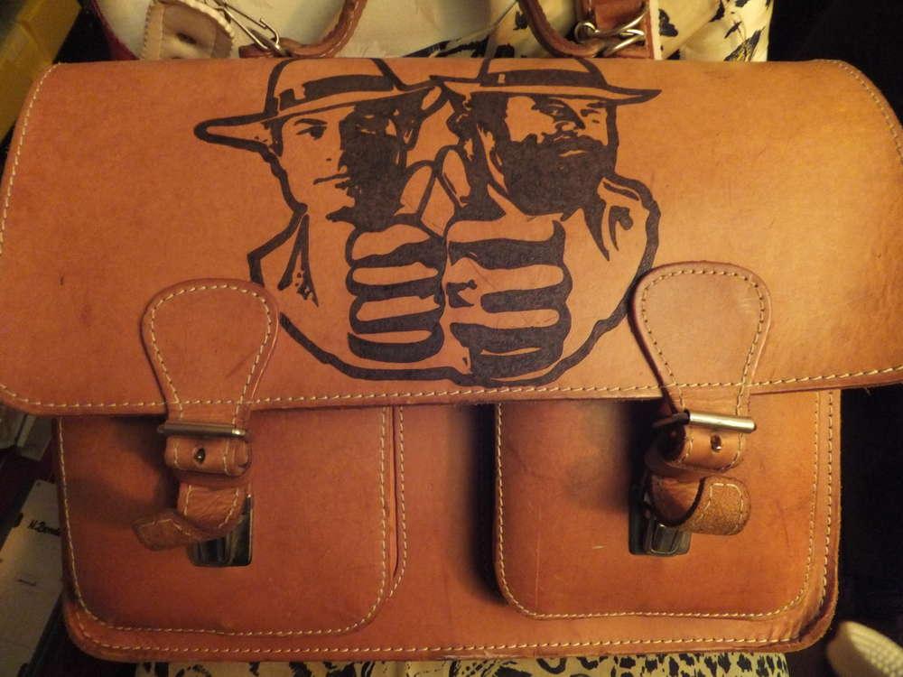

Also ich finde Ledertaschen ja toll. Das Problem: wenn man sie günstig auf dem Flohmarkt kauft, sind da evtl ein paar Macken drin und mit Stift draufgeschrieben. Sowas ist ärgerlich aber kein Grund die Tasche abzuschreiben. Man greift sich den Lötkolben oder Brenner und los gehts. So kann man seine Vorlieben trendig zum Ausdruck bringen und auch so manche Macke im Leder überspielen. Dafür machen Buddy & Terence den Daumen hoch. 

 

