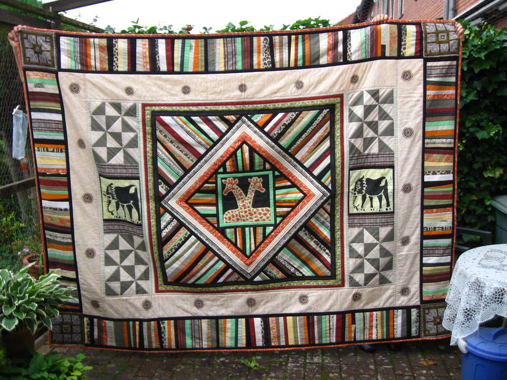
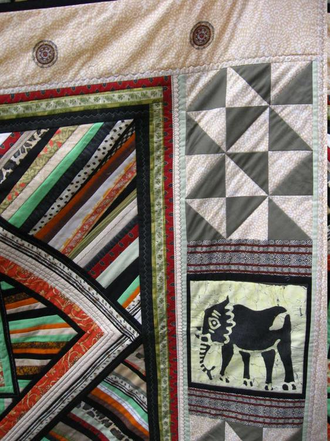
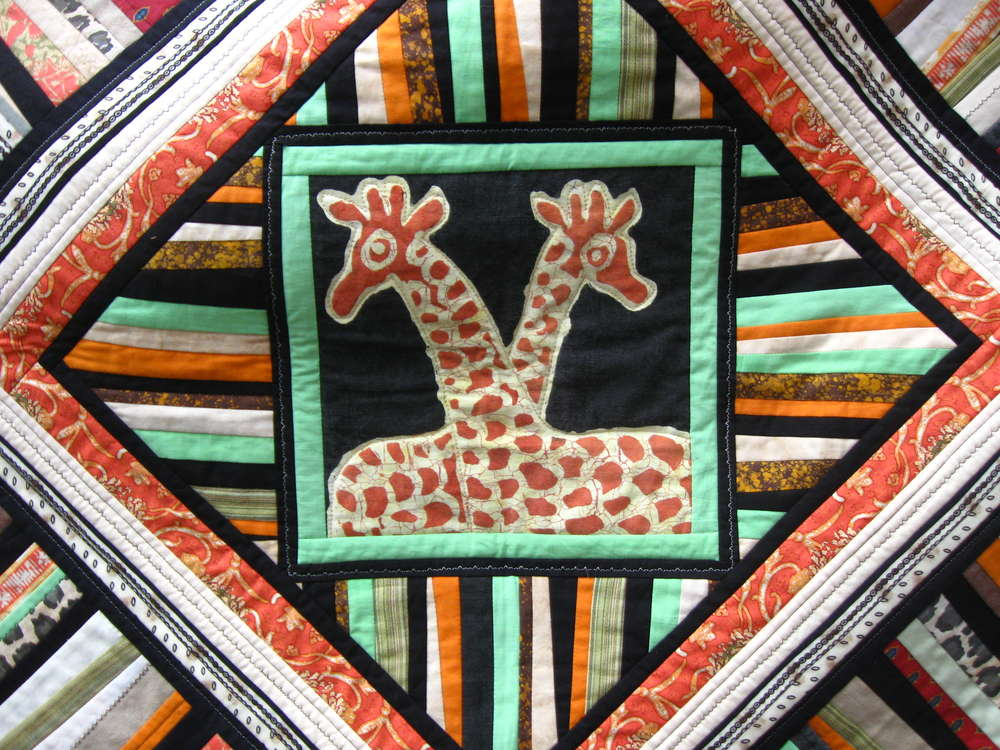
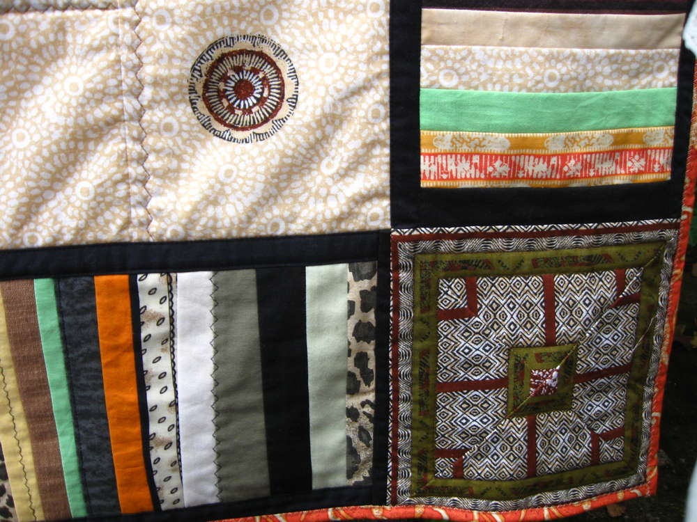
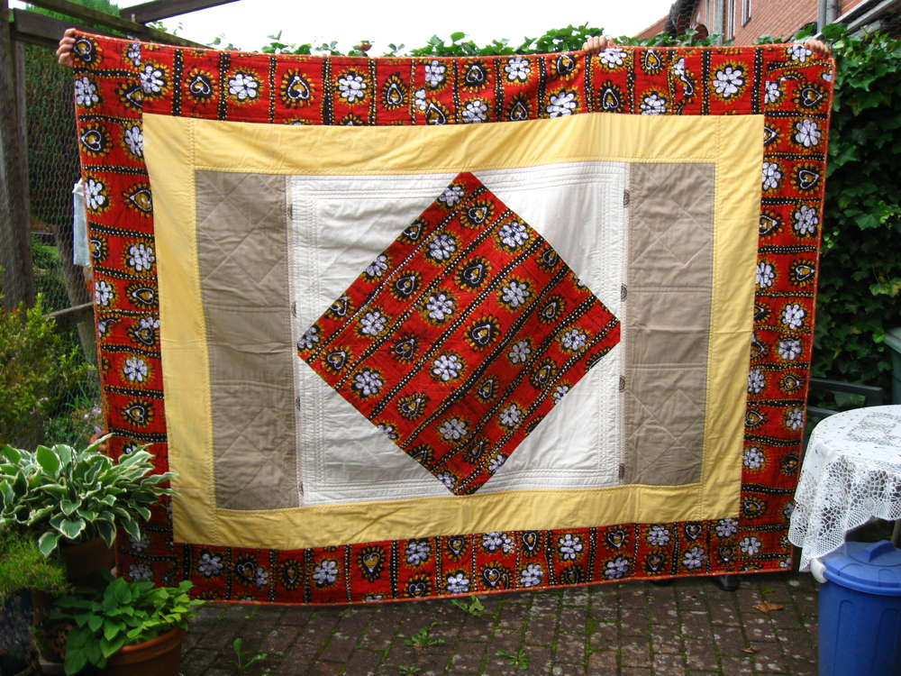

Puh!!!
Diese Auftragsarbeit für eine Afrikaliebhaberin war eine echte Herausforderung an meine tapfere Nähmaschine. An mich übrigens auch! Ich habe 22 Tage am Stück in jeder freien Minute daran gearbeitet. Und das ist schließlich dabei herausgekommen:

Ein ziemlich afrikanisch anmutender Bettüberwurf in den Maßen 1,80m x 2,40m. Er wiegt 3 kg, und es brauchte inklusive des Füllflieses ca. 20 qm Stoffe, die ich schon seit Monaten für dieses Projekt gesammelt hatte.
Ich habe wieder überwiegend "alte" Stoffe verwendet, was meiner Meinung nach, der Decke gewissermaßen einen Charakter verleiht. Also mussten erneut Tischtuch, Hemd und Hose, Geschirrtuch, Bettbezug, Laken und Kissen herhalten und wurden hemmungslos zerschnippelt; meist zu unterschiedlich breiten Streifen, aus denen der Quilt größtenteils besteht. Ich liebe diese Streifenmuster, wie man ja schon bei meinem [Gothic-Quilt](/2016/02/ein-altes-gothic-bild-heut-mal-als-quilt/) merken konnte. Natürlich sind auch neu gekaufte Stoffe verarbeitet, aber die habe ich mit Kaffee und Tee ein bißchen auf shabby getrimmt. Um die enorme Größe der Decke mit meiner normalen Haushalts-Nähmaschine zu handhaben, mußte ich folgenden Trick anwenden:

Ich habe von Anfang an alle 3 Lagen zusammengenäht (Oberstoff, Flies und Rückseite). Dann habe ich, wie auf der Rückseite ersichtlich, je nach Bedarf die verschiedenen Lagen angestückelt und mich so langsam zum Rand hin vorgearbeitet. Dabei muß sehr akkurat genäht werden, denn Ungenauigkeiten summieren sich natürlich bei einer solchen Größe.

Aber jetzt ist es geschafft, und ich denke "Afrika" wird sich gut in das Interieur seines zukünftigen Heimes einpassen.

Liebe Grüße Eure Lucy

