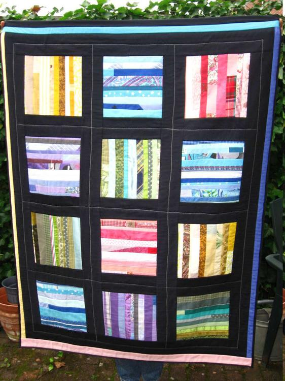
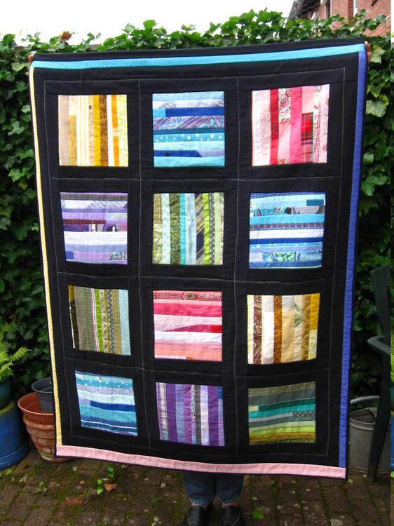

Diesmal möchte ich euch einen Quilt in einem für mich ganz ungewohntem Stil vorstellen. Er ist zwar wieder aus Restestreifen gearbeitet, aber ohne jeglichen Schnörkelkram. - Ein eher modernes Teil also.

Ich habe dafür auf 12 ca. 24cm große Stoffquadrate Streifen in unterschiedlichen Breiten genäht. Wie man sieht, aber nicht bunt durcheinander, sondern farblich sortiert. Es entstanden je 2 x gelb, pink, lila und je 3 x grün und blau/türkis. Um diese farbintensiven Patches gut zur Geltung zu bringen, wurden sie mit schwarzem Stoff unterteilt und eingerahmt. Das einzige Extra sind mittige weiße Zickzackstiche und ein dünner bunter Streifen am Rand. Am oberen Ende ist ein Tunnel gearbeitet, so daß man diesen Wandbehang nahezu unsichtbar aufhängen kann.

Auch die Rückseite ist einfach gehalten aus einer einzigen, allerdings gemusterten Stoffbahn mit grauem und kleinem schwarzen Rand. - Mal nicht so kompliziert und trotzdem hat es sehr viel Spaß gemacht, aus diesen schönen leuchtenden Stoffresten was zu zaubern.

Eine knallbunte Woche wünscht euch Lucy!

