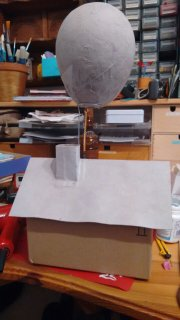
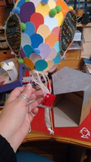
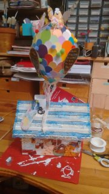
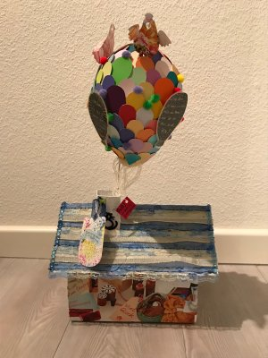
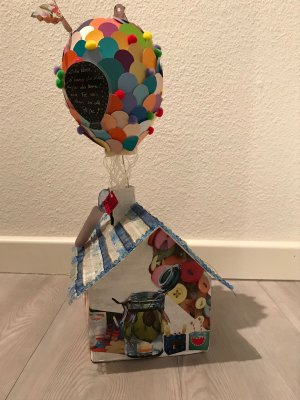
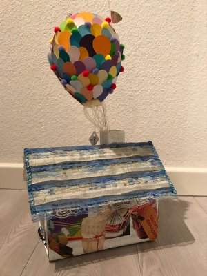
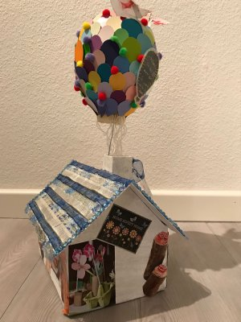

Jedes Ende birgt auch einen neuen Anfang (Weisheit des Tages). Letzte Woche erwähnte ich schon nebenbei, dass ich meine Arbeitsstelle verließ und ich war nicht die Einzige. Eine liebe, kreative Kollegin verließ unser Team schon vor mir. Ich hatte die Ehre mich am Abschiedsgeschenk austoben zu dürfen. Mit allerlei Nascherei und kleinen nützlichen Dingen bestückt, wie einem Bastel-Notfall-Kit, überreichten wir dann auch dieses Geschenk.

Die wenigen WIP-Bilder will ich euch aber nicht vorenthalten, ich glaube man kann ganz gut erkennen, wo ich meine Inspiration fand.

Zunächst suchte ich einen Karton, den ich mit Papier und einer Kleister-Wasser-Mischung beklebte um eine schöne Grundlage zu bilden, aus einem Müslikarton bastelte ich das Dach, welches als Deckel dienen soll. Der Ballon besteht aus Pappmachée und ist mittels Draht, der in den Schornstein geklebt wurde, befestigt.

Dann ging das Ausschneiden los, und wiedermal hatte ich eine gute Verwendung gefunden für die Farbkarten aus dem Baumarkt, man kann daraus nicht nur [Herzchenkonfetti](/2017/03/herzchenkonfetti/) machen, sondern auch lauter kleine, bunte Luftballons. Und ich bin froh, dass ich mir eine Heißklebepistole zugelegt habe. Und mit meinem Kratzpapier habe ich auch rumspielen können.

Und der Ballon sieht nicht nur toll und bunt aus, er ist auch hohl und das kann man super nutzen. Deshalb, hat dieser Ballon eine Notfallreißleine, wenn man an ihr zieht, zieht man den Stopfen (einen Schwamm) heraus und es fallen die innenliegenden Raffaelos raus. 

So und dann habe ich das Dach noch mit einer Hübschen Spitze gedeckt und mit Glitzersteinchen versehen und allerlei Kleinkram verziert, der mir passend schien, hoch lebe der Heißkleber. Die Hauswand habe ich mit lauter kleinen Zeitungsschnipseln beklebt, die mir zur Kollegin passend schienen. 

Ja und so sieht die kleine Haus-Schatulle aus.

Einen heißklebrigen Sonntag wünscht euch Ermeline.

