Wie [letzte Woche](/2018/02/hakeleinhorn/) versprochen kommt hier nun die Anleitung für mein Babyeinhorn. 

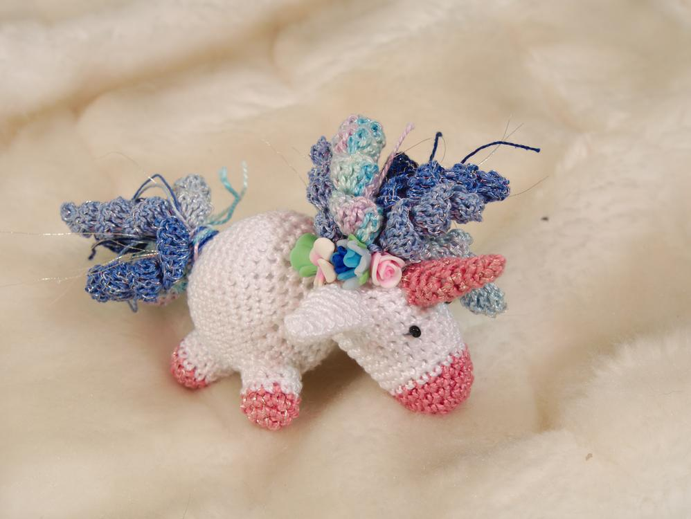

Wichtige Infos vorweg: 
Ich beende jede Runde mit einer Kettmasche, das vereinfacht das Rundenzählen und den Farbwechsel. Die Innenseite ist immer da, wo der Anfangsfaden hängt, du müsstest ihn also nur in das Werkstück hineinstopfen. Je nach Garndicke benötigst du die passende Häkelnadel, ich habe mit Perlgarn gehäkelt und dafür die Nadelstärke 2mm gewählt.
 
Du brauchst:

- Garn in drei Farben (rosa/weiß/blau)
- optional Goldgarn
- Häkelnadel in der richtigen Größe
- 2 Perlen für die Augen
- Füllwatte
- Stopfnadel
- Verzierungen (in meinem Falle sind es Blüten aus Fimo)
- mindestens eine Katze, die dich bei der Arbeit stören kann

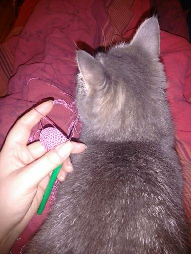

Du brauchst Kenntnis über:

- Magic Loop (ML)
- Luftmaschen (Lm)
- feste Maschen (fM)
- Kettmaschen (Km)
- Stäbchen (Stb)

##Kopf
1. (rosa/gold) 6fM in ML (denke nach jeder Runde an die Kettmaschen am Ende, ich erwähne sie im Folgenden nicht weiter)
2. alle M verdoppeln = 12M
3. jede 2.M verd. = 18M
4. 18fM
5. 18fM Farbe wechseln, mache die Kettmasche mit der neuen Farbe
6. (weiß)18fM
7. jede 3.M verd. = 24M
8. 24fM
9. 24fM
10. 24fM
11. jede 4.M verd. = 30M auf dieser Höhe werden die Augen festgenäht
12. 30fM
13. 30fM
14. 30fM
15. jede 4. und 5.M zus. = 24M
16. jede 3. und 4.M zus. = 18M
17. jede 2. und 3.M zus. = 12M
18. jede 1. und 2.M zus. = 6M
Kopf zunähen 

##Körper
1. (weiß) 6fM in ML 
2. alle M verd. = 12M
3. jede 2.M verd. = 18M 
4. jede 3.M verd. = 24M
5. jede 4.M verd. = 30M
6. jede 5.M verd. = 36M
7. jede 6.M verd. = 42M
8. 42fM
9. 42fM
10. 42fM
11. 42fM
12. 42fM
13. 42fM
14. 6. und 7.M zusammenhäkeln = 36M
15. 5. und 6.M zus. = 30M
16. 4. und 5.M zus. = 24M
17. 3. und 4.M zus. = 18M
18. 2. und 3.M zus. = 12M
19. 1. und 2.M zus. = 6M 
den Körper ausstopfen, das verbleibende Loch kann offen bleiben, daran nähen wir später den Kopf fest.

##Beine
1. (rosa/gold) 6fM in ML
2. alle M verd. = 12M
3. 12fM
4. 12fM Farbe wechseln, mache die Km mit der neuen Farbe
5. 12fM
6. 12fM
7. 12fM
Hier enden meine Stummelbeinchen, wenn du fest ausstopfst, kannst du die Beine auch länger häkeln. Häkel die Beine vier mal.

##Horn
1. (rosa/gold) 4fM in ML
2. 4fM
3. 1M verd. = 5M
4. 5fM
5. 1M verd. = 6M
6. 6fM
7. 1M verd. = 7M
8. 7fM
Verteile die Zunahmen möglichst rund um das Horn, sonst wird es krumm, also am besten setzt du die Zunahmen gegenüber an.

##Ohren
1. (weiß) 4fM in ML
2. jede 2.M verd. = 6M
3. jede 3.M verd. = 8M
4. jede 4.M verd. = 10M
5. jede 5.M verd. = 12M
6. 12fM
Häkel die Ohren zwei mal. Um die schöne Ohrmuschel zu erzielen, klappst du das Ohr ab der Hälfte der Länge nach zusammen und fixierst es mit dem Restfaden.

##Locken
Es empfiehlt sich die Locken ḿit dünnerem Garn zu häkeln, sonst wirkt es recht wuchtig bei dem Babyhörnchen. Häkel nun so viele Locken wie du magst, meine sind nicht länger als 23 Luftmaschen.
(blau/gold) beginne mit einer Lm-kette von mindestens 15M. Nun häkelst du in die 3.letzte Masche das erste von insgesamt 3 Stäbchen. In jede folgende Masche werden bis zum Ende (dem eigentlichen Anfang der Lm-Kette) 3 Stb gehäkelt. 

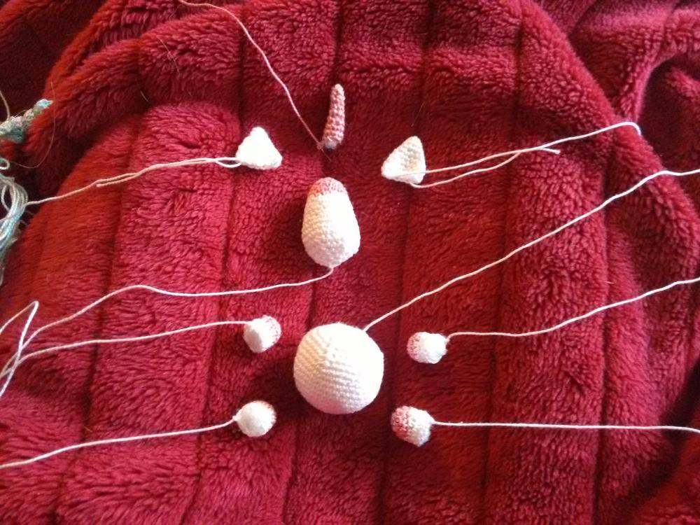

Und nun wird der Mini-Bausatz zusammengenäht. Und dann sollte sowas in der Art dabei herauskommen. 

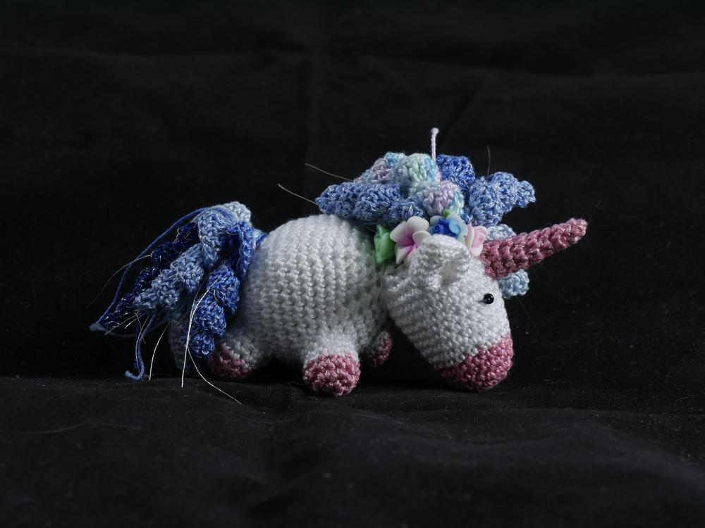
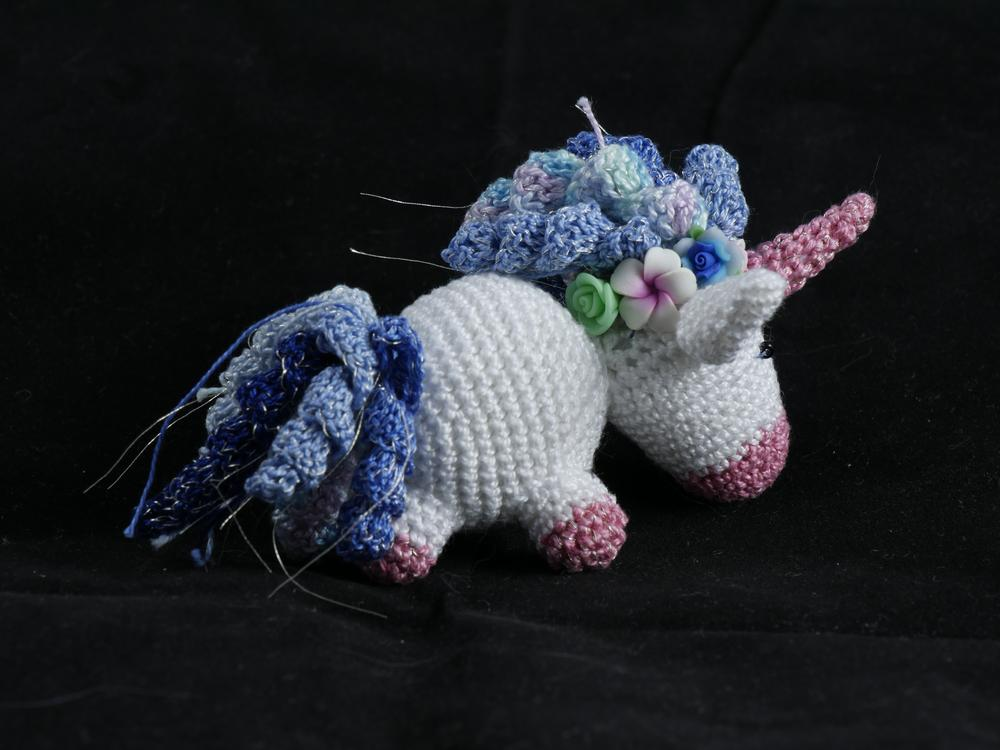
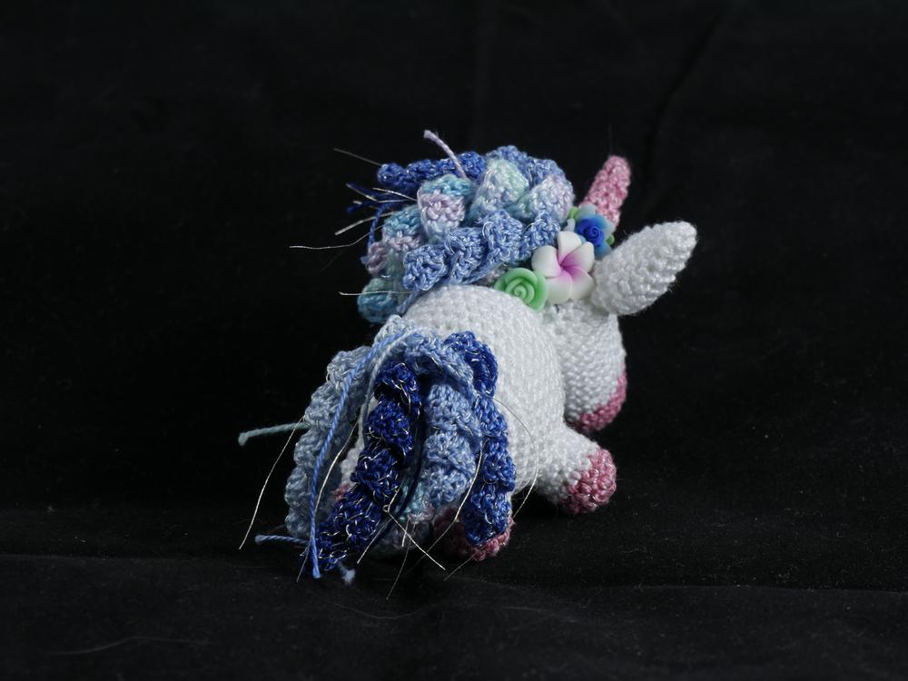
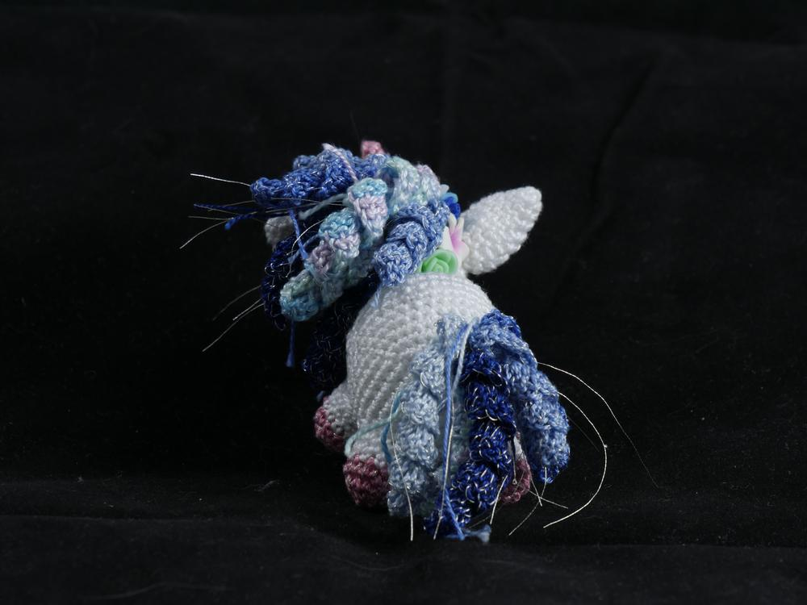
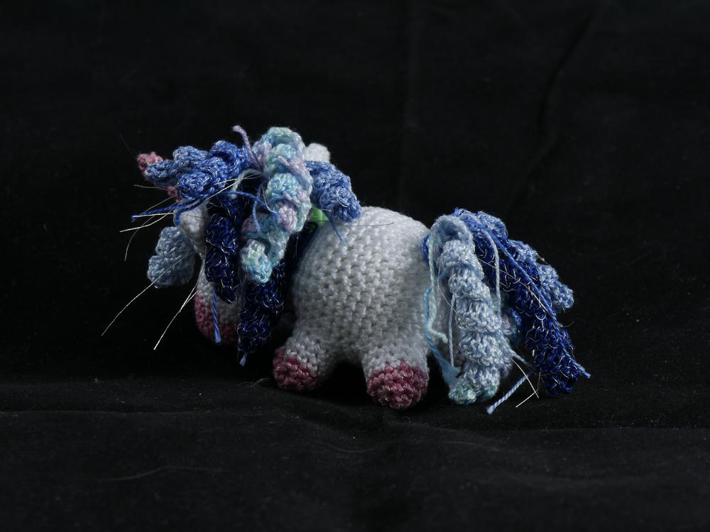
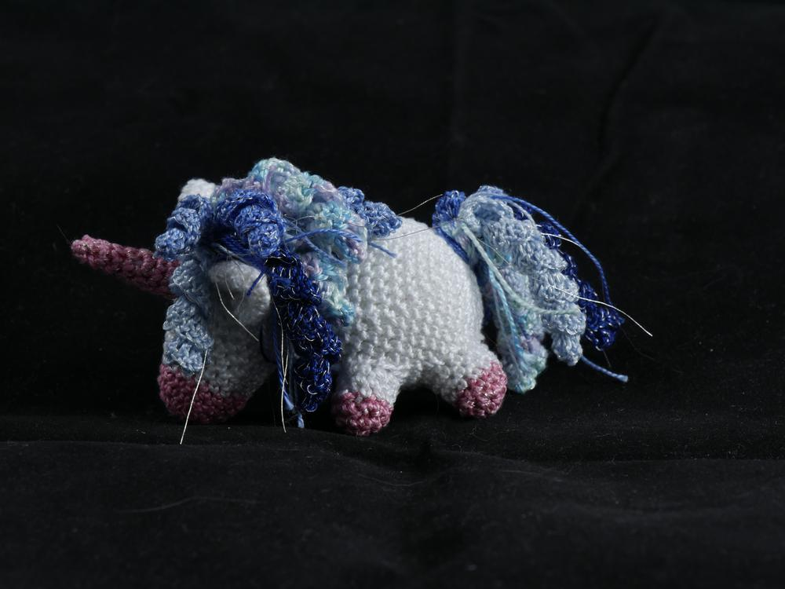
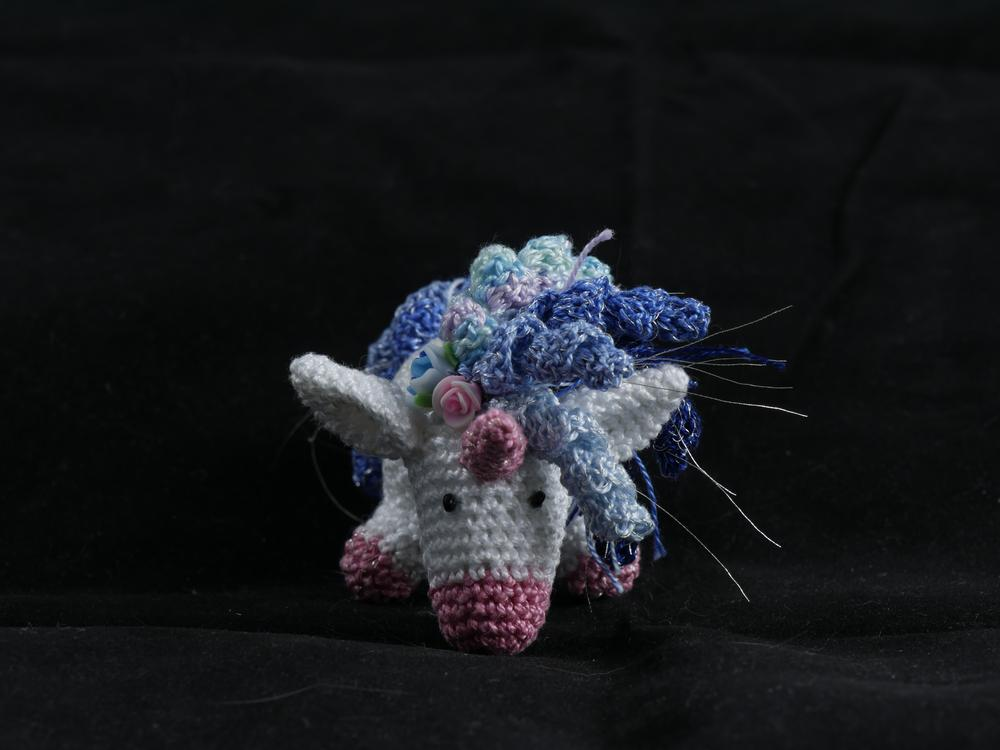
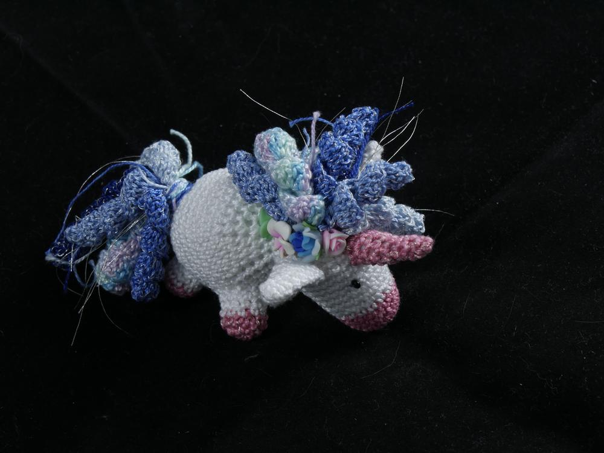
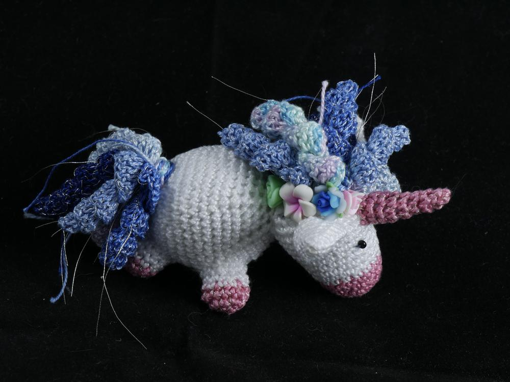

Wie immer wenn ihr euch von meinen Kreationen inspirieren lasst oder meine Anleitungen nacharbeitet, sind Anregungen sehr erwünscht und ich freue mich auch sehr über Eure Werke. Meine Anleitungen sind nur für private Zwecke gedacht. Wenn du also dieses Einhorn häkelst, dann schicke mir gerne ein Bild per Email an ermeline@flauschiversum.de und ich werde es hier hochladen. 

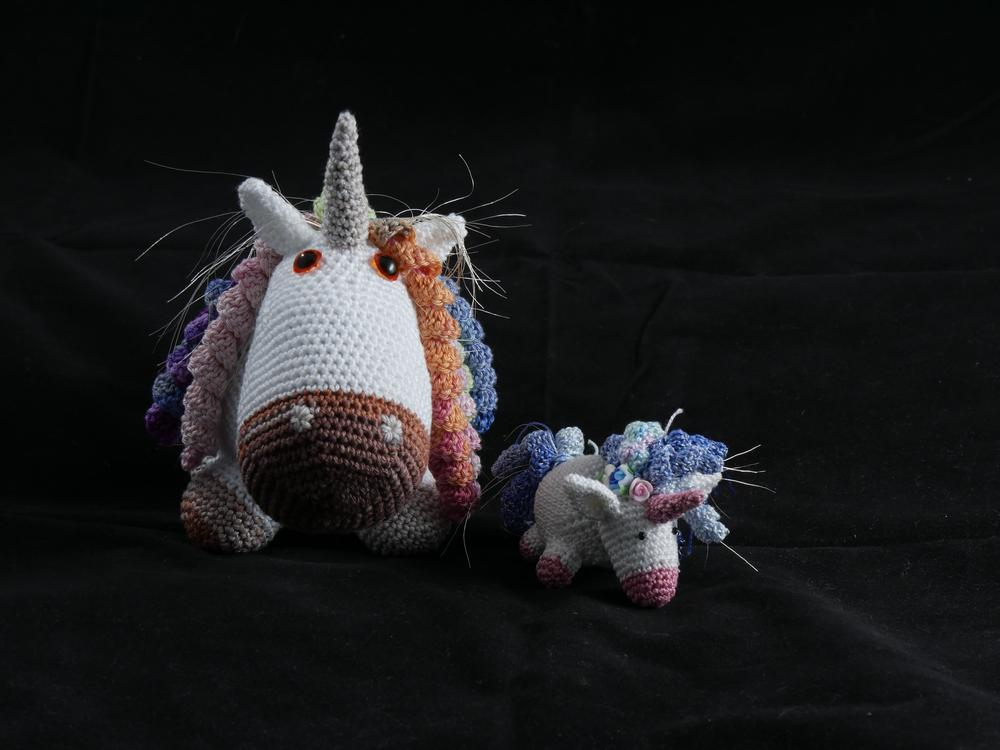
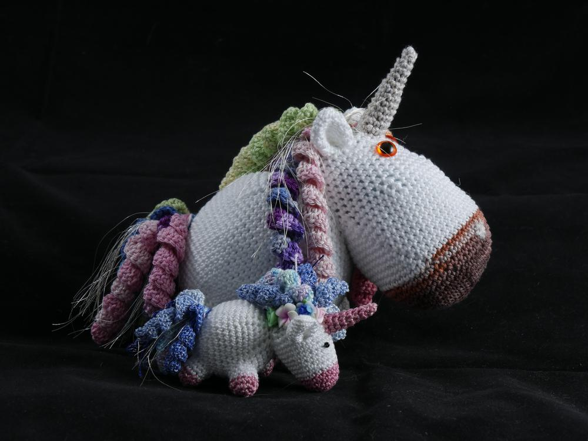

Wir wünschen Euch ein glamuröses, pink-fluffy-unicorniges Wochenende.

