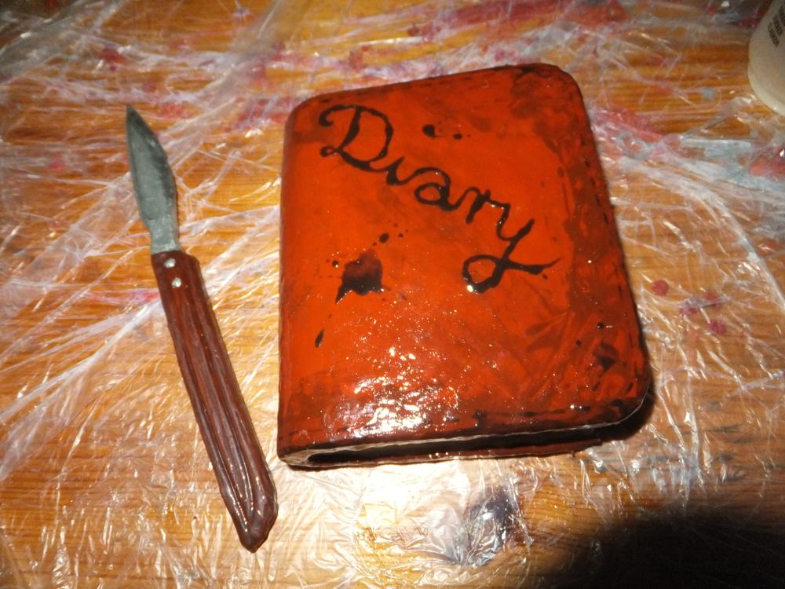

Es gibt viele Dinge, die neben der [Challenge von Lucy und mir](/2016/05/die-challenge/) entstanden sind. Zwar leigt unser Hauptaugenmerk derzeit definitiv bei unserer Challenge, für die es ein wöchentliches Statusupdate auf Facebook gibt, trotzdem muss man auch mal den Kopf frei bekommen und sich anderen Dingen widmen. 

Lucy widmet sich der Herstellung sinnvoller Alltagsgegenstände, wie Nadelkissen aus Kaffeekännchen, Kuscheldeckchen aus verstrickten Stoffstreifen für Katzen, Geschenkboxen aus Tapetenresten oder dem Neukombinieren ihrer alten Handtücher.

Ich habe mich anstecken lassen vom Larp-Waffen-Bau. Und ich hätte das definitiv als Letzte gedacht. Der Streitkolben ist ein Werk eines Freundes und das kleine Tagebuch das eines anderen Freundes, lediglich die Verzierungen sind auf meinem Mist gewachsen. Ich habe mir gedacht: "Mach doch mal Larp-Waffen für den Alltag." Die bisher umgesetzten Ideen sind alle noch nicht fertig aber da wäre ein [Wurfbuch](/2016/07/conquest-vorbereitungen/), das den Beworfenen zusätzlich beschimpft (sofern dieser lesen kann), ein Wasserkrug, aus dem man zunächst die Reste Wasser auskippen kann um dann damit zu werfen, das kleine Wurftagebuch, ein Nudelholz und Spiegeleier. Das Meißte ist noch nicht fertig, es gibt zusätzlich auch noch Projekte wie den dreibeinigen Schemel zum Werfen, eine Pfanne und mal schauen was uns noch so einfällt.... Das Skalpell ist für unseren Heiler.

