Wer kann schon sagen er hätte einen Ring selbstgemacht? Alle, die einen Kurs an der Volkshochschule gemacht haben, so wie ich. Endlich hatte ich mal Gelegenheit meine kaputten Ringe zu reparieren und die ungeliebten Silberteile weiterzuverwerten. Der Goldschmiedekurs ging über drei Tage und ich bin sehr zufrieden. Alles was mir nicht gefiel wurde zunächst eingeschmolzen, so konnte ich Materialkosten sparen. 

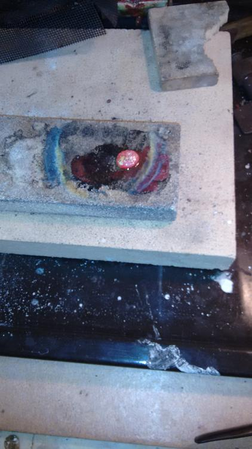

Ade zerbrochene Ringe, Ade Schmetterlingsohrringe aus Malta, die ich nie getragen habe, Ade zerrissene Kettchen. Da ich zwei verschiedene Typen Silber hatte, sind auch zwei Klümpchen entstanden.

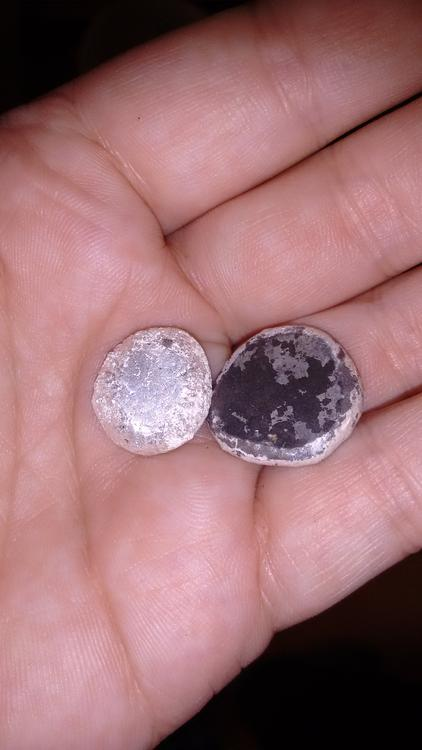
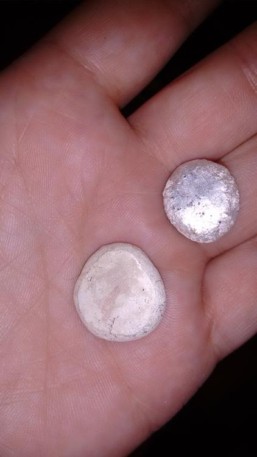
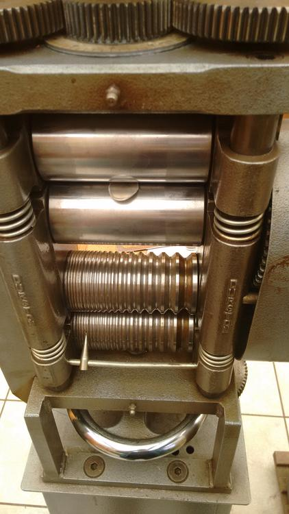

Mit dem 1mm dicken Silberplättchen kann ich arbeiten. 

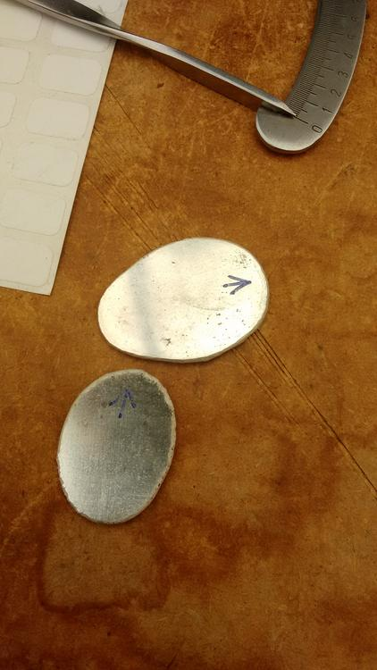

Also ran an die Säge. Ich habe bestimmt einen Rekord an kaputten Sägeblättern aufgestellt. Aber das Aussägen des Herzchens hat schonmal geklappt. Das Gravieren auch - A C A B - von oben nach unten gelesen, jetzt mag so mancher denken, dass ich Polizisten nicht mag, aber stattdessen liebe ich Katzen einfach nur sehr doll - All Cats Are Beautiful!!!!. Die Tatze wird da doch nach dem ganzen Frickelkram kein Hindernis darstellen...

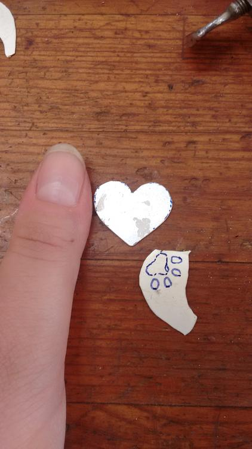
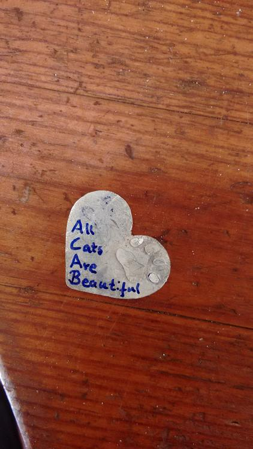

Vor dem Löten hatte ich etwas Angst, aber ich bin erfreut, dass meine Miniteile kaum verrutscht sind und die Tatze zu erkennen ist. Mit den kleinen, verrutschten Schönheitsfehlern kann ich durchaus leben.

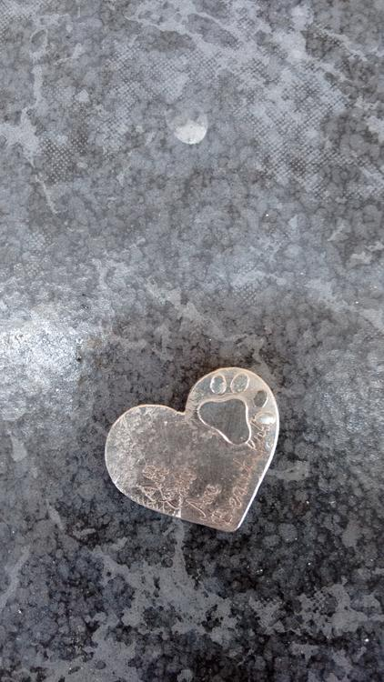

Jetzt heißt es: "Schmirgeln und hübsch machen". Nachdem ich dann noch eine plane Fläche gefeilt habe, konnte ich auch diese zwei Teile zusammenlöten. Wuhuuu der Puls steigt. Nach dem Säurebad kann jetzt poliert werden. 

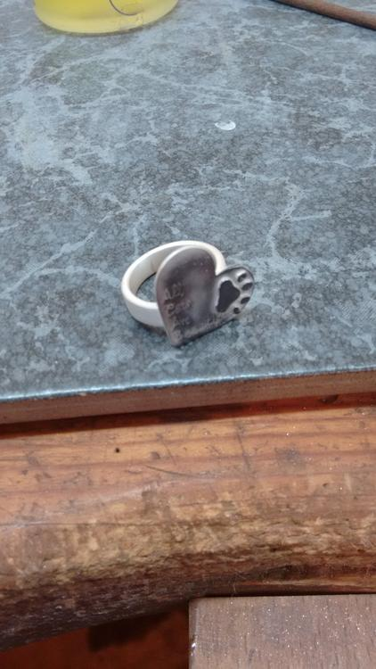
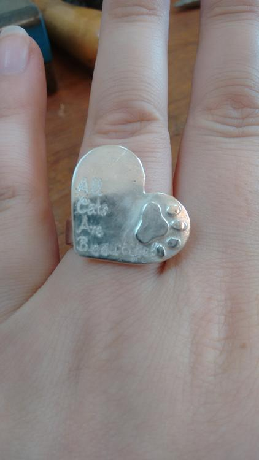

Ich liebe ihn, er ist so komplett anders als meine anderen Ringe aber er ist einzigartig und selbstgemacht. 

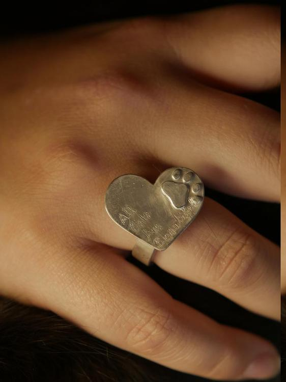
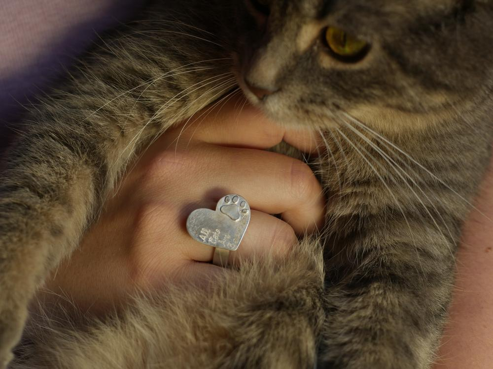 

Bleibt flauschig, liebt eure Katzen - because they're beautiful!!! Flauschigste Grüße von Eurer Ermeline.

