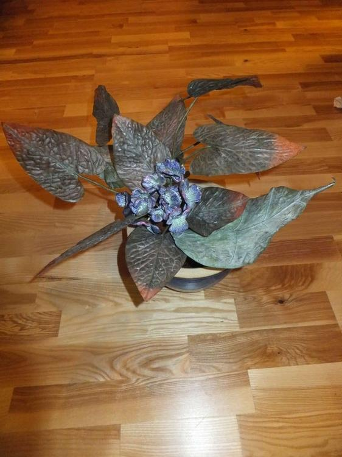
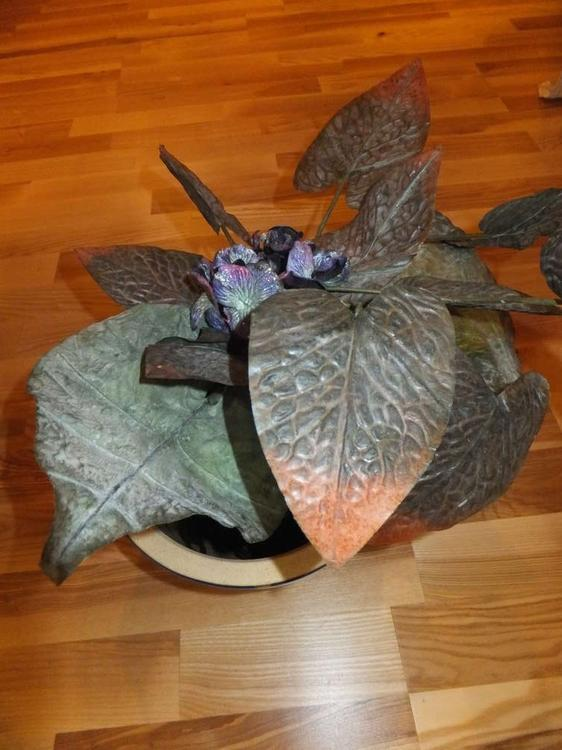
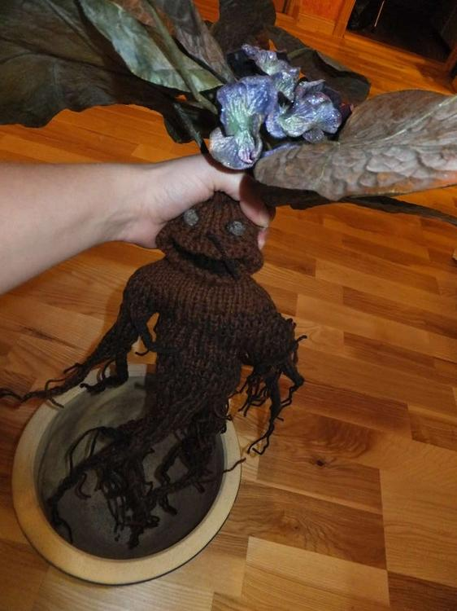
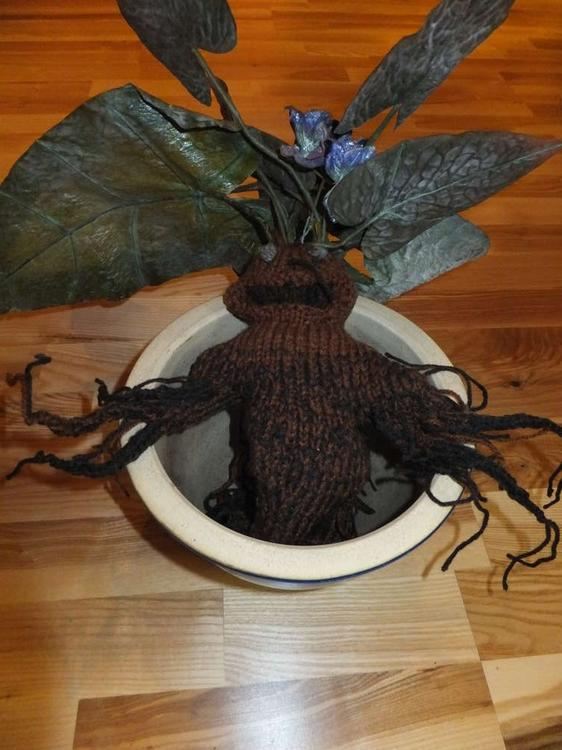
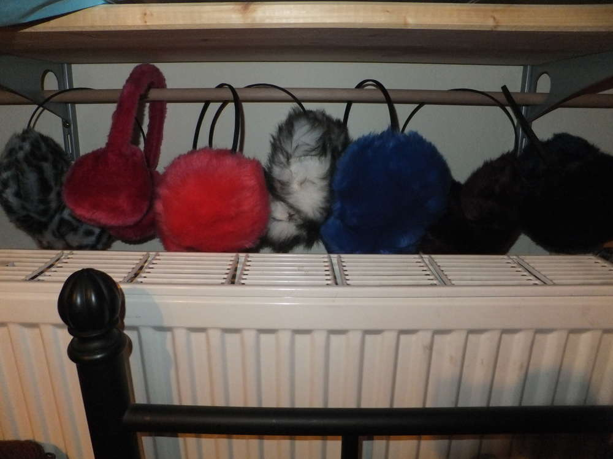

Mal wieder etwas für das Hobby LARP, wir fahren in diesem Jahr mit unseren Magiern auf eine Kriegscon und unser Schutz ist diese junge Alraune, mit der mein Magierfreund natürlich im Topf herumlaufen wird. Beim Herausziehen aus dem Topf kreischt sie (wir stellen es dar mit den Alarmanlagen die man in Schränke oder so kleben kann, sobald der Kontakt unterbrochen ist, also die Alraune den Topf verlässt, fängt das Ding an zu lärmen), natürlich tötet unsere Alraune nicht, sie ist ja noch jung, aber im Idealfall fallen alle, die nicht so tolle Ohrenschützer haben, in Ohnmacht. Die Alraune habe ich frei Schnauze gestrickt, muss ja nicht alles so sein wie bei Harry Potter, und das Grüngemüse obendrauf habe ich bei [Wolle&Hobby](/2013/07/wolle-hobby/) erstanden. Zufälligerweise konnte ich mir das Nähen der Ohrenpuschels sparen, weil ich so schön scheußliche Schützerchen für 2€/Stck finden konnte. Toll nicht wahr? Vielleicht laufe ich auch einfach so mal mit dem Ding durch die Innenstadt. :)

IST GERADE ZIEHMLICHLAUT HIER.... BESSER MAL DIE OHRENSCHÜTZER AUFSETZEN!!!!!!!!!!!!!!!!!!!
