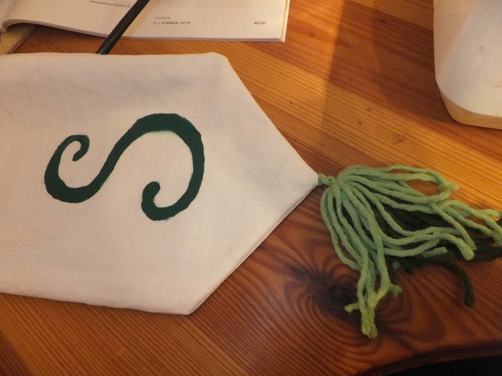

Einiges wurde hier gewuselt in der letzten Woche. Es geht aufs ConQuest zu und ich muss natürlich alles wieder auf den letzten Drücker fertig machen - und davon nicht wenig. Da wurde mal eben ein neuer Charakter erstellt und für dessen Gewandung musste noch einiges gemacht werden, zum Glück ist die [Gugel](/2016/07/guck-mal-ne-gugel/) ja schon fertig. Auch sonst mussten noch ein paar UFO's (Unfertige Objekte) beendet werden. Und zwischendrin die Katze, die den Braten mal wieder gerochen hat.
"Die Eine ist nur am Basteln und Herrchen will ne Sternenkarte zeichnen, das kann er sich aber abschminken, pöh!"

# Zaunwimpel
Unser Lager wird auf dem ConQuest eingezäunt und dafür habe ich unseren Schriftzug 'Bewahrer des Gleichgewichts' auf Wimpel gemalt, damit auch jeder weiß wer wir sind. Dafür musste jeder einzelne Wimpel natürlich auch noch genäht werden. Ich fragte mich beim Nähen, wer zum Donnerwetter auf die Idee gekommen ist, einen Namen zu wählen, der 25 Buchstaben hat und dann fragte ich mich, warum ich so bescheuert bin und das auch noch nähe. Naja hoffentlich belohnt die Optik für die Arbeit. Ich glaube ich mache mir auf Con den Spaß, blöde Anagramme zu bilden und die Buchstaben ein wenig umzusortieren.

# Armschiene
Mein neuer Charakter wird sich viel mit Schreiben befassen, die Idee für die Armschiene kam mir, weil ich noch eine alte Variante gefunden hab, an der ich meine ersten Brandings gewagt habe. Diese Armschiene ist jedoch punziert, was bedeutet, dass die Struktur der Feder in das Leder eingedrückt wurde. Mit Lederfarbe habe ich die Feder noch von der Schiene abgesetzt. Sie wird beim Schreiben zur Stabilisierung des Handgelenkes getragen und soll Fragen bezüglich meines Handwerkes beantworten. 

Und angezogen sieht das Ganze dann so aus.

# beleidigendes Wurfbuch
Was passt besser als Waffe für eine Schreiberin als ein Buch? Dieses hier ist ganz besonders, es ist schonmal als [UFO](/2016/04/was-man-neben-einer-challenge-noch-tut/) aufgetaucht und nun wurde es vollendet. Mit diesem 'Kompendium der Diffamierung' kann ich sowohl Waffenhiebe parieren als auch jemandem das Teil über den Schädel ziehen und gleichzeitig Beleidigen. Eine tolle Kombination. Es bildet zudem Grundlage für eine Anekdote über den Großvater meines Charakters, der Zahn gehört ihm und das Buch führe ich mit mir, damit es mich daran erinnert, dass nicht alles sofort niedergeschrieben werden muss (das war die Kurzfassung).

Das Buch kann sich super tarnen.

Zusätzlich habe ich noch die Spiegeleier und das Skalpell mit einer Versiegelung versehen, die können dann auch zum Einsatz kommen.

# Rundtisch
Für das runde Ritterzelt haben wir noch einen runden Tisch gemacht, der um die Mittelstange plaziert werden soll. Er wird mit Schellen zusammengehalten und dann auf drei in den Boden geschlagene Beine gestellt. Da ich bei einer runden Tischdecke neben dem Loch nicht auch noch einen langen Schnitt reinsetzen wollte, müssen wir sie wohl beim Zeltaufbau direkt mit auffädeln, na ob wir daran denken?

# In-Time-Tauglichkeit
Wir haben (räusper) Sommer und da muss man viel trinken, ich habe es nicht mehr geschafft einen Trinkschlauch zu bestellen (hatte ja auch genug zu tun), darum habe ich für meine Trinkflasche einen Überzug genäht, der das Ambiente nicht stört. 

Für die Bücher, die ich mitnehme habe ich jeweils noch einen simplen Umschlag aus Papier gemacht.
Auch unsere Erste-Hilfe-Tasche (keine Heilertasche!!) wurde von mir gekennzeichnet. Sie müsste nicht unbedingt ambientig sein, da sie aber gut sichtbar für echte Unfälle bereit stehen soll und wir unser Zelt auch mal auflassen wollen, habe ich mich für dieses Design entschieden. 

Na dann kann es ja losgehen. Viel Spaß auf dem Drachenfest, dem Conquest, Wacken und in den Sommerferien für alle Reisenden und Daheimgebliebenen, Eure Ermeline.

