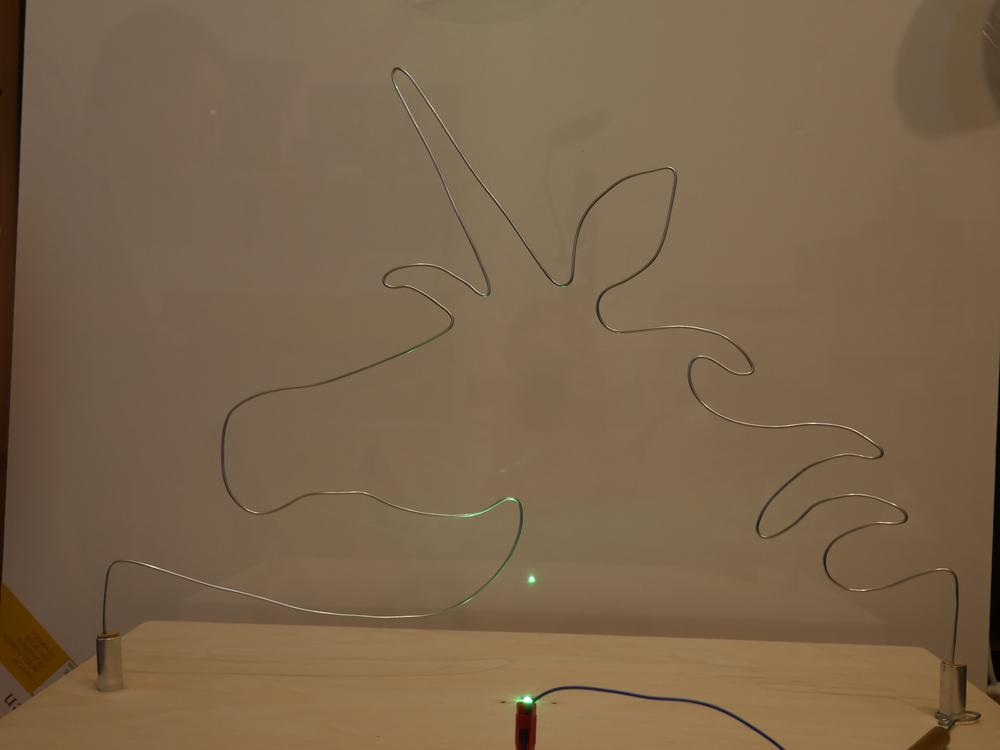
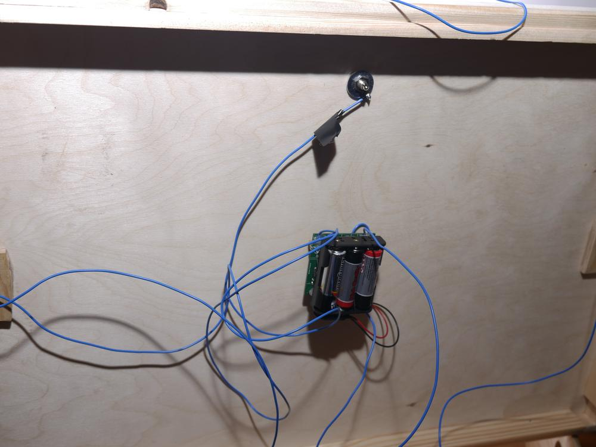
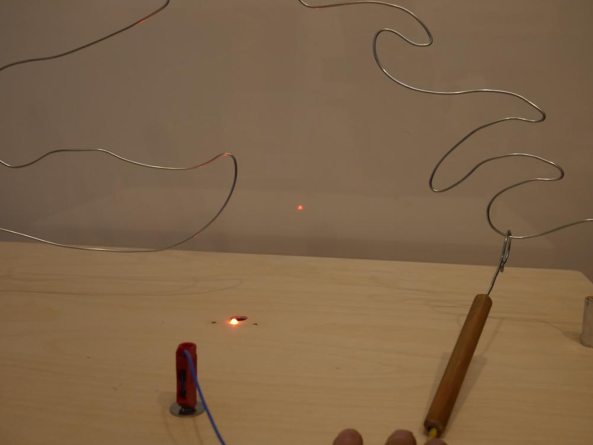
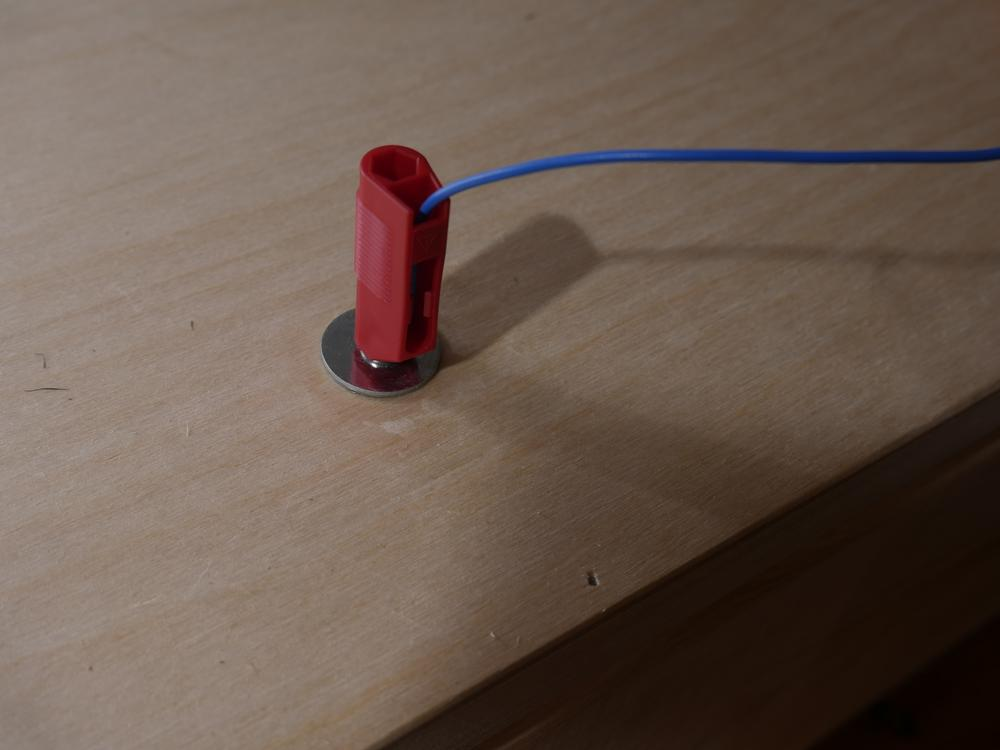
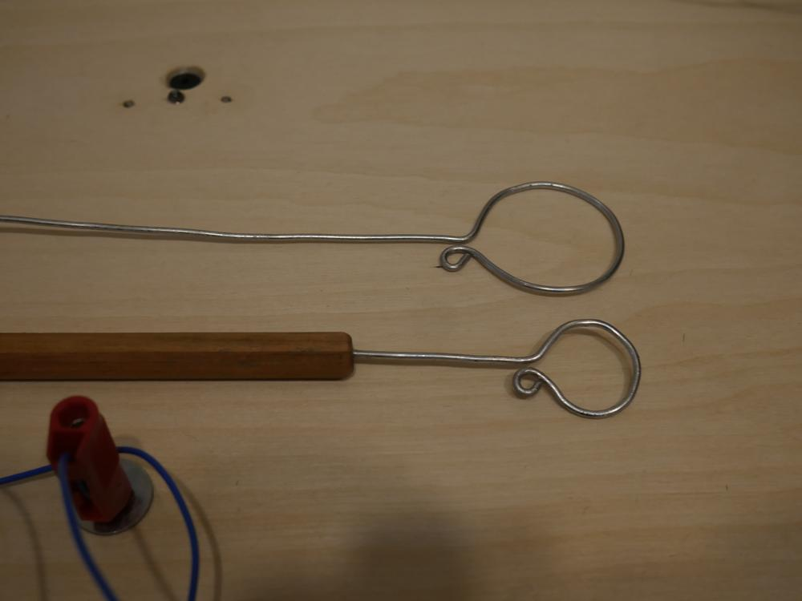
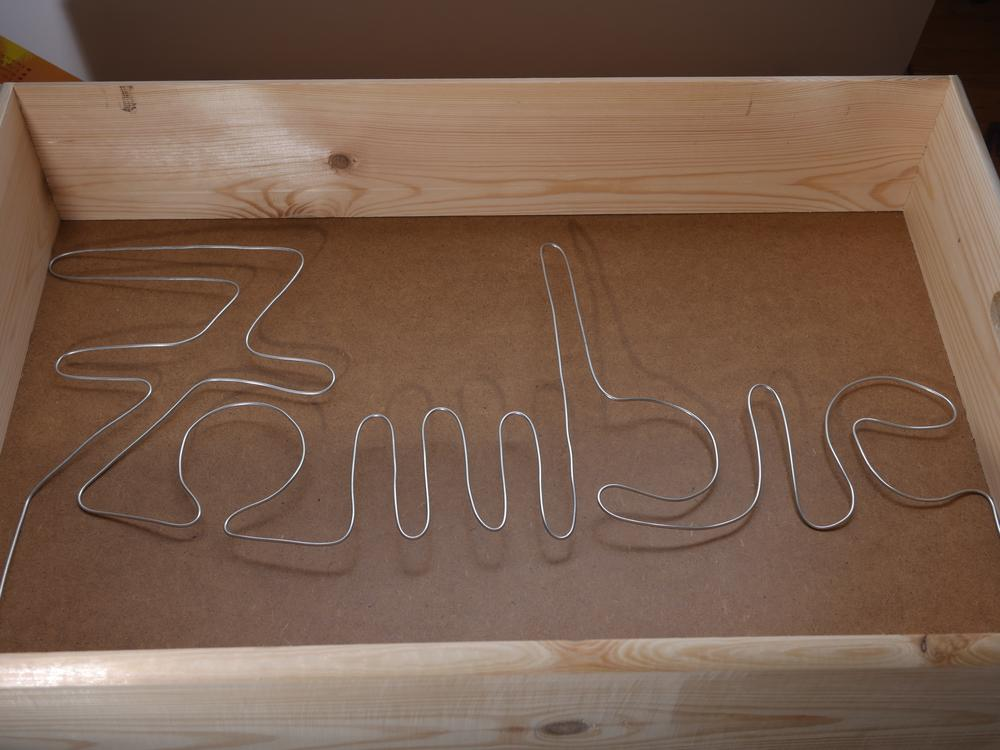
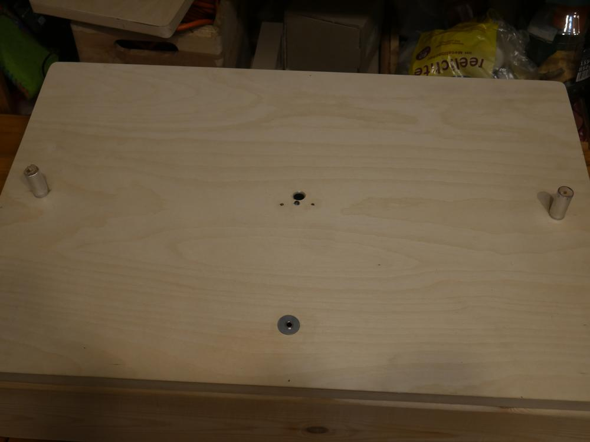

Wer kennt ihn nicht, den heißen Draht? Der Wunsch nach einem solchen Apparat war spontan entfacht, weil ein Freund uns mit seinen Plänen infizierte. Die Idee den gewundenen Draht auswechselbar zu machen fanden wir grandios. Die technischen Feinheiten konnte mein Freund Ehrlich erledigen. 

Unseren Draht kann man in zwei Teams spielen. Der rechte Kontakt färbt die LED grün und der linke blau ein. Wird der Draht berührt ertönt ein Piepen und die LED leuchtet rot, dann muss man erneut an dem Kontakt beginnen, der zuletzt berührt wurde. 

Man kann die Führungsösen in zwei Größen anschließen mittels eines Bananensteckers. 

Geplant ist der Einsatz des heißen Drahtes nicht nur zu verschiedenen Anlässen (daher auch der auswechselbare Draht), sondern als zu lösende Etappe bei einer Zombie-NERF-Veranstaltung. Dafür benötigten wir auch die zwei-Team-Komponente. Ich habe mich sowohl für das Zombie-NERF-Ding ausgetobt mit dem Zombie-Schriftzug, als auch meine Idee eines Einhorns umgesetzt. Als weitere Ideen gibt es noch die Heavy-Metal-Hand, ein Herz mit Pfeil und viele andere haben noch Platz in der Kiste, in der alle schon gebogenen Drähte aufbewahrt werden können. Mit nur einer Schraube an einer Lüsterklemme unterm Deckel, die den Kontakt herstellt, kann der Draht getauscht werden. Zur Stabilisierung wird er in die Korkenhalterung geschoben. 

Das Ganze ist schön platzsparend und leicht zu transportieren. Wenn euch noch weitere Ideen für Drahtgebilde einfallen, schreibt mir gerne eine Mail, in dem Sinne: bleibt drahtig, Eure Ermeline.
