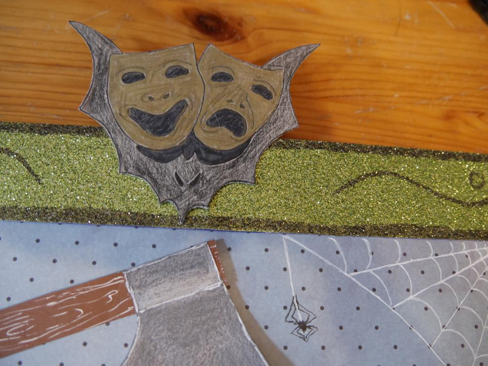
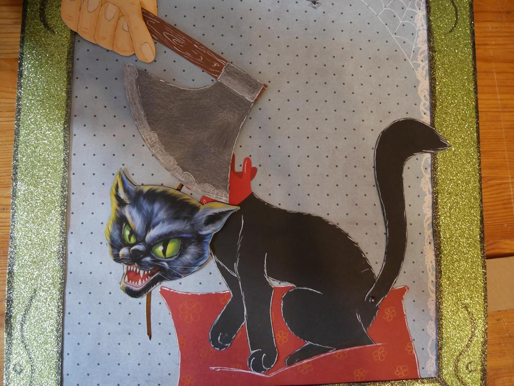

Damit kein Missverständnis entsteht: Ich liebe Katzen!
Und ich gebe zu, beim Basteln dieses Bildes hat mir ein wenig das Herz geblutet.

Hintergrund warum dieses Bild und wieso und überhaupt. Wer schon länger mitließt, der erinnert sich vielleicht, dass ich mal im Grusellabyrinth gearbeitet habe. Und auch wenn die [Zeit in Kiel vorbei](/2014/05/gedenktafel/) ist, so geht es doch in Bottrop weiter und man fühlt sich immernoch in gewisser Weise verbunden. Nun ist es so, dass es sich als Witz entwickelt hat, einen Kollegen, der definitiv keine Katzen mag mit Katzenbildern (bei jeder Gelegenheit) zu beunglücken. Diesmal dachten Tomcat und ich uns, dass besagter Kollege wieder eine Katze verdient hätte, da es sich bei diesem Anlass jedoch um das 15-jährige Jubiläum des Grusellabyrinths handelt, haben wir gewisse - ähhhm - Eingeständnisse gemacht. 

Was ursprünglich eine Grußkarte werden sollte, ist nun etwas größer geraten und zum interaktiven Bild geworden, dadurch hat es jedoch einen Platz im Büro erhalten, wo es jeden Tag für ein Lächeln auf dem Gesicht gewisser Menschen sorgt. Da weder Tomcat noch ich bei der Feier dabei sein konnten, hat eine Mitgrusellegin es für uns überreicht. Danke dafür an Hermine. Und nicht nur die Größe hat sich entwickelt auch die Idee der Umsetzung wurde erst während des Bastelns konkreter.

Und wenn die Katze fertig ist, muss das Drumherum gemacht werden, und dabei musste ich an Bodo Wartkes - Ja, Schatz! denken...

Ja und dann kommt der Spaß (für die Einen mehr, für die Anderen weniger) wenn alles fertig ist - das Köpfen.

Auch wenn es irgendwie zu einem inneren Konflikt bei mir geführt hat, bin ich doch zufrieden mit dem Werk. Und ich freue mich, dass Tomcat und ich einen kleinen Beitrag zum Jubiläum leisten konnten. 

PS: zeigt diese verstörenden Bilder nicht euren Katzen und wenn sie zart besaitet sind auch nicht euren Kindern.

Einen unblutigen Sonntag wünscht euch Ermeline alias Wilma B. 
