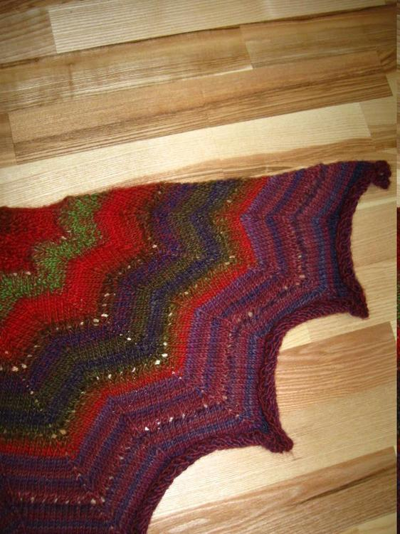
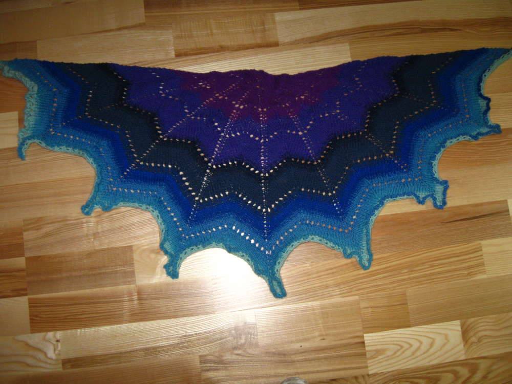
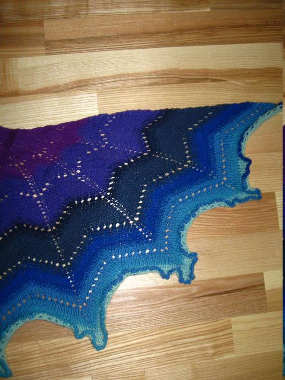
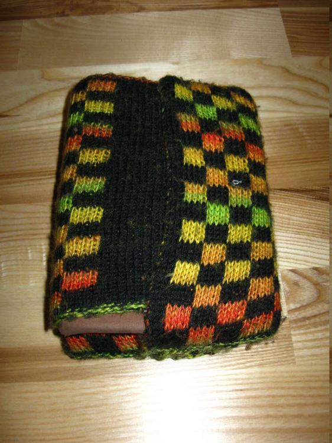

Starten wir das Jahr 2016 mal mit ein paar Oldies aus meiner Foto-Fundgrube. Ich habe diesen Post mal in die Kategorie Basteln eingeordnet, obwohl hier viele Sachen auch gestrickt und genäht sind. Kurzum es ist eine Sammlung vieler alter Projekte, die ich bisher noch nicht vorgestellt habe und manche davon habe ich auch nicht mehr. Verzeiht mir an dieser Stelle die schlechte Fotoqualität, mache Dinge habe ich nur noch auf diesen Fotos und daher nicht die Gelegenheit sie schöner abzulichten.

Hier sind ein paar selbstgemalte und abgemalte Bilder, die noch nicht im Flauschiversum auftauchen, die meisten kommen aus dem Jahr 2004 sind also über 10 Jahre alt, sie entstammen damit der Ära "Ich male auf Holz" die durch mein damaliges Schulpraktikum im Opernhaus eingeläutet wurde. Zwei Bilder sind auf Papier gemalt, das eine dürftet ihr sogar wiedererkennen von der Kategorie Malen.

## Bilder

Diese Fotos sind was für die Leute, die meinen Kleiderschrank schon in real gesehen haben, viele Menschen haben sich in ihm mit Edding verewigt und einiges zeugt aus meiner Zeit nach meinem Schulabschluss. Ich zeige das Innenleben mal nicht, da sind auch ein paar Peinlichkeiten drin...

## Kleiderschrank

Hier sind einige Strickwaren, die ich irgendwann mal gemacht habe. Das blaue Tuch ist aus einem meiner ersten gesponnen Garne. Das karierte Teil ist eine Buchhülle, die doppeltgestrickt ist.

## Gestrickt

Zum Schluss noch das Fundstück des Kleiderschranks. Meine aus Krawatten zusammengenähte Weste, der Verschluss ist eine alte Seidenfliege.

## Weste

