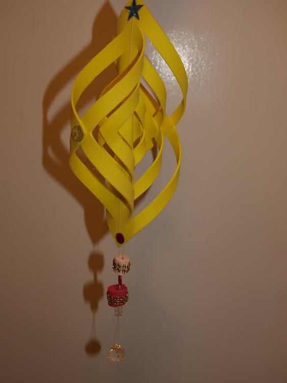

In der letzten Woche war mal wieder Basteln angesagt.

Ich habe mir ein paar Moosgummireste geschnappt und eine nette kleine Hänge-Deko fabriziert. Naja, klein ist vielleicht nicht die richtige Bezeichnung für ein 1 Meter langes Gebamsel!?

Es entstand aus 3 unterschiedlich großen Quadraten. Das größte hat eine Seitenlänge von 20 cm. Die habe ich dann locker zu einem Dreieck gefaltet und frei Hand eingeschnitten, wie es aus der Zeichnung ersichtlich ist. Die Einschnitte sind parallel mit etwa 1,5 cm Abstand zueinander. Dann werden die Spitzen von innen nach außen abwechselnd nach vorn und nach hinten gebogen und zusammengeklebt. Ich habe dazu einfachen Bastelkleber genommen und mit einer kleinen Klammer zusammengehalten, weil das Moosgummi doch ziemlich störrisch ist.

Aus noch kleineren Resten wurden Streifen geschnitten, um einen Bleistift gewickelt und auch so geklebt. Danach habe ich sie mit Pailletten und Glitzersteinchen veredelt. Gemeinsam mit ein paar bunten Knöpfen wird alles mit einem stabilen Baumwollfaden aufgefädelt und das ist auch schon alles. Zur Sicherheit habe ich noch den einen oder anderen Klecks Kleber verteilt, aber das muß nicht unbedingt sein.

Aus mehreren gleichgroßen Teilen lassen sich auch gut zu Weihnachten Sterne basteln, aber daran möchte ich jetzt noch gar nicht denken. Lasst einfach eurer Kreativität freien Lauf. Ich bin gespannt, was bei euch so dabei herauskommt.

Liebe Grüße sendet euch Lucy.

