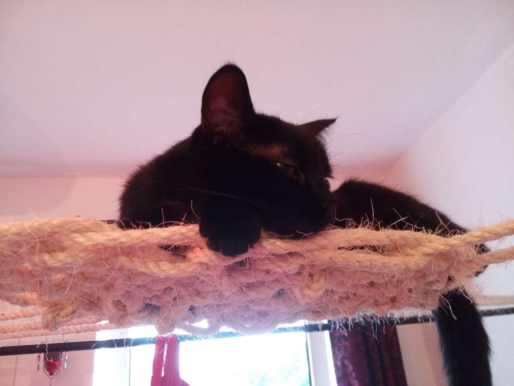
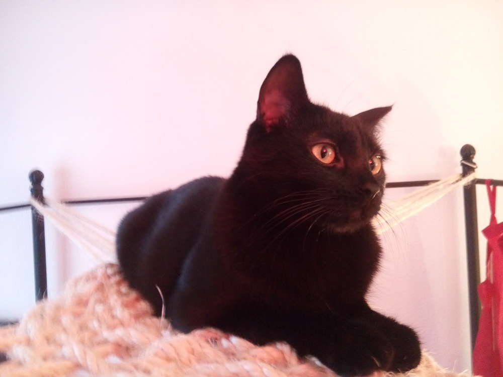
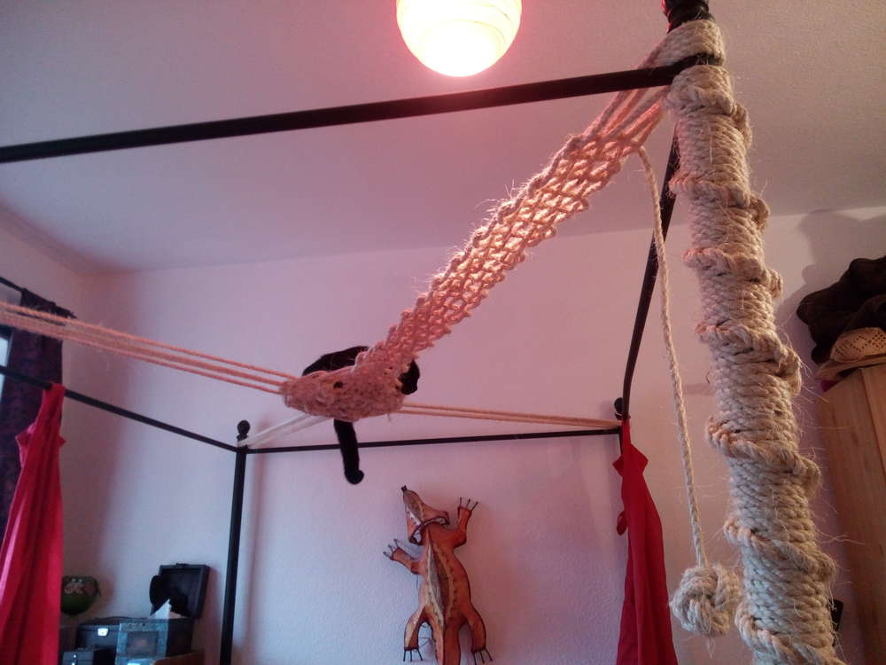
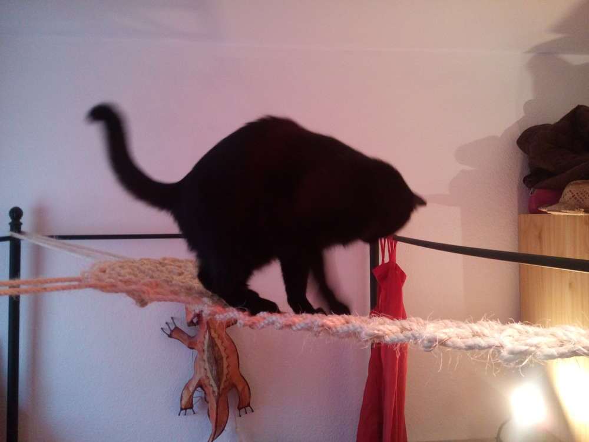
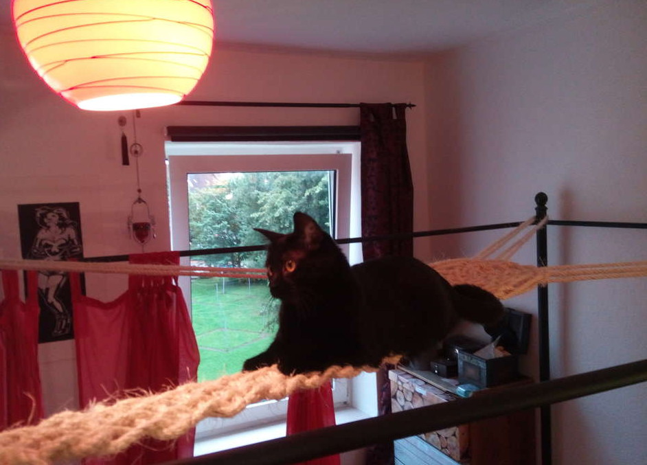

Kann man es mit seiner Katzenvernarrtheit übertreiben? - Ja!
Aber das ist mir egal. Nachdem ich den alten selbstgebauten Kratzbaum (nach 17 Jahren gutem Dienst - braucht wer nen Kratzbaum?) aus dem Wohnzimmer geschmissen habe, weil er einfach zu viel Platz wegnahm, habe ich endlich die Vision meiner Klettergelegenheit für Shubia installiert. Etwa 75 Meter Seil sind da verschnürt worden, die Kosten belaufen sich auf etwa 40€ für 100 Meter Seil mit 8mm Durchmesser, ich habe also noch was übrig. Juchee.
Da Shubia sowieso immer die Angewohnheit hatte unseren Baldachin als Trampolin zu benutzen und er deshalb weichen musste, entschloss ich mich für die Zweckentfremdung unseres Himmelbetts. Ihr ahnt ja nicht, wie unangenehm es ist, eine krallenbesetzte Katze aus dem Himmel des Bettes pflücken zu müssen, die sich 'nen feuchten Dreck um Frauchens Nachtruhe schert. Der Beitrag sollte lieber Frauchenfreundlich Klettern heißen.

Sonst kletterte das Fellknäul an den Vorhängen hoch, jetzt hoffe ich es mit dem Seil kompensieren zu können. Durch die Abspannungen in alle vier Ecken hat Shubi nun eine sichere Aussichtsplattform zum Dösen, Ausschau halten und Klettern. 

Die Brücke ist ihr noch nicht ganz geheuer, sie schaffte es jedoch schon sich darauf zu legen, sich umzudrehen und bis zur Mitte zu klettern. Jetzt ist in jedem Zimmer der Wohnung eine Kratz- und Spielgelegenheit, die nicht zu viel Platz in Anspruch nimmt.  

Das Beste ist wohl, dass ich trotz der Seilkonstruktion immernoch das Bett auseinanderbauen könnte und die Vorhänge auch noch zum Waschen abbekomme. Wer kein Problem mit Asymmetrie hat, kann sich leicht damit anfreunden, der vierte Vorhang ist nun auf die Fensterseite gewandert und kann beliebig hin und her geschoben werden. Zumindest nimmt der neue Kratzbaum keinen Platz weg, wo vorher welcher war. Und ja - in diesem Haushalt lebt nur eine Katze...

