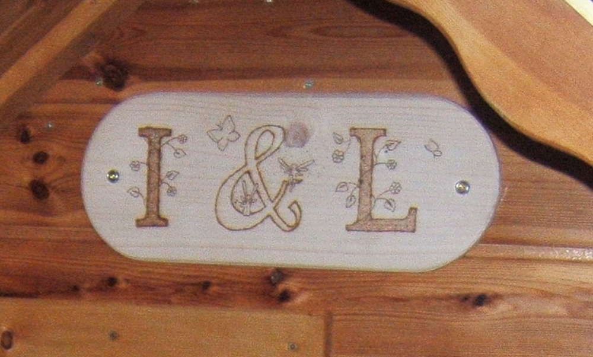

Also mein Papa ist der coolste von der ganzen Welt... und das kann ich beweisen. :) Ich fange am besten von vorne an, damit man auch die gesamte Entstehungsgeschichte kennt. 

Wir befanden uns in einem Holzhandel und sahen vor der Eingangstür ein kleines Kinderspielhaus aus Holz stehen. Die erste Begeisterung verflog schnell, denn witterungsbeständig schien das Häuschen nicht zu sein und schimmel-technisch war es eine Zumutung. Dabei war dies nur ein Ausstellungsstück und schon aufgrund schlechter Verarbeitung und Luftzirkulation verwittert. Aber die Idee war geboren für das ultimative Kinderspielhaus. Wie durch Zufall hat meine Schwester Kinder (na sowas) und damit hatten wir auch einen idealen Endabnehmer :) ...also ran an den Speck.

Wir bekamen eine alte Wohnzimmerverkleidung geschenkt, aus der wir die Wände des Hauses bauten. Das Haus soll einem Umzug stand halten können unter anderem auch, weil der Bauort nicht dem Spielort entsprach und daher passt das Haus in auseinandergebautem Zustand in einen Kombi. Wir hatten 4 Wände und ein Dach gebaut, aber das macht noch kein fertiges Haus. Damit ein Kind sich dort wohlfühlen kann und auch wohnen kann, fehlen Fenster und Tür, Vorhänge und Hausschild...

Also los geht's. Die Innenseiten der Wände haben wir mit Styropor isoliert und mit Stoff bezogen (Wer will schon, dass die Kinder das Styropor in seine Einzelteile zerlegen...?) und danach in einem Cremeton gestrichen (gutes Feng-Shui :D). Zur Belüftung, denn das Haus hat keinen Schornstein, ist in der Rückwand des Häusschens eine Toilettenbelüftung (wer möchte schon, dass die Kinder beim Spielen an Sauerstoffmangel leiden...), hier sieht man gerade einen neugierigen Eigenheimbesitzer, der bei der Montage spioniert.

Die Fenster sind aus Plexiglas und das Große an der Seite lässt sich aufschieben. Die Vorhänge hat meine Mutti beigesteuert, das macht das ganze schon viel wohnlicher (... und verbessert das Feng-Shui erheblich). Das Tollste überhaupt ist, glaube ich, die Klönschnack-Tür. Diese besteht aus massivem Holz und ist mit einer kleinen Schwelle zum Aufstützen während des Klönschnacks und einem kleinen Blümchen zum Durchschauen versehen. (Ein Herzchen wäre auch tollgewesen, aber dann hätte jemand das Haus vermutlich mit einem Plumpsklo verwechselt und das sollte nicht geschehen.) Ein kleiner Riegel verhindert das Aufschwingen der Tür.

Das Dach ist mit Teerschindeln bedeckt, diese sind wetterbeständig und das Haus sieht mit der Ziegeloptik viel detaillierter aus, es war zwar wesentlich mehr Arbeit aber sieht viel niedlicher aus. Wenn es regnet läuft in einer kleinen Regenrinne das Wasser ab und kann in eine kleine Tonne umgeleitet werden. Damit auch jeder weiß: "Dieses Haus gehört jemandem:" Habe ich noch ein kleines Schild mit den Initialen meiner Nichten gebrannt.

Im Sommer steht oft ein eigener Outdoor-Pool (Planschbecken) vor der Tür neben den kleinen Blumenkästen, die mit dem Wasser der Regentonne gegossen werden. Das untere Foto zeigt das Haus im Winterquartier. Es ist sooooo süß, oder? Und es gibt schon Pläne für Version 2.0 ;) und deshalb ist mein Papa der Coolste.
