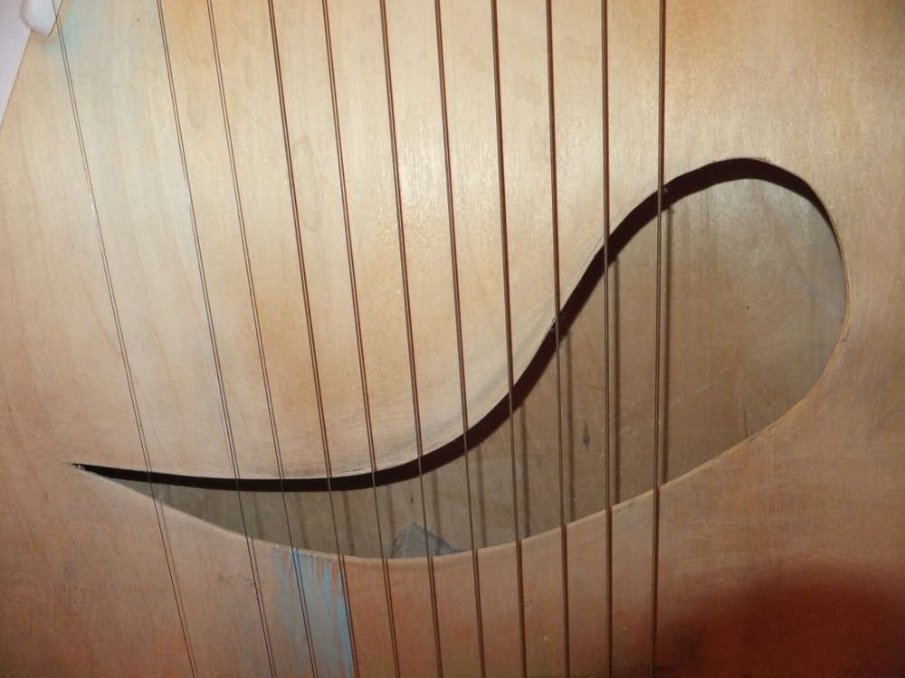
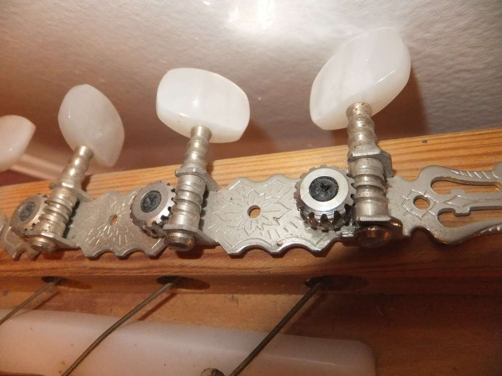
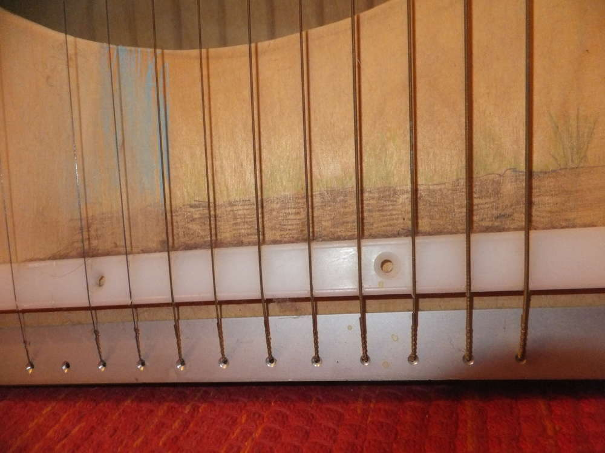
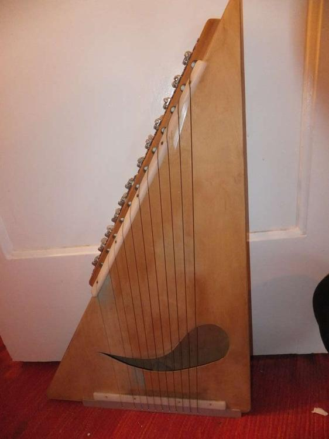
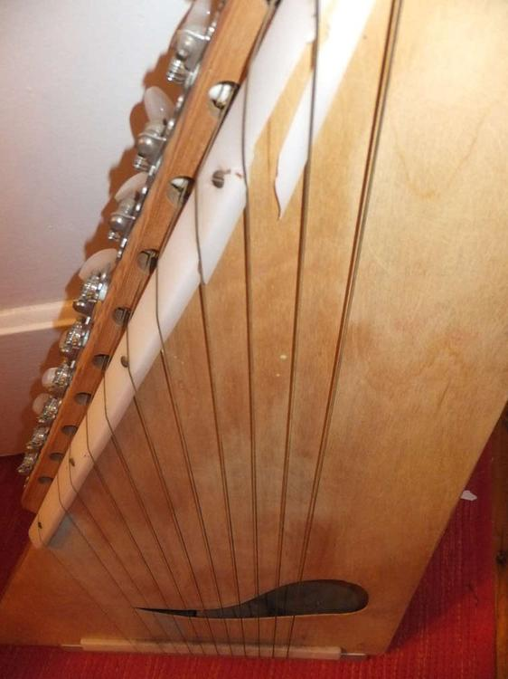
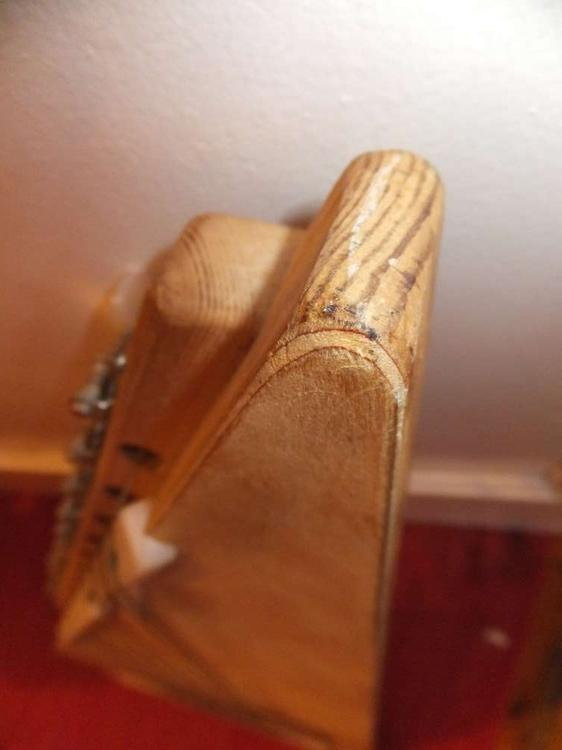
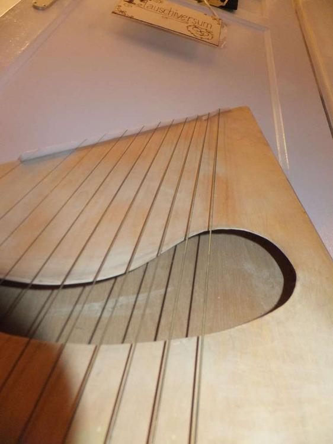
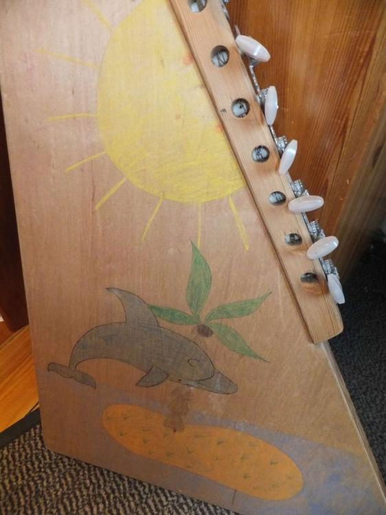
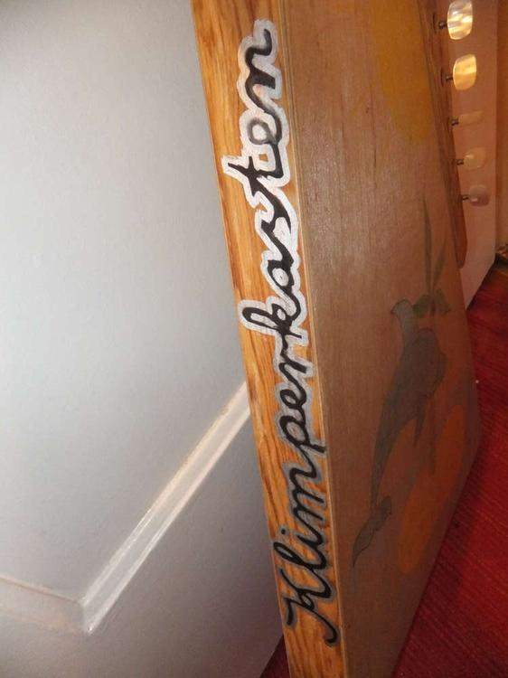

Ich muss hier auch mal wieder zeigen, was mein lieber Papa alles so gemacht hat. Neben der [Küche](http://flauschiversum.de/2014/08/hexenkuche/) und dem [Kinderspielhaus](http://flauschiversum.de/2014/06/kinderspielhaus-deluxe/) hat er mir mit diesem selbstkreierten Instrument eine klingende Kindheit beschert. Im Keller hat er damals diesen sogenannten Klimperkasten gebaut. Seine Erscheinung erinnert etwas an eine Harfe aber auch an eine Gitarre mit einem Hohlkörper. Meine Schwester und ich haben uns kurzzeitig kreativ mit Buntstiften ausgelebt, die Überreste sieht man noch an manchen Stellen durch. Der Klimperkasten war nie gestimmt oder wurde je von einem Profi bespielt, aber es machte einfach Spaß an den Knöpfen zu drehen, den Saiten zu zupfen und so dem Instrument seine Töne zu entlocken. Leider sind die Saiten nicht mehr komplett und auch die eine Plastikleiste hat gelitten, nichtsdestotrotz wird dies auch weiterhin mein Begleiter sein, auch wenn es als Zeuge für meine unmusikalische Seite steht. 

Ich erinnere mich immer gerne an die Dinge, die ich mit meinem Vater angestellt habe, ob es ums Drachenbauen aus Zeitung und Kartoffeln geht, die Unterhaltungen durch unsere Klönschnacktür im Schuppen, das Bauen von Regalen und einem Wollfass (zu dem es auch noch einen Betrag geben wird) oder um das Bepflanzen eines Hochbeetes oder das Ausdenken eigener Geschichten von denen eigens aufgenommene Kassetten zeugen (Zitat:"...und alle gingen vergnügt nach Haus, denn sie waren tot.") und die ich von ihm in Form von "Hahnchenpanchen und Hükenpüken" abends am Bett vernahm. Dalewankelewe Palewapalewa, dass du für mich und mit mir so tolle Sachen gemacht hast, jetzt kann der kreative Blödsinn im Rentenalter gerne weitergehen.

