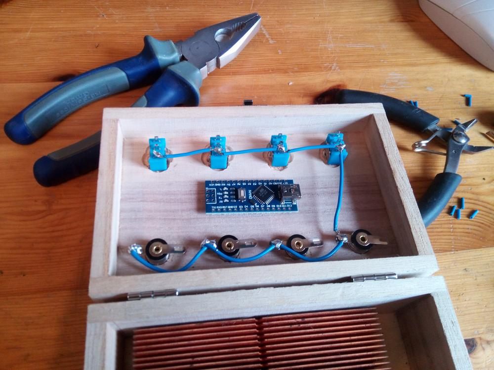
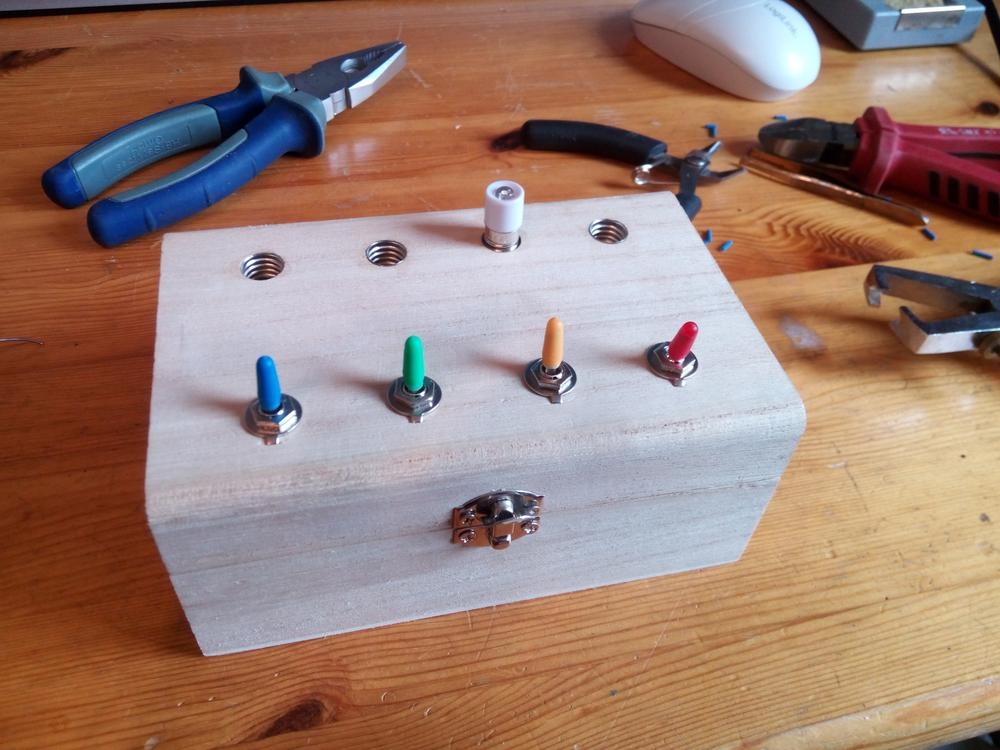
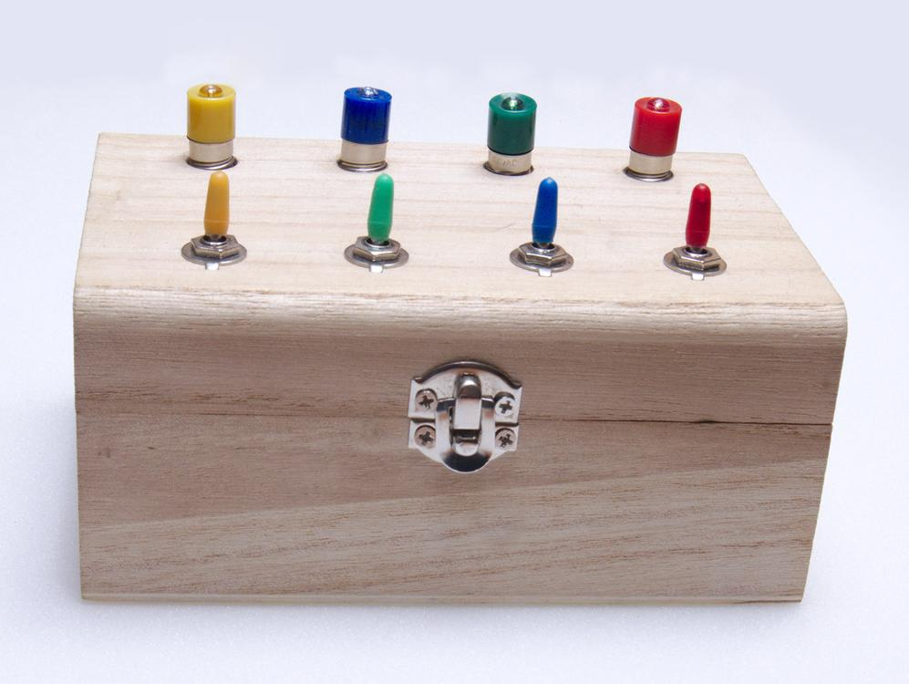
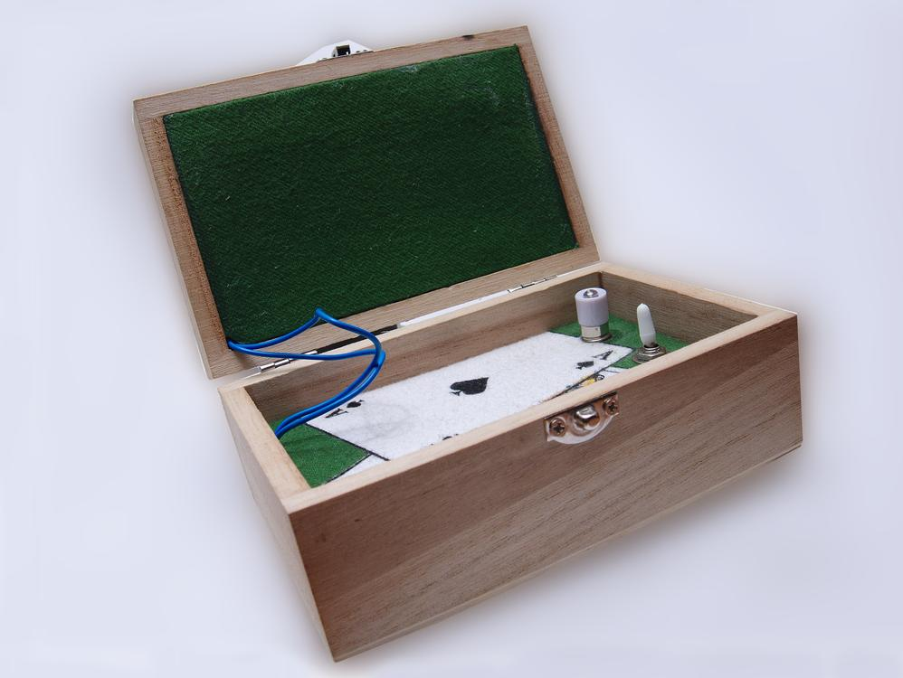
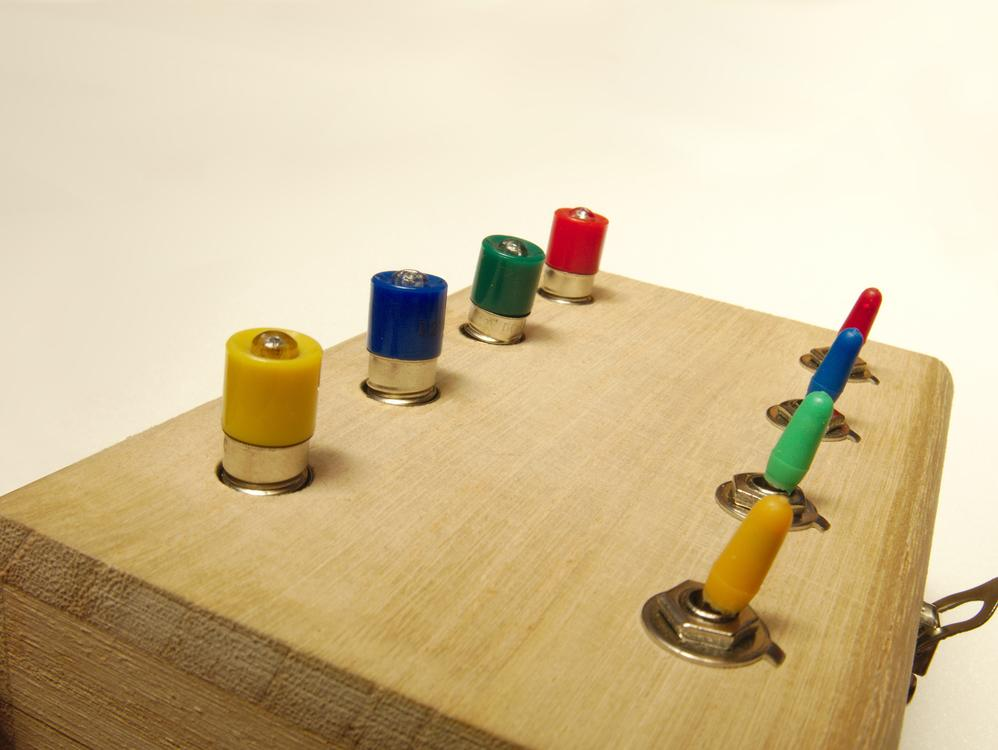

Wenn man, so wie ich, gelegentlich mal das Internet nach Zaubertricks durchforstet, findet man allerlei Skurilitäten.
Eine, die mir besonders gut gefallen hat, ist das "Magic Switchboard".
Es handelt sich dabei um einen kleinen Kasten mit vier farbigen Lampen und vier farbigen Hebeln.
Man kann sowohl die Farben der Lampen als auch die Farben der Hebel vertauschen, trotzdem betätigt der rote Hebel immer die rote Lampe, der Blaue die Blaue, usw.

Das ganze funktioniert natürlich nur, wenn der Zauberer selbst das Kistchen in der Hand hat.
Ein unbedarfter Zuschauer wird sich schwer tuen es ihm gleich zu machen.

## Benötigte Teile
Holzkisten gibt es bei Wolle und Hobby
Alles andere lässt sich mehr oder weniger günstig bei Ebay bestellen.

* Kippschalter (MTS-102)
* Lampenfassung Sockel E10
* 12V LED E10 Birne (Rot, Grün, Gelb, Blau, Weiß)
* Mini-Kippschalter Abdeckkappen
* Arduino Nano / Atmega328p Mikrochip

Die Software ist eine Eigententwicklung und kann auf [Github](https://github.com/RincewindWizzard/magic-switchboard) heruntergeladen werden.

Ihr fragt euch jetzt sicherlich, wie der Zauber funktioniert?
Die Antwort ist: Mit einer Menge Fantasie ;)
