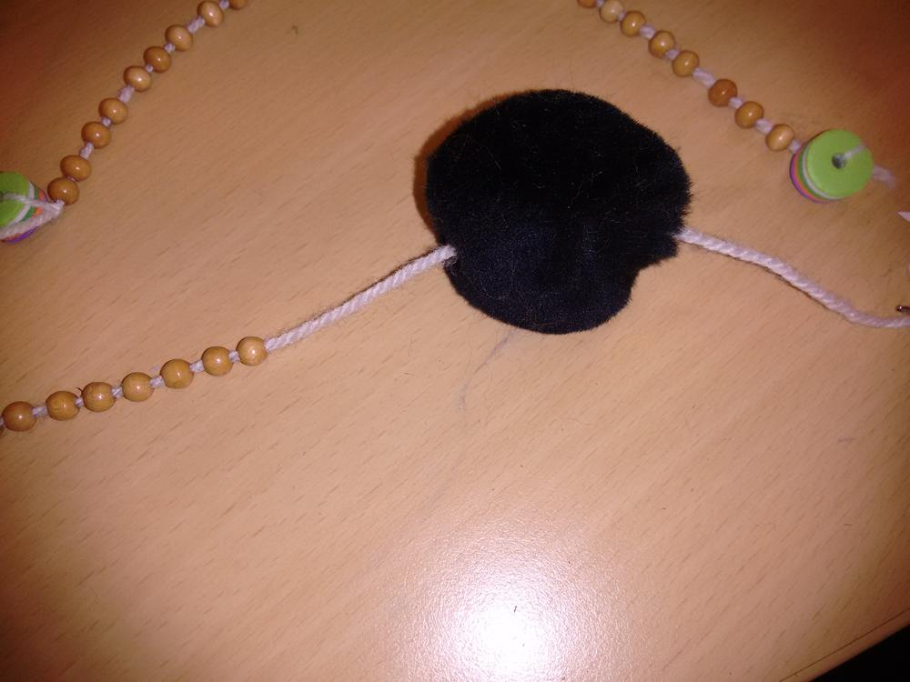
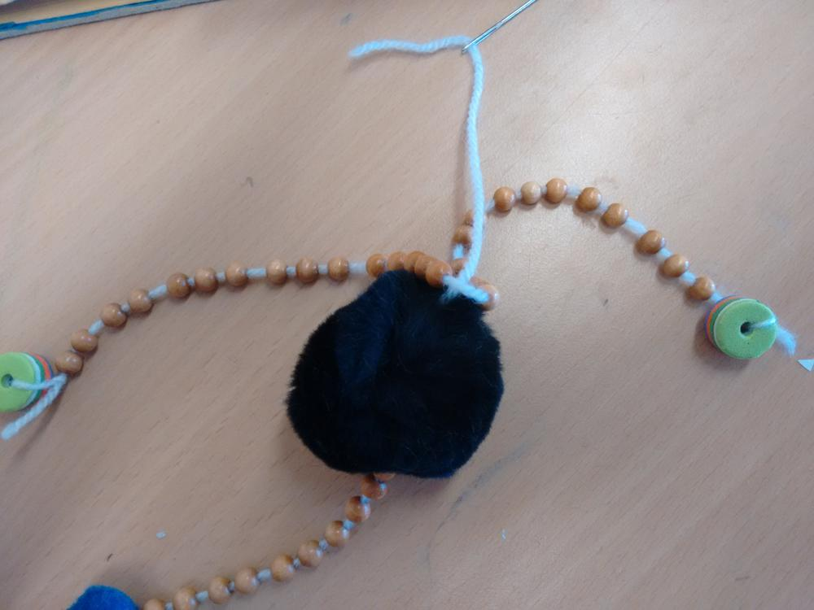

Marionettenbau ist die perfekte Beschäftigungstherapie nicht nur für Kinder. Alles fing damit an, dass ein fünfstündiger Dienst mit Kindern vor mir lag und ich mich fragte, was man machen könnte. Mein neuestes Lieblingsmedium Pinterest hat mich dann auf die glorreiche Idee gebracht Marionetten zu bauen. Also musste alles zusammengesucht und vorbereitet werden. 
Bastelkleber, Schere, Nadeln, Wolle, Bommel (2verschiedene Größen), Holzstäbchen, Bastelfilz, Wackelaugen, an wenigen Dingen hat es gemangelt, und so sind die Holzstäbchen zu Schaschlikspießen und die Wackelaugen zu Papier und Stift geworden. 
Hat trotzdem alles wunderbar funktioniert. 

Eine Stunde lang wurde gebastelt und eine weitere mit den Flattermännern gespielt.

Und weil die Ermeline die Kinder beschäftigt hat, konnte sie selbst auch noch einen Piepmatz bauen, um dem Stil der Kinder treu zu bleiben nannte ich ihn Krähe und machte noch eine kurze Anleitung für euch.

Als erstes haben wir Perlen aufgefädelt und locker über den Faden verteilt, dann schlenkert es nachher schön. An die Enden kommt jeweils ein Füßchen, das kann eine größere Perle sein oder wie bei uns Moosgummiperlen. 
Für den Kopf machst du einen Knoten am Ende des Fadens und stichst zuerst durch den Kopf durch um danach erneut Perlen für den Hals aufzufädeln.

Dann stichst du durch den Körper um mit dem est des Fadens die Beine zu befestigen, noch gut vernähen und fertig ist das Grundgerüst.

Nun muss noch das Gesicht entstehen, da wir uns auf Vögel eingestellt haben, brauchen wir einen Schnabel und zwei Augen, es sind natürlich der Fantasie keine Grenzen gesetzt auch verrückte Wesen haben eine Daseinsberechtigung.

Wenn die wichtigsten Teile mit Bastelkleber befestigt sind, kann mit Federn verziert werden und sich dem Marionettenkreuz gewidmet werden. Wir haben mit zwei Schaschlikspießen das Kreuz gemacht, dafür haben wir einen Faden um die Mitte gewickelt und anschließend mit Kleber fixiert.

So weit so gut, alle Kinder abgeholt, Feierabend in greifbarer Nähe aber so richtig fertig ist die ermeline noch nicht. Meine Gedanken kreisen um eine größere Variante und dafür fehlen mir noch ein paar Ingredienzien, also auf zum [Idee](/2013/07/idee-creativmarkt/)
Ich hatte meine [Grinsekatzentasche](/2016/05/grinsetasche/) dabei, stand bepackt mit dem Klöterkram an der Kasse, als mich die nette Verkäuferin darauf hinwies man könne die Tasche mit Lederfarben noch aufpimpen. Mist da hatte sie mich auf dem richtigen Fuße erwischt, habe zu viel Geld dort gelassen aber mein Marionettenprojekt konnte noch heute losgehen und die Grinsekatze kommt dann auch demnächst dran.

Ich habe immernoch ausreichend Plüschstoff übrig trotz [Karteikasten](/2014/05/karteikartenfresser/)und [Kissenhülle](/2015/04/monstermassiges-kuschelkissen/) um ein großes, fluffiges Marionettending bauen zu können. Also gesagt getan. Zuhause hingesetzt und das Ding zum Leben erweckt.

Ich habe mich zunächst dem Kreuz gewidmet. Mit einem Handbohrer machte ich ein Loch in ein Rundholz und bearbeitete dieses solange mit Raspel und Schmirgelpapier, bis die ausrangierten und gekürzten Essstäbchen in die Löcher passten und festgeleimt werden konnten.

Jetzt widme ich mich dem Kopf und dem Körper. Beide sollen aus dem Lila Plüschstoff gemacht werden, dazu benötige ich zwei unterschiedlich große Quadrate. Das kleine Quadrat für den Kopf hat eine Seitenlänge von etwa 15cm und das größere etwa 30cm. Per Hand nähe ich nun auf Links drei Seiten zusammen, am Anfang müssen alle Ecken in der Mitte verbunden werden. Beim Zusammennähenmusst du daraufachten, den Plüsch immer innen zu behalten, also immer alles reinstopfen. Bevor die letzte Seite geschlossen wird, krämpel ich die Arbeit um und stopfe alles mit Füllwatte aus.

Für die versteckte Naht empfehle ich euch einfach mal das Internet nach einer Anleitung abzusuchen, da gibt es gut bebilderte Erklärungen, das wäre hier mit dem Stoff nicht so deutlich erkennbar und man muss das Rad ja nicht neu erfinden.

Durch den ganzen Plüsch sieht man nicht, dass mein Piepmatz ein Quadratschädel ist, bei unplüschigen Stoffen muss man sich eine schmeichlerische Form zum Nähen suchen.

Wenn alles fertig genäht ist, kümmere ich mich noch um das Gesicht. Ich brauche einen Schnabel, den ich aus Bastelfilz genäht habe und die Augen habe ich aus einem EuroShop, sie wurden in meinem Fall an einer Ecke des Kopfes befestigt. Dazu habe ich die Ecke durch den Zwischenraum gezogen und gut mit dem Rest des Kopfes vernäht.

Ich habe zwar noch große, runde Holzklötze, die ich als Füße nutzen könnte, aber mir fielen meine alten Babyschuhe ein, die ich noch in einer Kiste liegen hatte, hier wird also alles weiterverwendet.

Jetzt muss nur noch alles verbunden werden und da mir die Kombination aus Lila und Grün so gut gefiel, schnappte ich mir noch etwas von dem Grünplüsch und schnitt daraus einfach einen Streifen für den Hals und zwei gleiche für die Beine zurecht. Die Beine an den Schuhen festnähen und dann unter dem Bauch des Vogels, der Hals wird am Kopf befestigt, achtet dabei darauf, dass ihr den Kopf nicht schief annäht, sonst habt ihr nen schrägen Vogel (Autsch!! den konnte ich mir nicht verkneifen). Näht den Hals noch am Körper des Vogels fest und dann müssen nun nur noch die Fäden gezogen werden.

Die Spielfäden werden an 4 Stellen befestigt, zwei an den Füßen einer am Körper und einer am Kopf.
Die Fäden der Füße werden mit den Seiten des Kreuzes verbunden, der Faden vom Körper an der Mitte des Kreuzes und der vom Kopf an der langen Seite des Kreuzes, auf diese Weise kann der Vogel später bessser nicken.
Das unbeabsichtigt Lustige ist, beim Laufen watschelt mein Vogel mit nach außen gedrehten Füßen durch die Gegend. Tja gleiches Prinzip wie die kleinen Vögel und doch ganz anders.

Ich freue mich über Eure Marionettenkreationen, schickt gerne Bilder an Ermeline@Flauschiversum.de dann stelle ich sie auch hier rein, schönen Sonntag Eure Ermeline.

