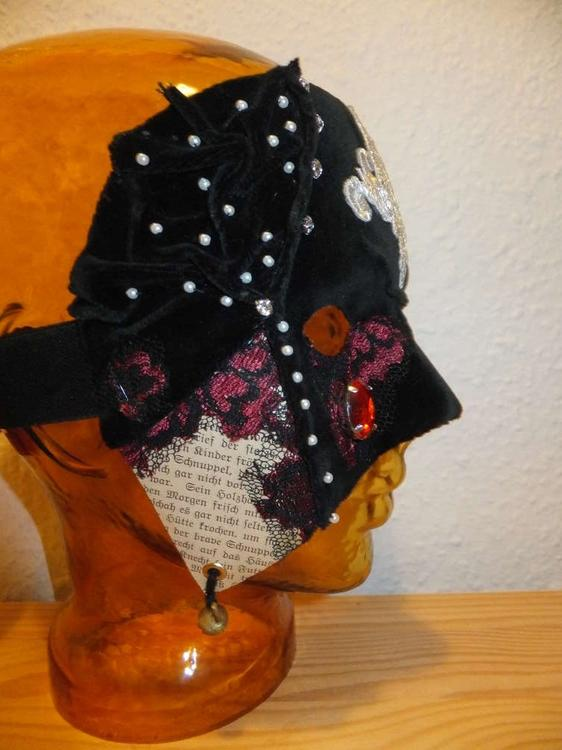
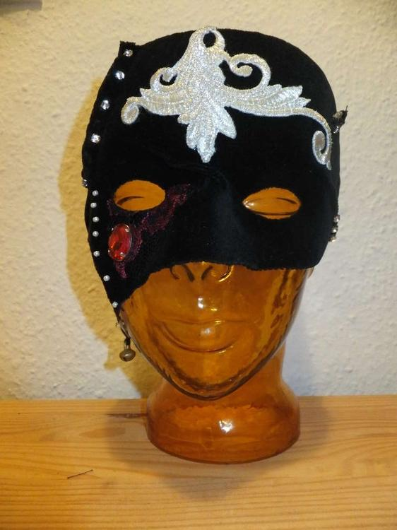
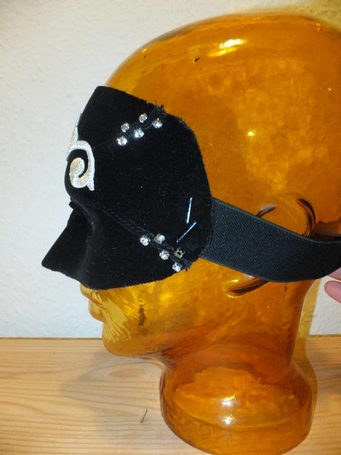

So eine Firmenfeier mit dem Motto "Maskenball" steht bei einem Freund an und es wird an mich herangetreten: "Sag mal Ermeline... könntest du vielleicht, ich hab hier noch diese blanko Maske..." "Klar!" sag ich. "Was stellst du dir vor, ich würde das so und so machen, schau mal dieser Stoff und ich hab hier noch Perlen und dies und jenes..." Ermeline wühlt und kramt in ihren Kisten weiter, bis die Materialien zusammengesucht sind und dann wird der Freund nach hause geschickt, damit das Ermelinchen in Ruhe arbeiten kann.

Tadaaaa das ist dabei herumgekommen. Ich glaub ich mach noch ein paar Masken mehr, da kann man so schön den ganzen Kleinkram verarbeiten, den man mühselig gesammelt und weggepackt hat. ;)

Es folgt noch ein Bild von dem glücklichen Besitzer, in kompletter Gewandung.

 
