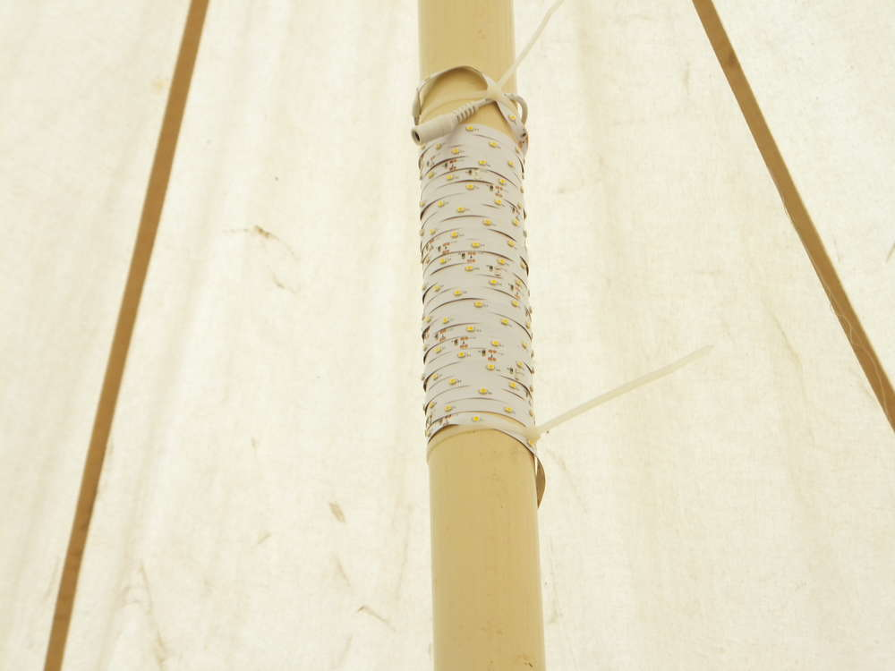
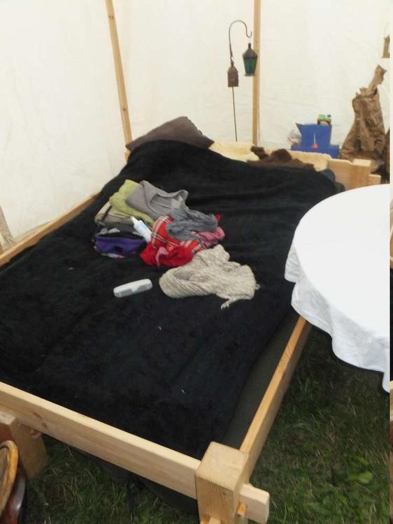

Wie versprochen gebe ich heute mal einen Einblick in unser Con-Lagerleben. Wir waren auf dem ConQuest of Mythodea und haben mal allen Kram mitgenommen, der irgendwie in unsere Transportkapazitäten passte. Diesmal gibt es also hauptsächlich Fotos und eventuell entdeckt ihr auch das [Nekronomikon](/2014/01/nekronomikon/) oder das [Langziehohr](/2014/05/langzieh-waaaaaas/) oder mein [Wurfbuch](/2016/07/conquest-vorbereitungen/), meine [Gugel](/2016/07/guck-mal-ne-gugel/), den [Räuberhut](/2015/04/rauberhut/), den [Rincewind-Hut](/2014/01/rincewind-hut/) und unser gefilztes [Banner](/2014/08/das-neue-banner/), die [Magierdinge](/2016/03/magierdinge/), sowie viele andere Kuriositäten kann man in unserem Regal wiederfinden und neu entdecken.

Es geht also an den Lageraufbau, da müssen Steckbetten und Steckregale aufgebaut und befestigt werden, das Zelt steht schon lange. Der Tisch muss eingebaut werden, und die Regale eingeräumt... und später fragt man sich, was ist eigentlich Zuhause geblieben, beziehungsweise, warum habe ich zwei Hausstände? Und ich sollte wohl nicht erwähnen, dass wir im Zelt einen Lichtschalter hatten, der mittels Energie von einem Akku unser Zelt hell erleuchtet LED sei dank?

Wer mein Lagersystem für die Lebensmittel versteht, kann gerne ein kleines Kommi oder ein Like dalassen.

 

Unsere Kuriositätenausstellung war ebenfalls durch LED beleuchtet, es waberte in bunten Farben fröhlich vor sich hin.

 

Hier sind noch ein paar Detailaufnahmen vom Bett, dieses gehört zu einem weiteren Projekt welches ich mit meinem Papa verwirklicht habe.

Tja und dann wird irgendwann nur noch abgebaut, eingetütet und gestopft.

Und ab gehts nach Hause. Hui und da soll es Leute geben die sowas als Urlaub bezeichen, Kofferpacken ist leichter.

