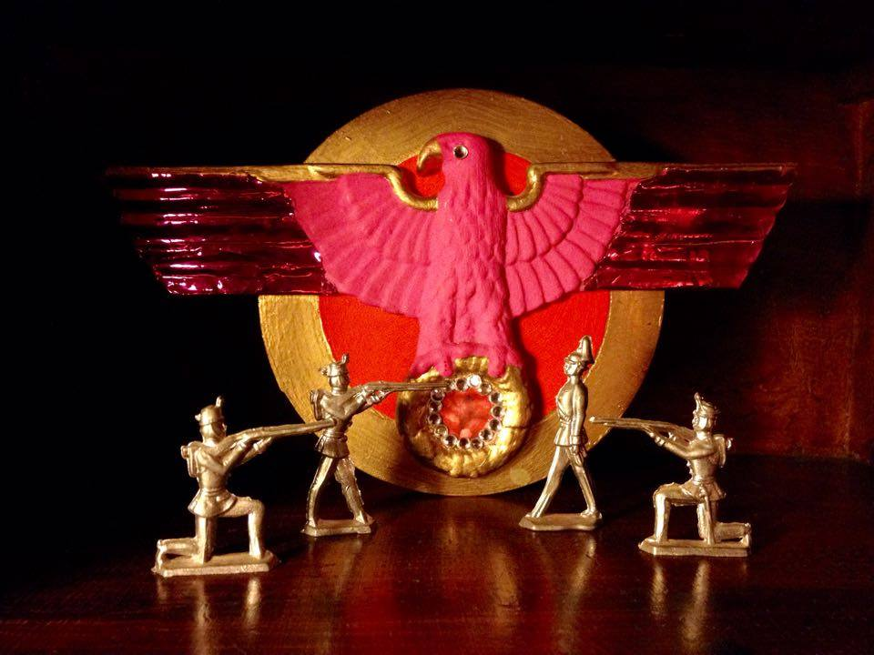
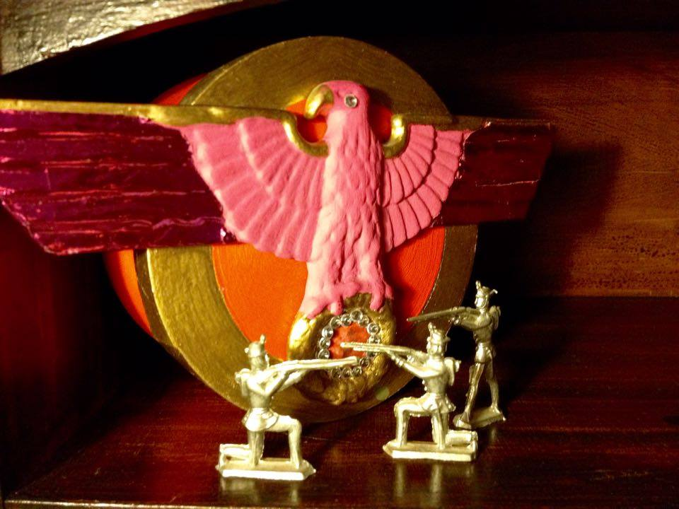

Endlich wieder ein Bastelpost im Flauschiversum! ;) Inspiriert ist dieses warmpinkglitzernde Reichsfedertier vom grandiosen Musical "The Producers", welcher dieser in einer Szene als Bühnenbild erscheint. Im Musical versucht ein gescheiteter Brodwayproduzent mit seinem Buchhalter durch einen Steuerbetrug, namentlich dem weltgrößten Flop der Musicalgeschichte, "Frühling für Hitler", eine große Geldmenge illegal zu beschaffen und sich in Rio abzusetzen. Eine großartige Geschichte gespickt mit viel Zynismus und Sarkasmus, genau so, wie ich es liebe.

Genug davon. Der hier gelandete Adler hat seinen Horst bei mir auf dem Schreibtisch gefunden, garniert mit einem goldenen Boden und Zinnsoldaten. Den Adler aus Kunstharz habe ich über Ebay gekauft und mit sage und schreibe 5(!!!) Schichten pinker Plakafarbe überstrichen. Er hat sich ziemlich gewehrt, wollte wohl nicht warmrosa werden. ;) Die Flügelenden sind mit pinker Folie überklebt und Kranz und obere Flügelkante mit Goldbronze angemalt. Im Kranz ist anstatt des Kreuzes eine Portion Hackfleisch. Um kleine Nazis zu ärgern ist der Adler mit besonders vielen Dekostrasssteinen beklebt. Den Hintergrund bildet ein runder Holzdosendeckel, welcher ebenfalls rot und mit Goldbronze bemalt wurde. Die Zinnsoldaten sind vom Flohmarkt und mit kleinen Sprechblasen aus Papier versehen.

Man kann von diesem Reichsfedervieh halten was man möchte. Solange es zur Diskussion welcher Art auch immer anregt, bin ich zufrieden!;) Wer sich die besagte Szene einmal ansehen möchte, sei auf diesen [Link](https://www.youtube.com/watch?v=z9ZbKbtMmnkhttp://) verwiesen.
   
