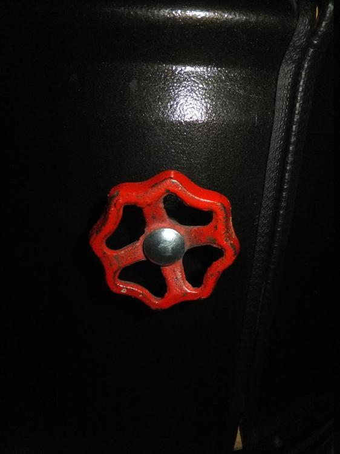
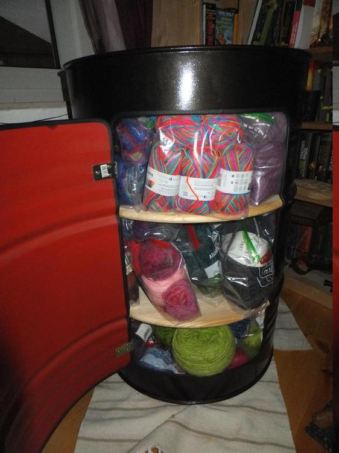

Andere haben einfach nur Wolle oder "ein Glas voll Dreck", ich habe ein Fass voller Wolle. Dieses Ungetüm hat bei meinem Umzug schon für Entsetzen gesorgt. Dieses Werk ist mal wieder eines mit freundlicher Unterstützung von Papa Wollknoll. Die Idee entstammte einer Galileo-Folge, in der es um das Upcyclen grö?eren Schrotts ging. 
Zunächst besorge man sich also ein altes ausgewaschenes Ölfass für 10€ und hole die Flex hervor.

Als erstes haben wir uns der Tür angenommen und das hat auf dem Hinterhof für mächtiges Getöse gesogt... nichts anderes waren unsere damaligen Nachbarn gewohnt. Als die Tür fertig ausgeflext und die Kanten entgratet waren, habe ich mich um den neuen Anstrich gekümmert. 

Da das alte zerkratze blau rot mich nicht so gepackt hat, entschied ich mich für roten Hammerschlaglack an der Innenseite und für schwarzen an der Außenseite. 
Die Tür und die Fasskante wurde mit einem Kantenschutzprofil versehen, mit zwei Scharnieren wieder verbunden und der alte Absperrhahn-Handgriff aus dem Labor auf dem Hinterhof sorgt dafür, dass ich die Tür auch benutzen kann. 

Die Wülste am Fass kamen uns bei den Regalböden sehr entgegen, denn so mussten wir nur die Fichtenholzplatten zusägen und an den Kanten passend anhobeln um sie dann (zugegeben mit etwas drücken und schieben) in dem Fass zu platzieren. Zur Sicherheit sind noch je drei Schrauben von Außen in das Holz geschraubt, da wackelt nix mehr. 

Tja und wenn man das Fass befüllt, sieht es so aus. 

Und warum meine Umzugshelfer einen fluchtähnlichen Reflex beim Anblick des Fasses zeigen, dass müssen sie selbst erzählen wenn sie mögen... ;)

