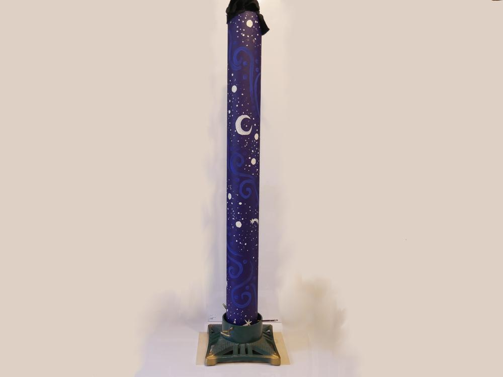
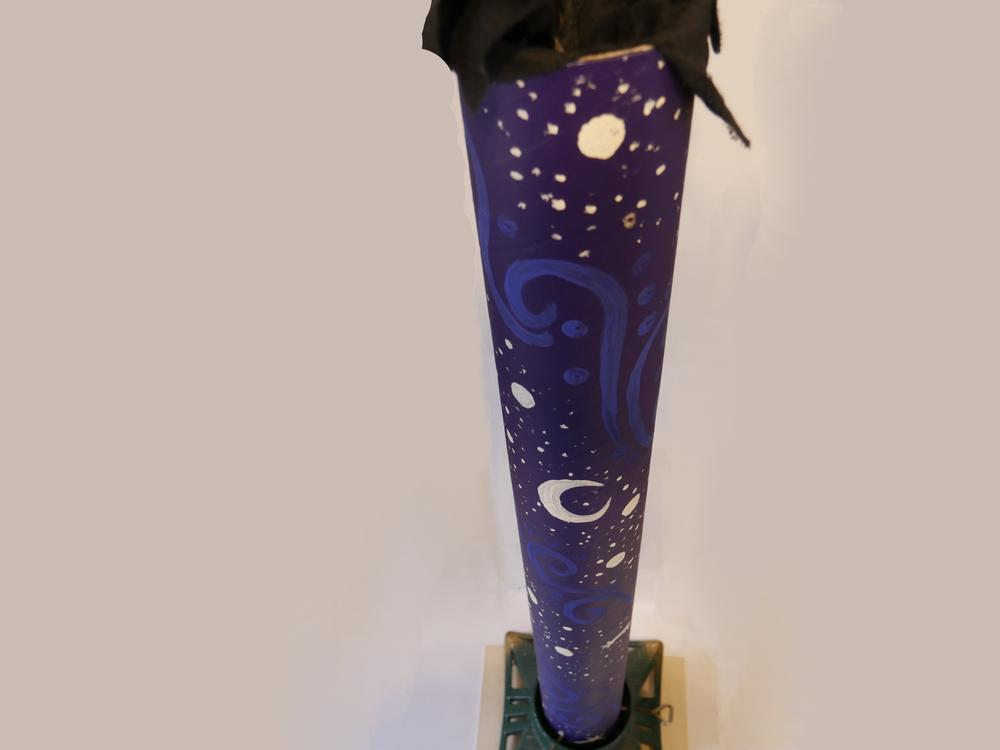
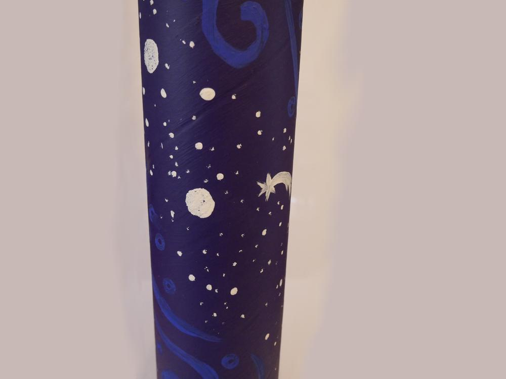

Was macht man nur mit alten Kerzenresten? Also ich habe mir für unsere Zeltwochenenden mal eine große Vorplatzkerze von 1,20 Meter gegossen. 

Bezahlt habe ich nur 1,50€ für den Christbaumständer, diese Idee ist sogar auf meinem Mist gewachsen, da ich nicht schweißen kann um mir einen passenden Ständer zu bauen und da alle diese ollen Christbaumständer von anno dazumal loswerden wollen, ist das eine gute Lösung für mein Problem. Wer will schon eine kippende Kerze. 

Die Teppichrolle bekommt man umsonst im Baumarkt hinterhergeschmissen, man kann sich allerdings vorstellen, dass sich ein Transport von einer 4 Meter Papprolle mit dem Fahrrad unter Umständen kompliziert gestalten kann... Wenn dann noch ein paar Farbreste herumschwirren, kann man diese super aufbrauchen. 

Auch den Stoff habe ich als ausgemusterten Theaterstoff bekommen, der war leider so spröde, dass ich daraus auch nichts mehr zaubern konnte, nun ist er mein Kerzendocht. 

Naja nun habe ich knapp 2 Jahre lang Kerzenreste gesammelt und man sollte meinen sie würden reichen - tun sie aber nicht. Die Kerze ist knapp ein Drittel gefüllt mit Wachs, da fehlt also noch ein wenig, wer also Kerzenreste hat und sie nicht mehr braucht, kann gerne für dieses Projekt spenden. Dann kann auch endlich ein Bild in entfachtem Zustand folgen.

Die Idee bekam ich übrigens bei einem Besuch eines Kunsthandwerkermarktes. Die Kerze soll über 30 Stunden brennen und wenn man nachfüllt, kann sich die Zeit mehr als verdoppeln, da bin ich ja mal gespannt, auch ob die Feuereigenschaften meinen Vorstellungen entsprechen. Bis dahin heißt es dann aber noch fleißig sammeln und schmelzen.
