Seit etwas mehr als einer Woche herrscht Ausnahmezustand. Wir haben Familienzuwachs bekommen und zwar von der flauschigen Sorte. Zwar hat Shubia viel Spaß dabei, meine Werke zu manipulieren, das Arbeitszimmer umzuorganisieren und als Model zu dienen, aber das war mir noch nicht genug, da ging noch was. Zudem müssen die diversen Katzenkletter- und Kuschelgelegeheiten ausgenutzt werden, deshalb ist jetzt Jemima herzlichst in der Flauschiversumzentrale Willkommen zu heißen. Leider sind dadurch meine UFOs (UnFertige Objekte) auch weiterhin solche geblieben, weil die Zusammenführung meiner Models nicht ganz so einfach ist. 
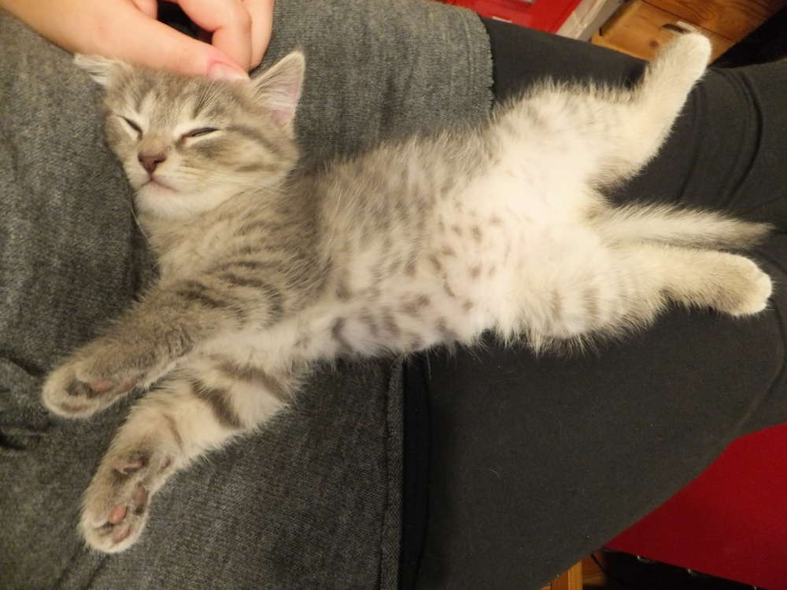
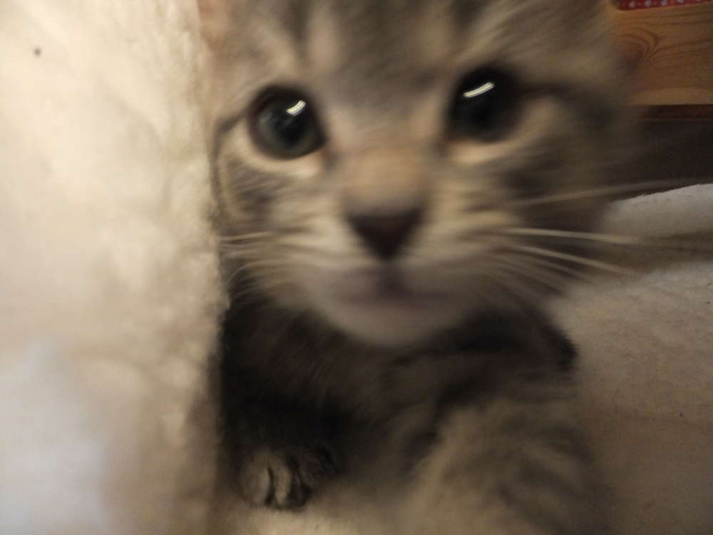
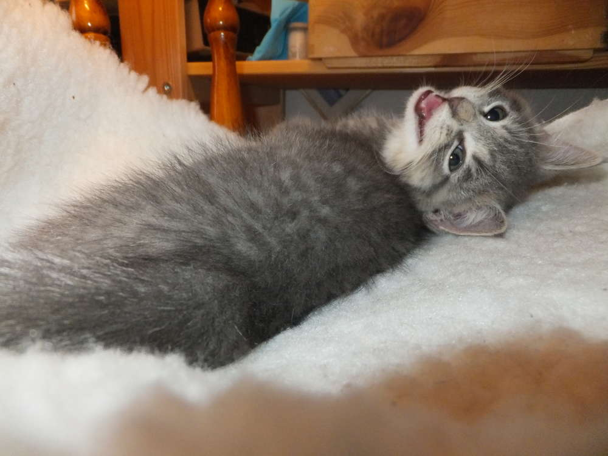
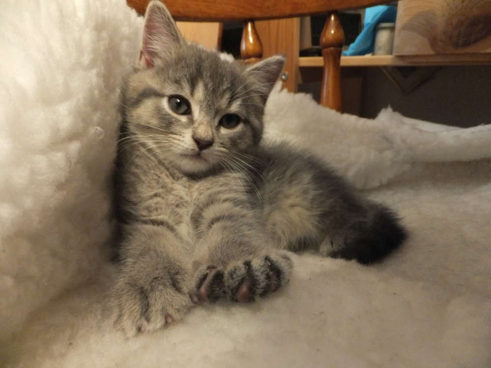

Diverseste Ideen warten auf Umsetzung, denn schließlich geht ab Herbst wieder das richtige Basteln los. Das musste jedoch alles warten und so kümmerten wir uns um einen Sichtzaun der die derzeit noch zwei Territorien trennt. Derzeit scherzeln wir noch viel über eiserne Vorhänge, Besatzungszonen und Ost- und West-Block, trotzdem bin ich froh, wenn die Tür wieder weg kann und meine Flauschis keine Zerfleischis mehr sind. Ich hatte eine Freundin zum Nähen bei mir, war im Kino, ich habe das Kabel meines MP3-Players umstrickt, habe mich in Occhi geübt, mich mit vielen Menschen getroffen und letztendlich versuche ich nebenbei noch meine Ferien ein wenig entspannt angehen zu lassen. Deshalb wird es heute mal eine Sammlung von UFOs und solchen die zunächst welche bleiben werden geben.

Jetzt muss auch mein MP3-Player-Kopfhörerkabel nicht mehr frieren und ich muss nur das Ladekabel wiederfinden, damit ich beim Sport endlich Musik hören kann.
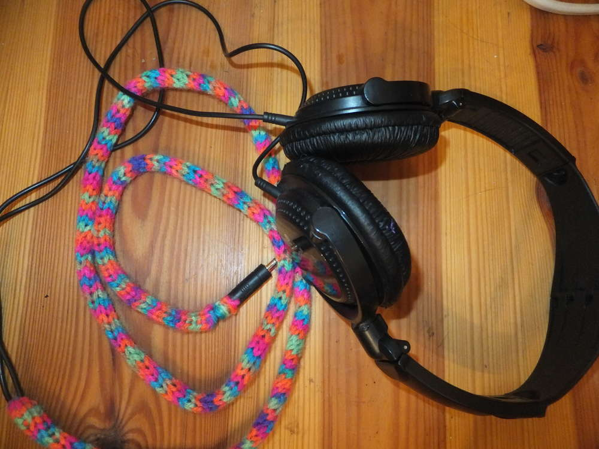

Mit der Occhi-Spitze hatte ich geplant eine Maske zu machen, aber irgendwann hat mich die Motivation im Stich gelassen.
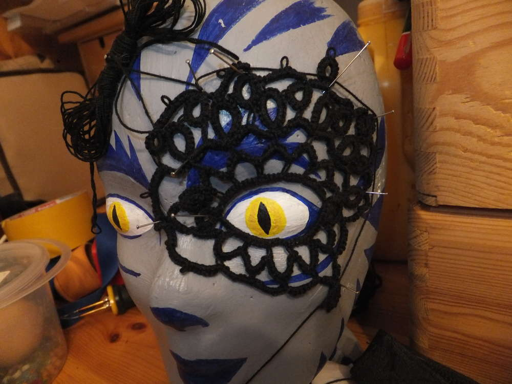

Der Sichtzaun wird schon eifrig zum Beschnuppern genutzt und das nebeneinander Fressen funktioniert auch schon super.
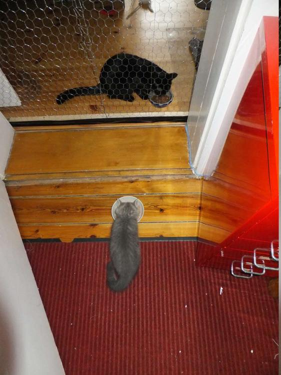
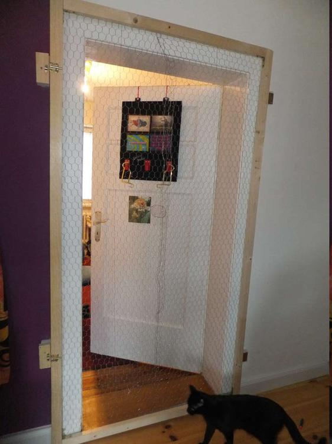

Mein Rezeptebuch wurde durch die Nutzung immer schmutziger, so kümmerte ich mich um eine Rettung meiner Lieblingsrezepte durch Laminierfolien. Jetzt müssen sie nur noch ausgeschnitten und gefaltet werden und dann kann man sie sichzum Kochenhinstellen, ohne Angst zu haben, dass sie vollgeschmiert werden.
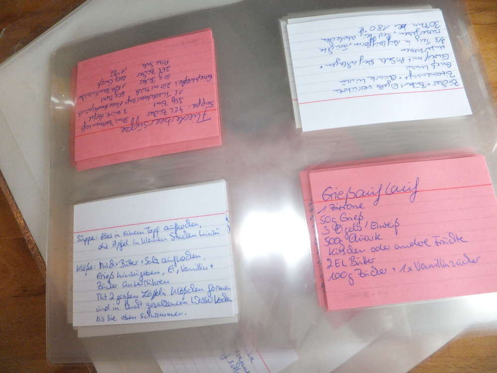

Dieser Stoff soll mal ein Tellerrock werden.
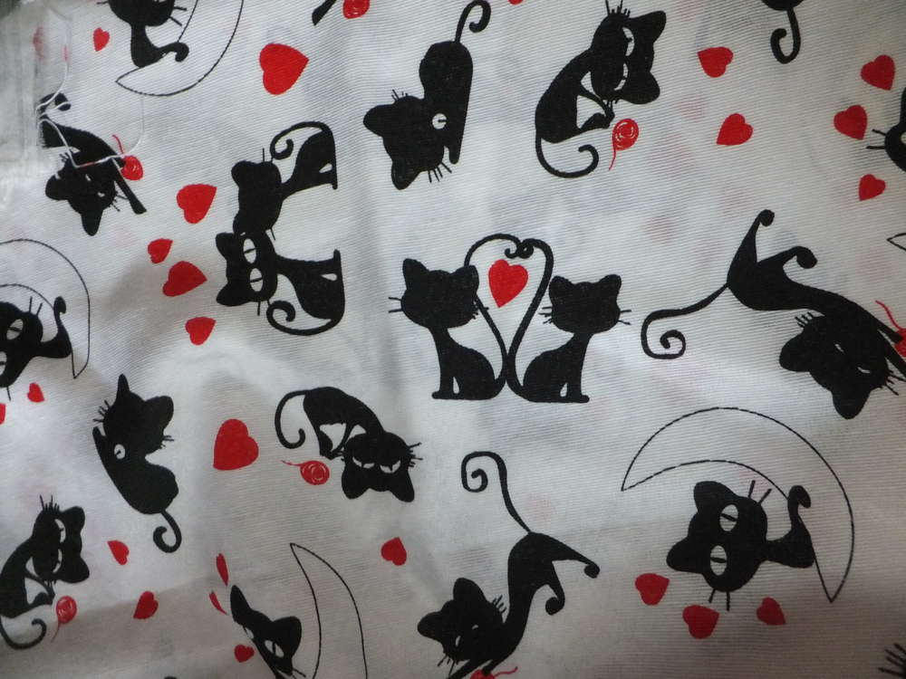

An dem Edlothia-Tuch häkel ich jetzt schon seit mehreren Wochen um es dann am Anfang der Ferien wieder aufgeribbelt zu haben um von Neuem beginnen zu können. Blöde Fehler meinerseits machten die Fertigstellung unmöglich. Ich benutze dazu die Wolle von Wollschnassel, sie fällt im gehäkelten Zustand sehr weich und das Tuch schmiegt sich später bestimmt sehr bequem an.
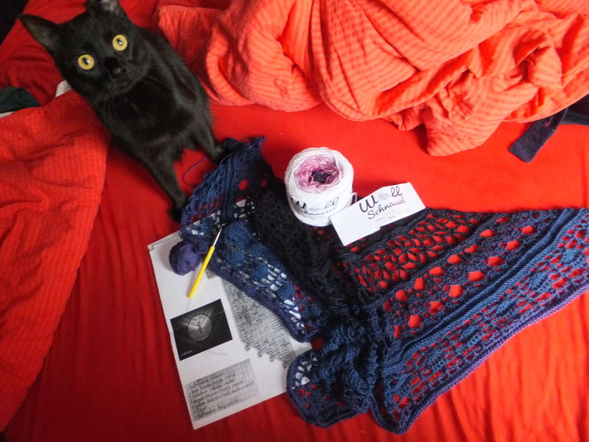
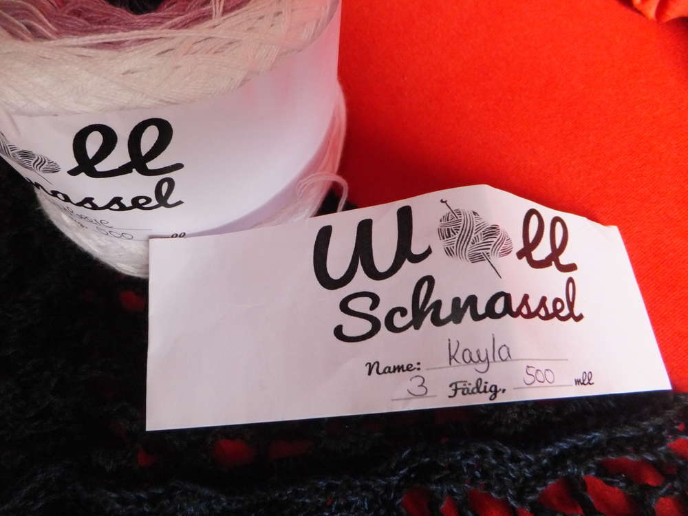

Einen schönen Sonntag, tolle Ferien und bis nächste Woche, Eure Ermeline.

