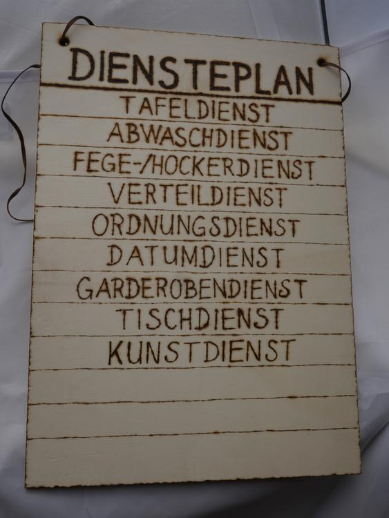

Meine Kollegin wünschte sich einen Diensteplan für unsere Klasse. 

Es sollte einer sein, der nicht aus Papier ist und jede Woche aufs neue hingekritzelt werden muss. Da kam ich dann ins Spiel, habe mich also hingesetzt und 25 Wäscheklammern beidseitig mit den Namen der Kinder in unserer Klasse bebrannt und den Diensteplan fertig gemacht, an den nun die Klammern jede Woche neu angeheftet werden können. 

Schlicht und einfach, aber er erfüllt definitiv seinen Zweck. 
Tschö mit Ö Eure Ermeline
