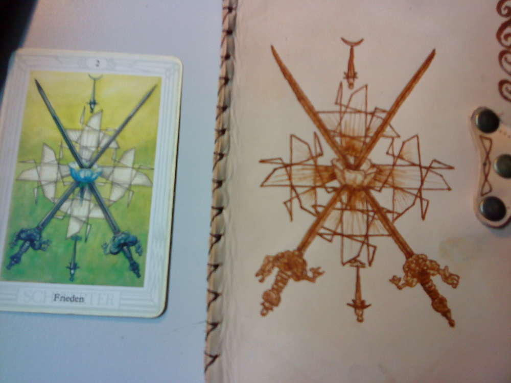
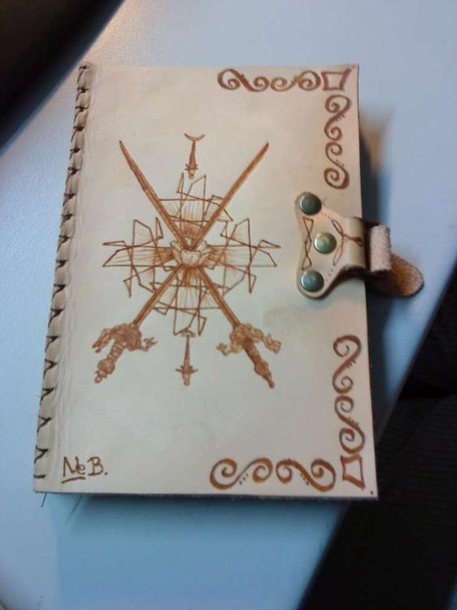
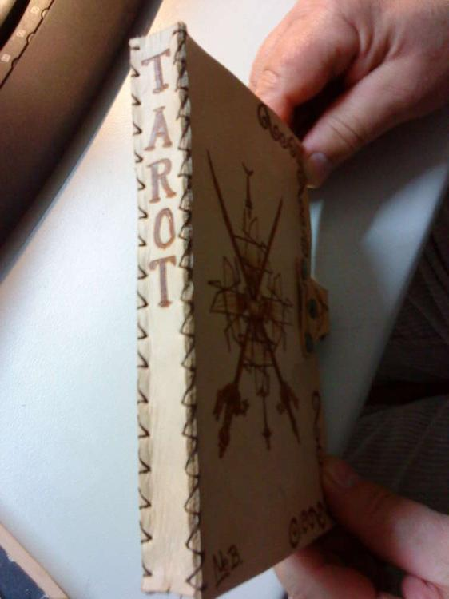
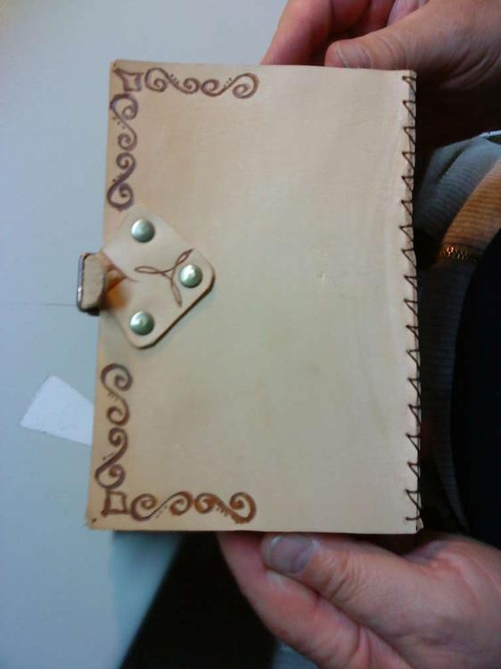
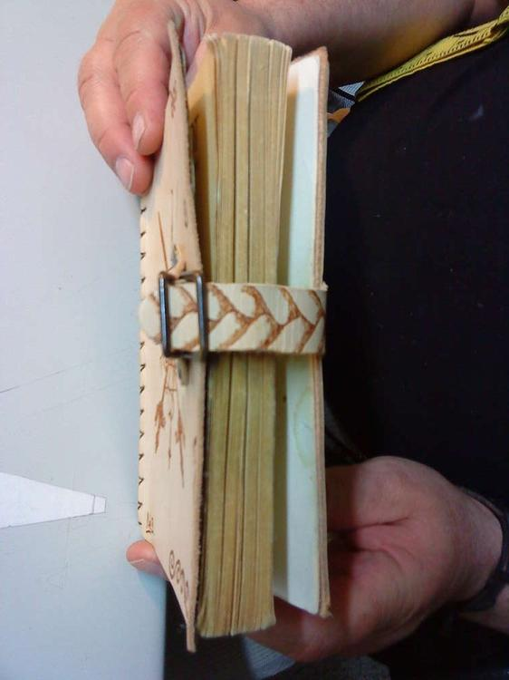

Hier mal ein zeitlich etwas länger zurückliegendes Werk. Der Herr Papa der hat ein Tarotbuch. Und dieses Buch ist schon sehr abgegriffen. Der Buchrücken zerfleddert und im Allgemeinen nicht mehr all zu schön anzusehen. Da kommt es ja gelegen, dass die eigene Tochter derzeit mit Leder am experimentieren ist. Den Lötkolben hatte ich sowieso schon beschlagnahmt, mein Papa sieht sich selbst gerne als enteignet an, :D dabei kann er immer alles widerhaben... Naja aber das Leder war da, der Lötkolben war da und das Buch musste neu. Mein Paps entschied sich für das Motiv des Friedens, welches zukünftig sein neues Buchcover verschönern sollte. Na und das ist das Ergebnis.  

