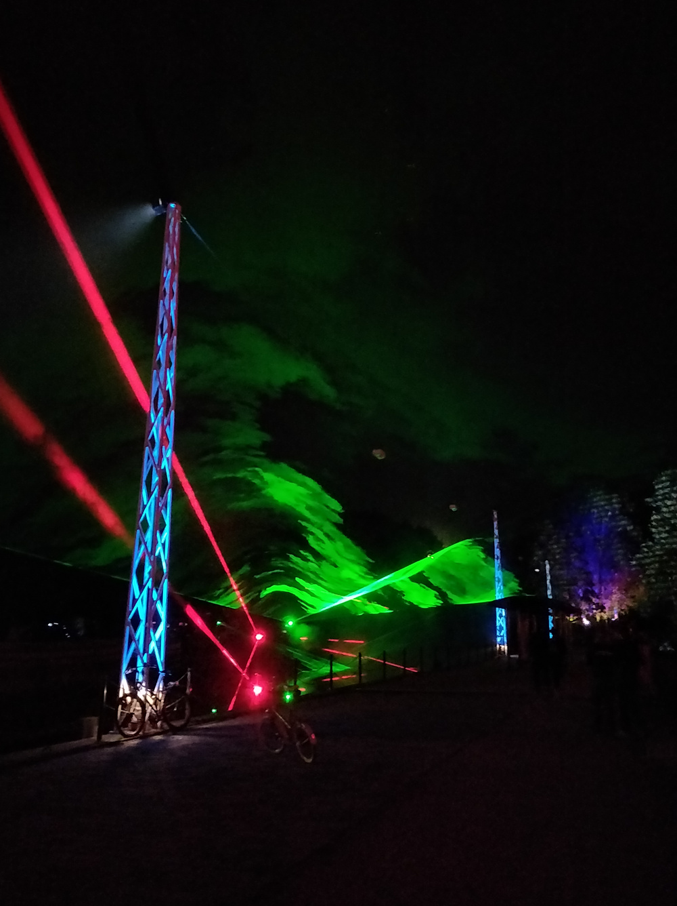

Das Flauschiversum ist jetzt schon etwas älter und hat seit 2013 viele Posts veröffentlicht.
Dieses Jahr ist es leider etwas ruhig geworden, was unter anderem daran lag, dass die alte Technik nicht mehr so recht wollte.
Unser Techniker hat also keine Mühen gescheut, während seines Urlaubs auf dem Chaos Communication Camp die Software für das Flauschiversum komplett neu zu schreiben.
Alles geht jetzt schneller, besser und bald gibt es vielleicht sogar ein neues Design.

Damit ihr auch was davon habt, habe ich ein paar Fotos vom Camp gemacht.

Viele Grüße an alle Leser!