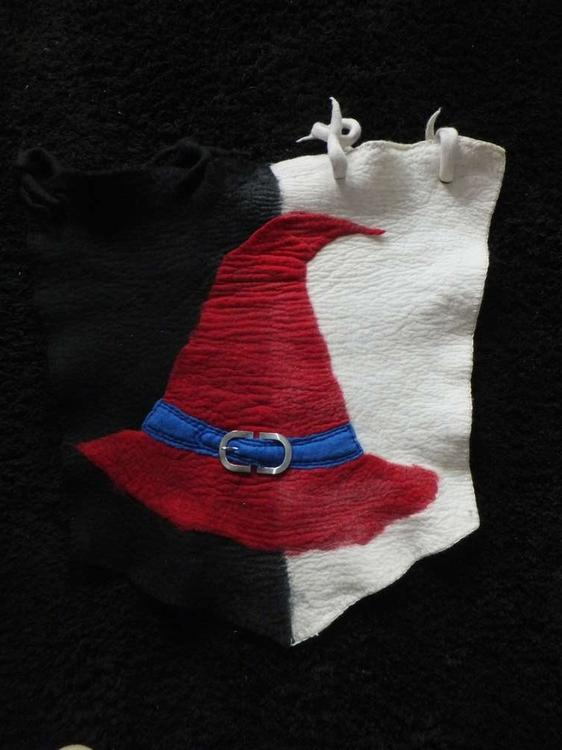

Wie eifrige Leser schon mitbekommen haben könnten, widme ich mich in meiner Freizeit dem Hobby LARP (Live Action Role Playing). Jetzt ist auch schon durch die vielen Hüte bekannt geworden, dass ich mit vielen Magiern herumhänge, wichtig ist also, dass man unsere kompetente Gruppe auch als solche erkennt. Da liegt es nahe das man sich ein Banner fertigt mit dem auffälligsten Wiedererkennungszeichen, dass wir aufbringen können... hier nun das Ergebnis.Der zweifarbige Hintergrund besteht aus verschiedenfarbigem Vlies und wurde mit einem vorgefilzten halben Hut vereint. Die Gürtelschnalle soll den Hut aufwerten und das blaue Hutband wurde noch mit blauem Faden bestickt, ebenso wurde das ganze Banner umsäumt um dem Ausfransen vorzubeugen. Wer also auf Con dieses Banner am Mast hängen sieht, der kann sich nun sicher sein, der Ärger wird uns jetzt viel schneller finden und hier wird man kompetent von noch kompetenteren Magiern beraten... chrmchrm. Hier findet man die Magier der "Bewahrer des Gleichgewichts".
