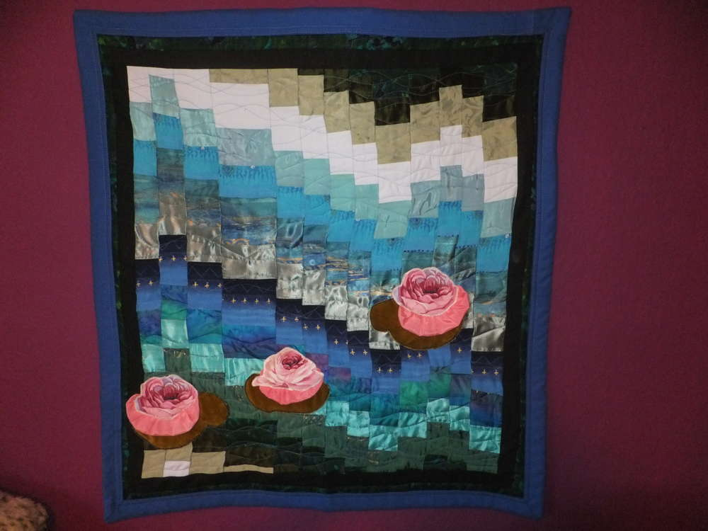
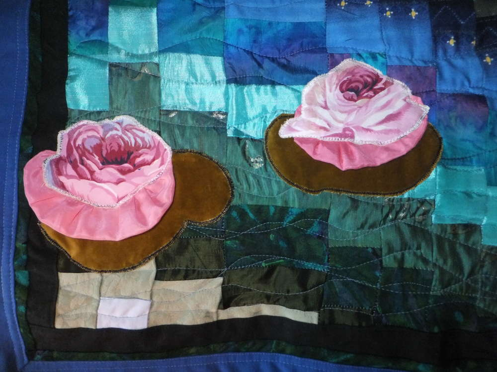
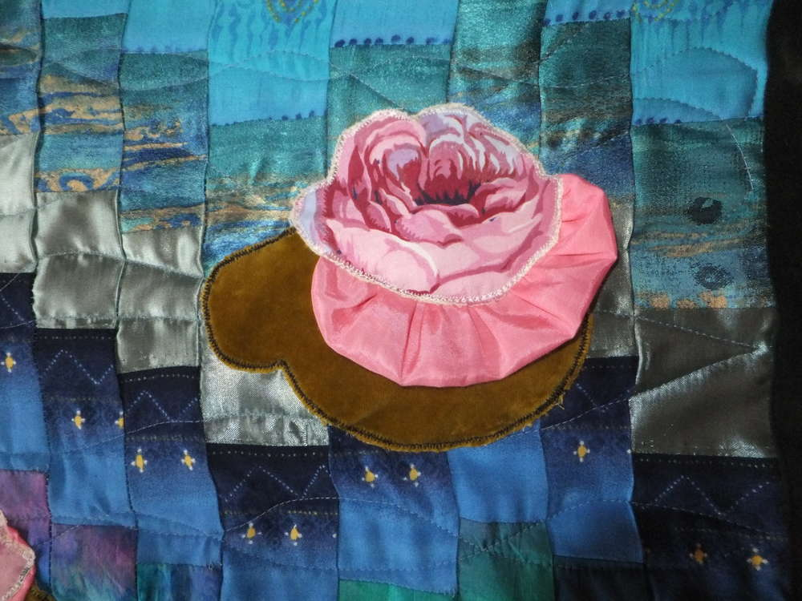

Weil mein Gästebad so langweilig aussah, beschloß ich, es mit einem Bild zu verschönern. Und was paßt in einen solchen Raum besser, als ein Seerosenquilt a la Monet?

Den habe ich nämlich auf [YouTube](https://www.youtube.com/watch?v=K6Gcv_P6cIk) entdeckt und folgendermaßen nachgearbeitet:

Ich habe mir blaue und grüne Stoffe zusammengesucht, die einen schönen Farbverlauf versprechen, und sie dann in 12 Streifen von ca. 5 -7 cm Breite geschnitten. Sie müssen nicht alle genau gleich breit sein, aber doch einigermaßen. Die Länge entspricht der Breite des Quilts. Allerdings muß man noch ein paar cm als Nahtzugabe einplanen.

Dann habe ich alle Streifen in der gewünschten Farbfolge zusammengenäht und zum Schluß auch noch den ersten Streifen mit dem letzten verbunden, so daß ein Schlauch entsteht. Der muß dann ordentlich gebügelt werden und wird danach quer wieder in Streifen geschnitten. Ich habe den ersten wieder 5 cm breit gemacht, die folgenden dann 1 - 2 cm breiter und danach wieder schmaler werdend.

Oberhalb des hellsten Stoffquadrates wird dann die kleine Naht aufgetrennt, so daß wieder ein Streifen entsteht. Bei dem 2. Rund wird das hellste Stoffquadrat in der Mitte durchgeschnitten, und so kann man durch das versetzte Öffnen der Schlauchteile eine wellenartige Optik entstehen lassen, die sich einem erst so richtig offenbart, wenn die geöffneten Streifen in der RICHTIGEN REIHENFOLGE !!! wieder zusammengenäht sind.

Die Seerosen habe ich aus einem Rosenstoff improvisiert, weil ich leider keine anderen Blüten auftreiben konnte. Das Blatt wurde aus einem Rest Samt ausgeschnitten (ich liebe diesen Stoff und habe mir davon schon eine bezaubernde Handtasche genäht), und um diese Applikationen noch ein bißchen plastischer zu machen, hab ich noch etwas gekräuselte rosa Seide zwischen Blatt und Rose gesetzt. Tja, das Aufnähen dieser Blumen mit ganz engem Zickzackstich war wohl das Fummeligste vom ganzen Teil. Die Rückseite besteht aus grünem Baumwollstoff und die Zwischenlage aus Fließ.

Für den Rand habe ich einen 3 cm - Streifen schwarz, dann 2 cm dunkelgrün gewählt. Mit einem etwas breiteren dunkelblauen Streifen wurde die Sache schließlich vollendet, und voila:

So verziert der gute alte Claude Monet

mein tristes kleines Gäste WC.

Viel Spaß, eure Lucy!
