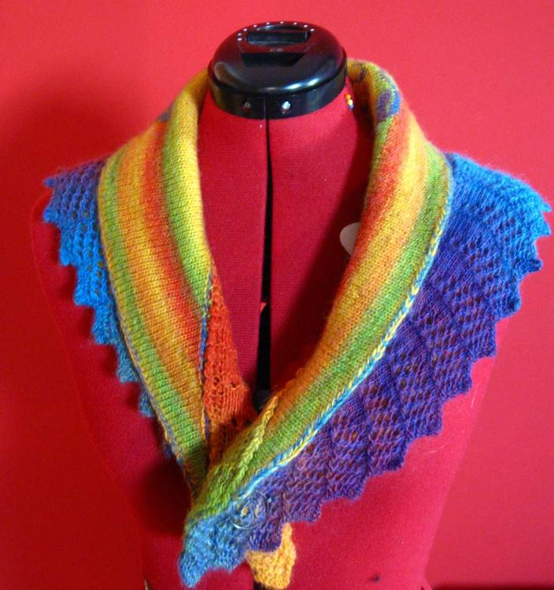
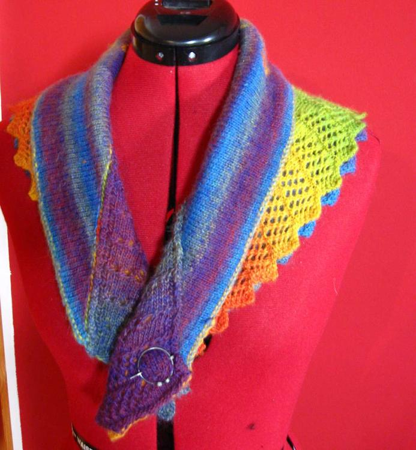
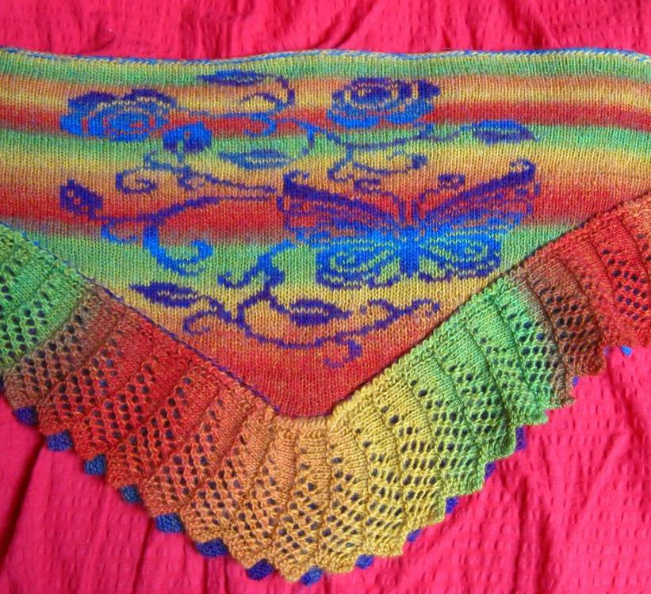
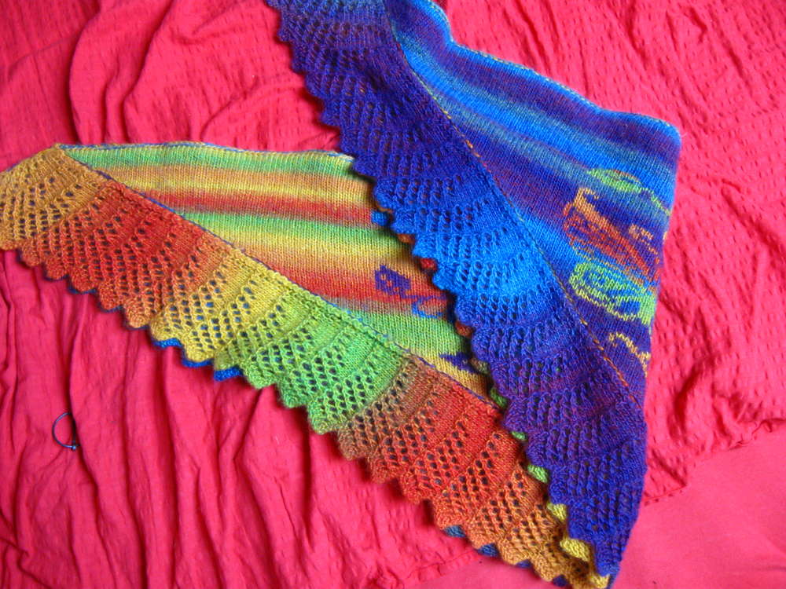
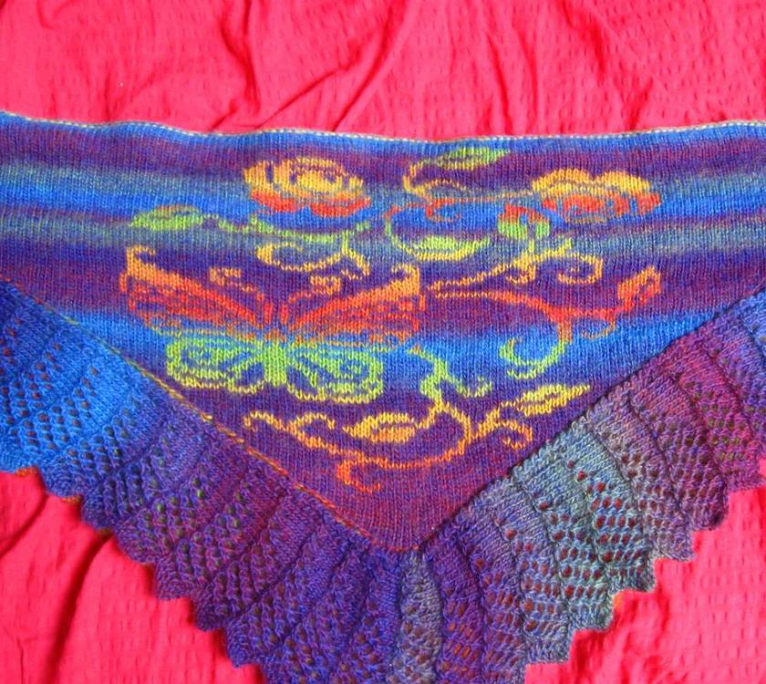

Ich finde ja wenn man Muster strickt ist es doof, dass es auf der Rückseite des Strickstücks immer so doofe Fäden gibt... praktisch wenn man das Doppelstricken für sich entdeckt, ich spare mir hier eine Fotoanleitung zu machen, denn es gibt genug gute Anleitungen auf [Youtube](https://www.youtube.com/watch?v=2yhfjOQeQl8), stattdessen sind hier ein paar Fotos von meinem ersten doppelt gestrickten Tuch, wer die Strickspitze wiedererkennt - ja sie ist abgeschaut beim "[In the Pink](http://flauschiversum.de/2014/01/in-the-pink/ "In the Pink")".

Das Muster habe ich mir selbst gebastelt mit dem tollsten Handarbeitsprogramm für den PC "Sticken bhv" unterschätzt diese unscheinbare kleine Zeitschriftenbeilage nicht. Du kannst quasi aus jedem Bild eine Stickschrift machen, zum Stricken musst du manche Bilder zuvor stauchen, da Strickmaschen nicht gleich hoch wie breit sind. Ich bekam sie vor vielen Jahren in die Finger und wenn ihr das Glück habt da ran zu kommen und auch mit dem Doppelt-Stricken anfangen wollt, dann schützt sie wie euren Augapfel, ich jedenfalls werde diese CD nie mehr rausrücken.
